# 四轴无人机飞行能耗预测实验 2.0：TCN + RLS 输出说明

本文件与 `2.0/out` 当前生成的 CSV、JSON 和 PNG 一一对应，用于复核实验方案、读取结果，并和 `1.0/out` 做同口径对比。2.0 沿用 1.0 的数据源、特征工程、标签定义、flight 分组切分、随机种子、评价指标和输出命名；算法部分改为短时间窗因果 TCN 前向推理，再用 RLS 对功率输出进行实时在线校正。

## 1. 实验方案

数据来自 DJI Matrice 100 四轴无人机公开数据集。程序读取 `flights.csv`，完成数值转换、缺失值清理、R/H 航线筛选、功率标签构造和 28 维特征工程。功率标签定义为：

$$
P_i=\max\left(U_i I_i,0\right)
$$

其中：
$P_i$：第 $i$ 个采样点的真实瞬时功率，单位 W。
$U_i$：第 $i$ 个采样点的电池电压，单位 V。
$I_i$：第 $i$ 个采样点的非负放电电流，单位 A。

处理后共有 249210 条记录、198 次飞行。数据按 `flight` 整组随机划分，随机种子为 42：

| 集合 | 飞行数 | 记录数 |
| --- | ---: | ---: |
| train | 138 | 174653 |
| val | 30 | 34796 |
| test | 30 | 39761 |

测试集不参与网络参数更新；标准化统计量只由训练集计算，保存在 `out/model/scaler_2.0.json`。

## 2. 1.0 与 2.0 的对比边界

两版共同使用：

- 同一公开数据源、同一清洗规则和同一 28 维输入特征；
- 同一 `power_w` 目标、采样间隔积分公式、flight 分组切分和随机种子 42；
- 同一测试集指标：样本级功率 MAE、RMSE、R2、MAPE、WAPE，以及 flight 级能耗 MAE、RMSE、R2、MAPE、WAPE；
- 同一功率区间和 flight 汇总表结构，同名图表的轴含义保持一致。

模型对比方法完全对应：1.0 在验证集比较 5 个 MLP 候选，2.0 在验证集比较 5 个短时间窗 TCN 候选。2.0 的每个候选同时计算 TCN 原始输出和 RLS 校正输出，`tcn_*` 字段表示校正前基线，不带 `tcn_` 前缀的字段表示最终结果。

## 3. 2.0 模型流程

每个 flight 按时间排序，窗口左侧不足时使用该 flight 的首个样本填充。因果 TCN 只读取当前及历史窗口：

$$
\hat{P}^{\mathrm{TCN}}_t=f_{\theta}\left(X_{t-L+1:t}\right)
$$

其中：
$\hat{P}^{\mathrm{TCN}}_t$：时刻 $t$ 的 TCN 功率预测，单位 W。
$f_{\theta}$：因果 TCN 及其可学习参数。
$X_{t-L+1:t}$：从当前时刻向前的输入窗口。
$L$：窗口采样步数。

TCN 由 3 个残差卷积块组成，通道为 `[64, 64, 32]`，卷积核宽度为 3，膨胀率依次为 1、2、4，Dropout 为 0.08。卷积块使用 `GroupNorm`，模型头部增加当前时刻输入的 skip connection，使低功率和突变工况不只依赖卷积历史特征。训练损失为低功率和高功率加权的 Huber Loss。

RLS 将 TCN 输出映射到实测功率，使用归一化尺度 $s$ 构造回归向量：

$$
\boldsymbol{\phi}_t=\begin{bmatrix}1\\ \hat{P}^{\mathrm{TCN}}_t/s\end{bmatrix},\qquad z_t=P_t/s
$$

$$
\tilde{P}_t=s\boldsymbol{\phi}_t^{\mathsf T}\boldsymbol{\theta}_{t-1}
$$

$$
\mathbf{K}_t=\frac{\mathbf{C}_{t-1}\boldsymbol{\phi}_t}{\lambda+\boldsymbol{\phi}_t^{\mathsf T}\mathbf{C}_{t-1}\boldsymbol{\phi}_t},\qquad
\boldsymbol{\theta}_t=\boldsymbol{\theta}_{t-1}+\mathbf{K}_t\left(z_t-\boldsymbol{\phi}_t^{\mathsf T}\boldsymbol{\theta}_{t-1}\right)
$$

$$
\mathbf{C}_t=\frac{\mathbf{C}_{t-1}-\mathbf{K}_t\boldsymbol{\phi}_t^{\mathsf T}\mathbf{C}_{t-1}}{\lambda}
$$

其中：
$\tilde{P}_t$：RLS 校正后的实时功率，单位 W。
$P_t$：当前已观测的实测功率，单位 W。
$s$：功率归一化尺度，保存在 `scaler_2.0.json`。
$\boldsymbol{\phi}_t$：由偏置项和归一化 TCN 功率组成的回归向量。
$z_t$：归一化实测功率。
$\boldsymbol{\theta}_t$：时刻 $t$ 的仿射校正参数，分别对应偏置和比例。
$\mathbf{K}_t$：RLS 增益向量。
$\mathbf{C}_t$：参数协方差矩阵。
$\lambda$：遗忘因子，本实验为 0.995。

程序按 flight 独立重置 RLS 状态，执行“先输出、后更新”：先用历史参数输出当前功率，再在当前实测功率到达后更新参数。部署输入没有 `power_w` 时，只执行 TCN 前向和已有 RLS 参数校正。

## 4. 时间窗口调参

`out/model/tuning_results_2.0.csv` 保存了 5 个候选时间窗。典型采样间隔约为 0.12 s，秒级窗口折算为下表采样步数。选择分数为：

$$
S=\mathrm{WAPE}_{\mathrm{flight}}+0.2\,\mathrm{WAPE}_{\mathrm{sample}}
$$

其中：
$S$：候选窗口选择分数，越小越优。
$\mathrm{WAPE}_{\mathrm{flight}}$：flight 级能耗 WAPE。
$\mathrm{WAPE}_{\mathrm{sample}}$：采样点功率 WAPE。

| 候选窗口 | 采样步数 | 验证 TCN 功率 WAPE (%) | 验证 RLS 功率 WAPE (%) | 验证 TCN 能耗 WAPE (%) | 验证 RLS 能耗 WAPE (%) | 选择分数 |
| ---: | ---: | ---: | ---: | ---: | ---: | ---: |
| 0.6 s | 5 | 11.7844 | 10.9362 | 2.5612 | 1.2264 | 3.4136 |
| 1.0 s | 8 | 12.1191 | 11.3627 | 2.8732 | 1.2353 | 3.5078 |
| 1.5 s | 12 | 12.0360 | 10.9618 | 2.8173 | 1.1812 | 3.3736 |
| 2.0 s | 17 | 12.3926 | 11.7989 | 2.3114 | 1.6438 | 4.0036 |
| 3.0 s | 25 | 11.8700 | 10.9696 | 2.6377 | 1.1378 | 3.3317 |

综合分数最小的窗口为 **3.0 s、25 个采样步**。短窗口满足实时性要求，3.0 s 在本次验证集上同时取得最低综合分数和最低 flight 能耗 WAPE。候选比较图如下。

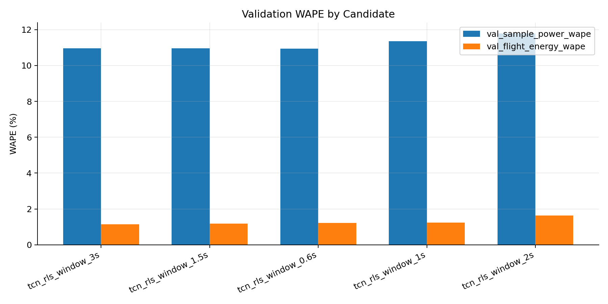

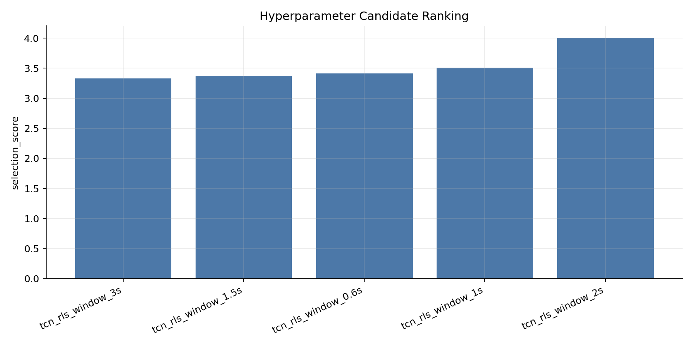

## 5. 当前测试集结果

以下数值直接读取 `out/model/evaluation_2.0.json`。RLS 校正和 TCN 基线使用同一测试集 39761 条记录、30 次飞行。

| 指标 | TCN 基线 | RLS 校正 | 单位 |
| --- | ---: | ---: | --- |
| 样本功率 MAE | 39.2280 | 36.9329 | W |
| 样本功率 RMSE | 69.7206 | 64.9023 | W |
| 样本功率 R2 | 0.9137 | 0.9252 | 无量纲 |
| 样本功率 WAPE | 9.9496 | 9.3675 | % |
| flight 能耗 MAE | 0.5660 | 0.3307 | Wh |
| flight 能耗 RMSE | 1.0573 | 0.9257 | Wh |
| flight 能耗 R2 | 0.9629 | 0.9716 | 无量纲 |
| flight 能耗 WAPE | 2.5990 | 1.5186 | % |

MAPE 分别为 536.7397%（RLS 样本功率）和 1.6990%（RLS flight 能耗）。功率接近 0 W 时分母很小，MAPE 会被少量低功率样本放大，因此功率主比较采用 MAE、R2 和 WAPE。

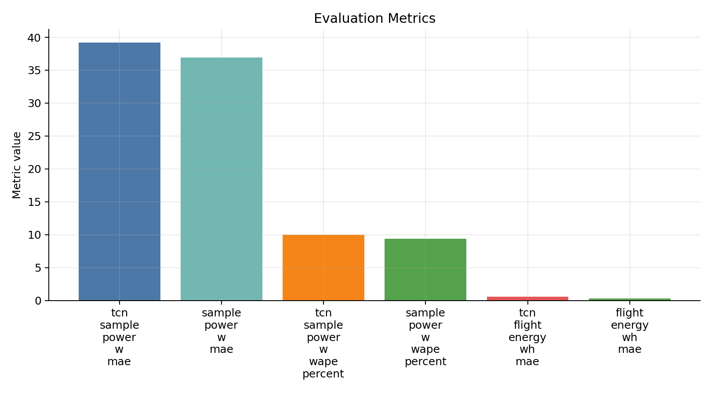

与 1.0 的最终输出对照如下：

| 版本 | 样本功率 MAE (W) | 样本功率 R2 | 样本功率 WAPE (%) | flight 能耗 MAE (Wh) | flight 能耗 R2 | flight 能耗 WAPE (%) |
| --- | ---: | ---: | ---: | ---: | ---: | ---: |
| 1.0 MLP | 36.4561 | 0.9196 | 9.2466 | 0.6298 | 0.9597 | 2.8922 |
| 2.0 TCN | 39.2280 | 0.9137 | 9.9496 | 0.5660 | 0.9629 | 2.5990 |
| 2.0 TCN + RLS | **36.9329** | **0.9252** | **9.3675** | **0.3307** | **0.9716** | **1.5186** |

相对 2.0 TCN 基线，RLS 将样本功率 MAE 降低 2.2951 W、WAPE 降低 0.5821 个百分点；flight 能耗 MAE 降低 0.2353 Wh、WAPE 降低 1.0804 个百分点。相对 1.0，2.0 的主要收益体现在 flight 能耗指标，逐点功率 MAE 接近但略高，说明能耗积分对误差的时间平均起到了平滑作用。

## 6. 训练过程

最终训练日志位于 `out/model/training_log_2.0.csv`，对应 3.0 s 窗口。训练和验证损失均使用加权 Huber Loss，图中纵轴为标准化损失，不是 W 或 Wh。

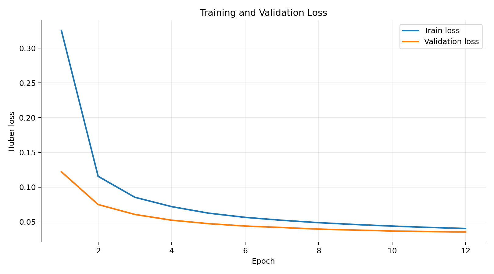

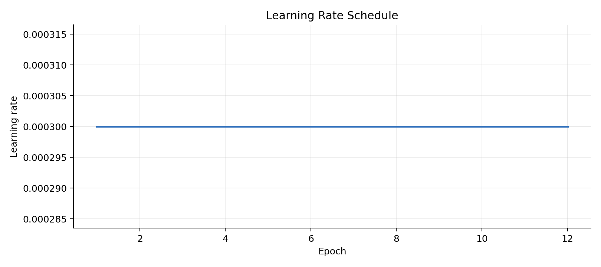

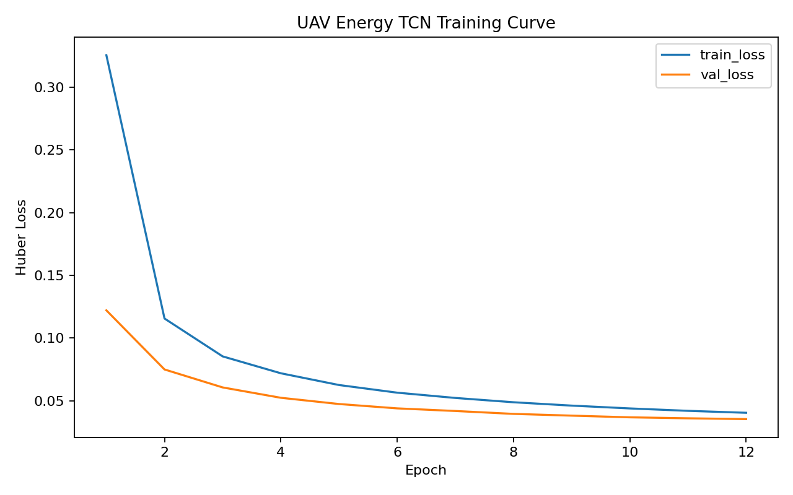

## 7. 功率分段与 flight 结果分析

`out/model/power_bin_evaluation_2.0.csv` 对最终 `predicted_power_w`（RLS 输出）按真实功率分段统计：

| 真实功率区间 | 样本数 | 真实均值 (W) | 预测均值 (W) | MAE (W) | WAPE (%) |
| --- | ---: | ---: | ---: | ---: | ---: |
| 0-50 W | 9549 | 1.2502 | 22.3723 | 22.1115 | 1768.5800 |
| 50-300 W | 704 | 162.6580 | 219.4742 | 127.3218 | 78.2758 |
| 300-450 W | 4471 | 409.9169 | 453.7460 | 59.1327 | 14.4255 |
| 450-600 W | 19985 | 520.0242 | 520.0682 | 31.0002 | 5.9613 |
| 600 W 以上 | 5052 | 658.0570 | 612.0622 | 56.1738 | 8.5363 |

450-600 W 是样本最多且最稳定的区间，预测均值与真实均值只差 0.0439 W。0-50 W 区间的真实均值接近 0，而模型仍保留约 22 W 的输出，主要来自停机/着陆末段的状态边界不清和非零基线约束；该区间不适合单独使用 MAPE 判断模型优劣。50-300 W 样本较少且动态状态比例高，误差仍然偏大，是后续改进的重点。

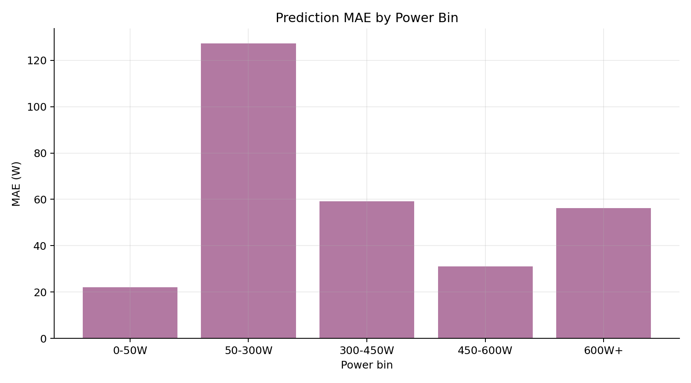

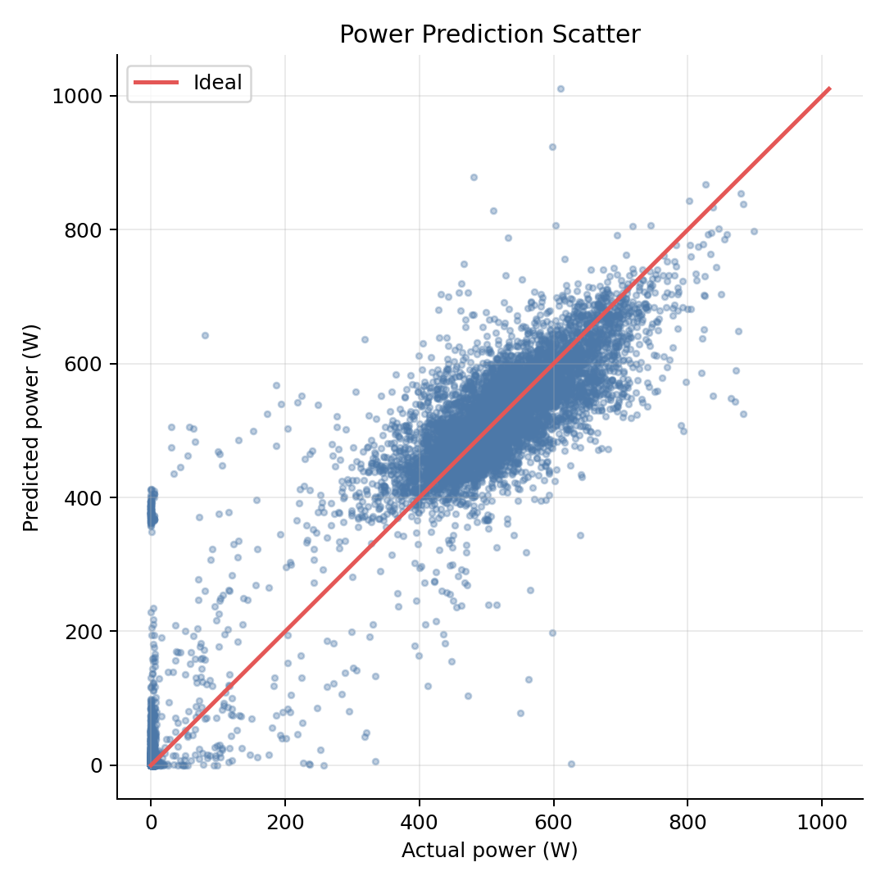

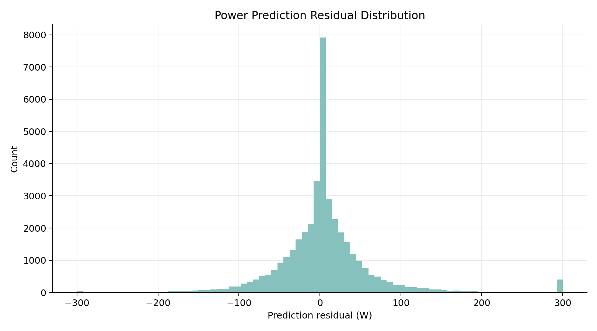

散点图显示，改进后的 TCN 输出不再集中成旧版本的两条水平平台，预测点沿理想线形成连续分布；高功率段的离散程度较小，低功率段仍有明显的正偏差。残差直方图与分段表反映的是同一现象。

flight 能耗汇总保存在 `out/model/flight_energy_summary_2.0.csv`。大多数 R1 飞行的能耗误差低于 0.4 Wh，RLS 对不同飞行的偏置进行了逐段修正。`flight 224` 仍是最明显的异常案例：真实能耗约 17.657 Wh，RLS 预测约 22.461 Wh，误差约 4.804 Wh。该飞行属于 H 航线、编程速度为 0，末段出现近零功率，但输入特征中没有明确的着陆或停机状态标志，TCN 和 RLS 都会把部分末段状态延续为较高功率。这个案例说明，增加停机状态特征或单独建模着陆段比继续增大网络容量更有针对性。

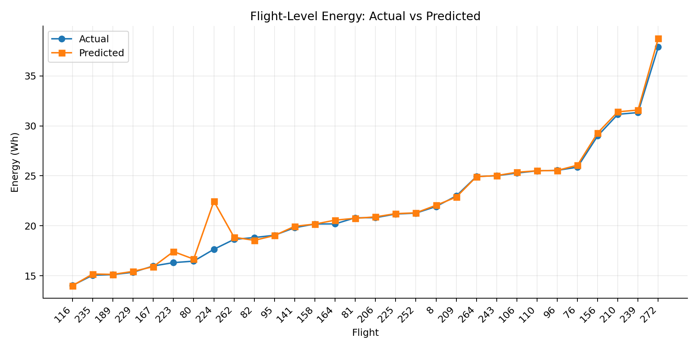

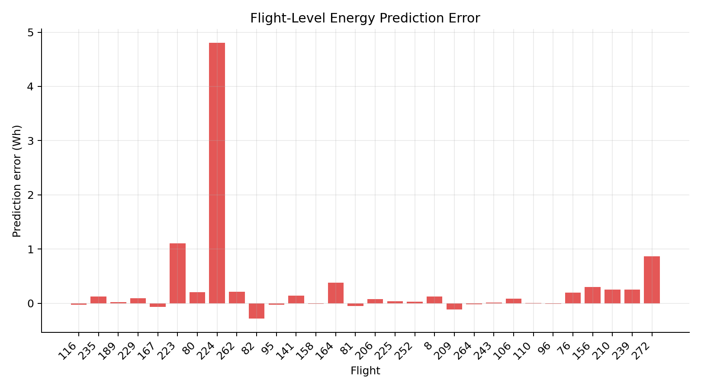

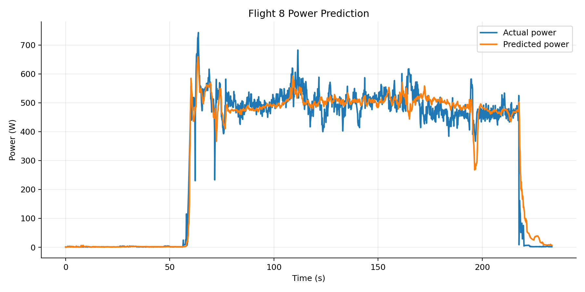

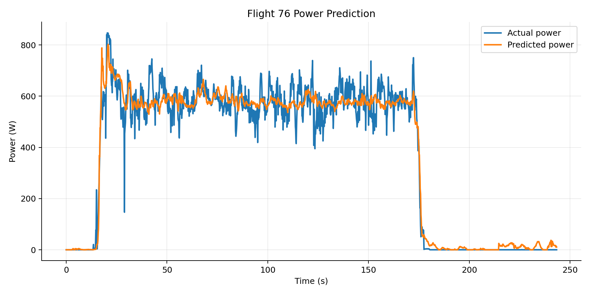

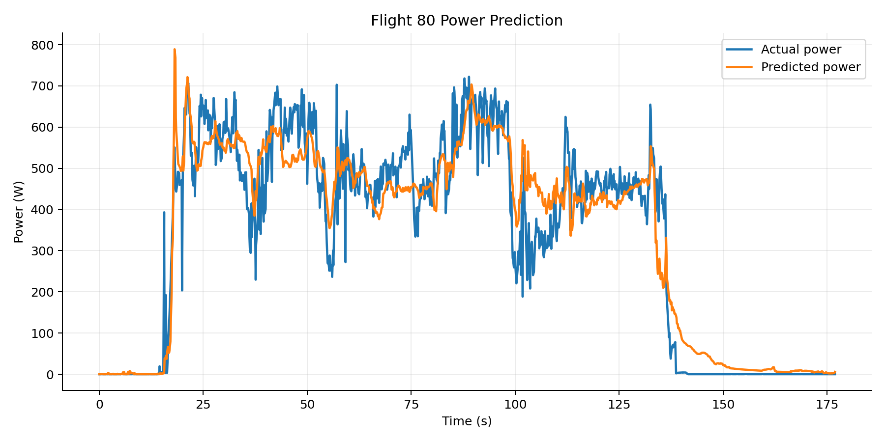

三张典型 flight 时序图分别展示无载荷、带载荷和不同速度/高度条件下的 TCN 基线与 RLS 输出。图中 `Predicted power` 为最终 RLS 结果，原始 TCN 结果可在预测 CSV 的 `tcn_predicted_power_w` 列中复核。

## 8. 输出文件与字段

- `data/processed_2.0/dataset_summary.json`：原始记录数、清洗后记录数、flight 数量和切分规模。
- `data/processed_2.0/uav_energy_features.csv`：清洗和特征工程后的建模数据。
- `model/scaler_2.0.json`：训练集标准化参数、特征列、典型采样间隔和功率尺度。
- `model/tuning_results_2.0.csv`：五个时间窗候选及验证集比较结果。
- `model/training_log_2.0.csv`：每轮训练损失、验证损失、学习率和窗口参数。
- `model/evaluation_2.0.json`、`evaluation_2.0.csv`：TCN 与 RLS 的双基线评估指标。
- `model/flight_energy_summary_2.0.csv`：逐 flight 的真实能耗、TCN 能耗、RLS 能耗和误差。
- `model/power_bin_evaluation_2.0.csv`：按真实功率区间统计最终预测误差。
- `predictions/test_predictions_2.0.csv`：逐点保存输入、`tcn_predicted_power_w`、`rls_corrected_power_w`、`predicted_power_w`、校正量、能耗和 RLS 最终参数。
- `custom/custom_scenarios_2.0.csv`：自定义工况输入。
- `custom/custom_predictions_2.0.csv`：自定义工况的 TCN/RLS 预测序列。
- `custom/custom_prediction_summary_2.0.json`：自定义工况行数、平均/最大功率和累计能耗。

图表目录与文件的对应关系如下：

- `figures/training/`：训练损失、学习率、候选窗口验证 WAPE 和超参数排序。
- `figures/results/`：总体指标、flight 能耗对照、flight 能耗误差和功率分段 MAE。
- `figures/prediction/`：功率散点、残差直方图和 3 个典型 flight 功率时序。
- `figures/custom/`：自定义工况功率时序和累计能耗。

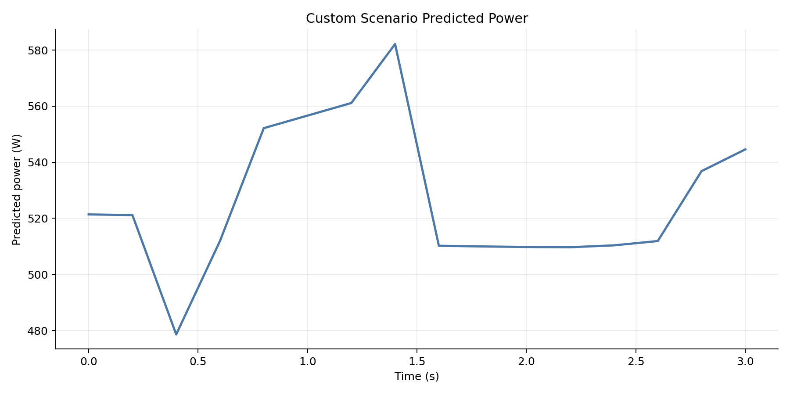

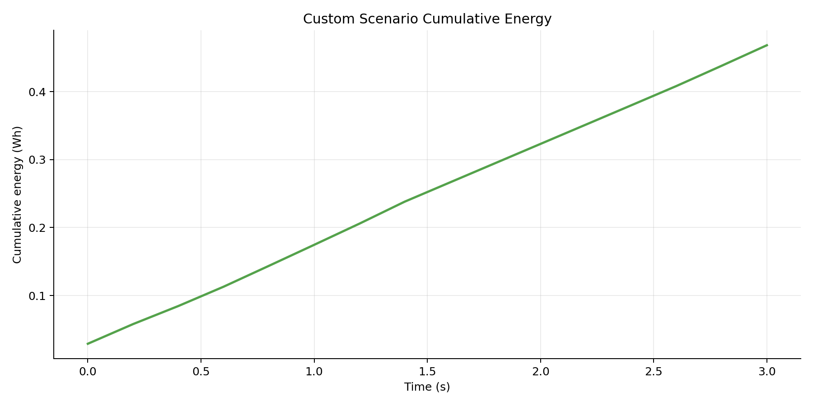

自定义工况结果只表示模型推演，不替代真实飞行测试。当前自定义输入共 16 个采样点，平均预测功率 526.7811 W，最大预测功率 582.1537 W，累计预测能耗 0.46825 Wh。

## 9. 复核和运行顺序

```powershell
python main.py train
python main.py evaluate
python main.py visualize
python main.py predict
```

复核时先对照两个版本的 `dataset_summary.json`，再对照 `tuning_results_1.0.csv` 与 `tuning_results_2.0.csv`，最后在相同指标和单位下比较 `evaluation_1.0.csv` 与 `evaluation_2.0.csv`。功率散点、分段表和 flight 汇总应结合阅读，以区分稳定巡航误差、低功率段误差和动态切换误差。
