# 四轴无人机飞行能耗预测模型 3.0

## 1. 版本作用

3.0 保留 2.1 的 22 维 TCN 输入、TCN 结构、时间窗候选、RLS 候选参数、按 flight 切分数据、预测区间和自定义工况功能。新增内容是：按照不固定采样间隔计算每个 flight 的每秒真实能量；TCN 仍输出逐采样点功率；RLS 在完整 1 秒窗口结束后使用能量监督更新；最终输出逐点功率、每秒能量和累计能量。

## 2. 运行配置

在 `3.0` 目录执行：

```bash
python main.py all --device cuda
```

本次运行使用 CUDA，TCN 候选和最终训练均为 80 个 epoch。其他初始数据和 2.1 保持一致：R1 航线、随机种子 42、22 个输入特征、批大小 2048、学习率 `3e-4`、权重衰减 `1e-4`、TCN 通道 `[64,64,64,32]`、卷积核 3、Dropout 0.08、Huber 参数 0.65。

## 3. 数据处理

原始数据读取自 `D:/Python-files/Energy-prediction/data`。本次读取 257896 条原始记录，保留 R1 航线后得到 227551 条有效采样记录、182 个 flight。train/val/test 分别为 158625/32820/36106 条，对应 126/28/28 个 flight。

采样间隔由同一 flight 内相邻 `time` 差值计算，异常间隔使用训练数据有效间隔中位数补齐。功率由电压和非负放电电流计算，采样间隔能量为 `power_w * dt_seconds / 3600`。每秒窗口使用 `floor(time)` 编号，并按 `dt_seconds` 加权求和。

主要数据文件：

- `out/data/processed_3.0/uav_energy_features.csv`：逐采样点清洗和特征表。
- `out/data/processed_3.0/second_energy_3.0.csv`：每个 flight 的每个秒级窗口真实能量表。
- `out/data/processed_3.0/train.csv`、`val.csv`、`test.csv`：按完整 flight 切分的数据。
- `out/data/processed_3.0/feature_metadata.json`：输入特征和字段说明。
- `out/data/processed_3.0/dataset_summary.json`：数据规模和版本摘要。

## 4. TCN 训练和窗口选择

TCN 输入不直接使用真实每秒能量，输入仍为 2.1 的 22 维工况特征；TCN 输出每个采样点的 `power_w` 预测。时间窗候选为 0.25、0.5、1、2、4、6、8、10、12、16 秒，对应 2、4、8、17、33、50、67、83、100、133 步。4 秒位于第 5 个候选，避免把候选上界同时当作默认最优。

逐点功率训练损失仍使用 Huber 损失。每个候选训练 80 个 epoch，不使用调参阶段早停。窗口选择同时考虑逐点功率、秒级能量和 flight 总能量：

$$S_{TCN}=WAPE_{second}+0.2WAPE_{sample}+0.5WAPE_{flight}$$

其中：

$S_{TCN}$：TCN 窗口选择价值函数，越小越好。

$WAPE_{second}$：验证集秒级能量 WAPE。

$WAPE_{sample}$：验证集采样点功率 WAPE。

$WAPE_{flight}$：验证集按 flight 汇总能量 WAPE。

本次最优窗口为 `2.0 s / 17 步`，TCN 选择分数为 `7.38557800`，对应秒级能量 WAPE `5.06666542%`，采样点功率 WAPE `7.17943963%`，flight 能量 WAPE `1.76604930%`。10 个候选的完整结果保存在 `out/model/tuning_results_3.0.csv`。

## 5. 秒级能量和 RLS 数据流

每个 flight 开始时初始化 RLS 参数和协方差矩阵。当前 1 秒窗口内，TCN 对全部采样点逐点预测功率，RLS 使用窗口开始前的参数校正这些功率。窗口内参数不更新。

窗口结束后，程序使用每个采样点的实际 `dt_seconds` 积分 TCN 功率、RLS 校正功率和真实功率，分别得到 `tcn_second_energy_wh`、`predicted_second_energy_wh` 和 `actual_second_energy_wh`。真实能量在窗口结束前不可用，因此不会参与当前窗口的功率校正。

RLS 将窗口预测能量和真实能量换算为窗口平均功率，再进行仿射回归：

$$\bar{P}_{f,k}^{true}\approx\theta_{0,f,k}+\theta_{1,f,k}\bar{P}_{f,k}^{pred}$$

其中：

$\bar{P}_{f,k}^{true}$：真实能量除以窗口实际时长得到的真实平均功率。

$\bar{P}_{f,k}^{pred}$：当前窗口预测能量除以窗口实际时长得到的预测平均功率。

$\theta_{0,f,k}$：RLS 的功率偏置参数。

$\theta_{1,f,k}$：RLS 的功率缩放参数。

$f$：flight 编号；每个 flight 独立重置 RLS。

$k$：当前秒级窗口编号。

更新完成后，`theta_{f,k+1}` 只用于下一个窗口。最后一个窗口更新的参数不会反向修改已经输出的结果。

## 6. RLS 超参数搜索

搜索固定最优 TCN 窗口的验证集预测，不重复训练 TCN。72 组候选均按以下顺序运行：按 flight 排序并重置 RLS；逐窗口预测；窗口结束后积分能量；使用当前窗口真实能量更新；将新参数传给下一个窗口。

每个 flight 先计算独立价值函数，再对 28 个验证 flight 等权平均：

$$S_{RLS,f}=WAPE_{second,f}+0.2WAPE_{sample,f}+0.5WAPE_{flight,f}$$

$$S_{RLS}=\frac{1}{N_{flight}}\sum_f S_{RLS,f}$$

其中：

$S_{RLS,f}$：单个 flight 的 RLS 价值函数。

$S_{RLS}$：所有验证 flight 的汇总价值函数。

$N_{flight}$：验证集 flight 数量，本次为 28。

$WAPE_{second,f}$：单个 flight 的秒级能量误差。

$WAPE_{sample,f}$：单个 flight 的逐点功率误差。

$WAPE_{flight,f}$：单个 flight 总能量误差。

上一轮 72 组搜索选择：遗忘因子 `0.97`、初始协方差 `10`、预热 `0.1 s`，汇总价值函数为 `6.68360866`。手动重训时使用新的 `7 × 7 × 6 = 294` 组预选范围：遗忘因子 `0.90、0.93、0.95、0.96、0.97、0.98、0.99`，初始协方差 `1、2.5、5、10、25、50、100`，预热 `0、0.05、0.1、0.25、0.5、1.0 s`。新结果仍写入 `out/model/rls_tuning_results_3.0.csv`，重新训练后应以新的验证集汇总分数更新本节结果。

## 7. 最终训练、测试和结果

固定 `2.0 s / 17 步` 和上述 RLS 参数后，最终 TCN 训练 80 个 epoch，最佳验证损失为 `0.02064699`，出现在第 30 个 epoch。测试集只在超参数全部固定后运行一次。

| 指标 | TCN | TCN + 秒级能量 RLS | 单位 |
|---|---:|---:|---|
| 样本功率 MAE | 33.3710 | 31.6002 | W |
| 样本功率 RMSE | 50.6321 | 49.1276 | W |
| 样本功率 R2 | 0.9492 | 0.9522 | 无量纲 |
| 样本功率 WAPE | 8.2143 | 7.7784 | % |
| flight 能耗 MAE | 0.5225 | 0.2492 | Wh |
| flight 能耗 RMSE | 0.7106 | 0.3423 | Wh |
| flight 能耗 R2 | 0.9771 | 0.9947 | 无量纲 |
| flight 能耗 WAPE | 2.3879 | 1.1391 | % |

RLS 后 flight 能耗 MAE 从 `0.5225 Wh` 降至 `0.2492 Wh`，WAPE 从 `2.3879%` 降至 `1.1391%`；样本功率 WAPE 从 `8.2143%` 降至 `7.7784%`。测试集包含 36106 条记录和 28 个 flight。95% 功率预测区间覆盖率为 `94.3084%`，平均宽度为 `169.9646 W`；flight 能耗区间覆盖率为 `100%`，平均宽度为 `9.1514 Wh`。RLS 的主要作用仍是窗口级能量一致性校正，不保证每个采样点误差指标全部同步改善。

## 8. 结果图展示与分析

本节嵌入本次 3.0 实际运行生成的全部结果图。训练图用于检查候选窗口和最终模型的选择过程，评估图用于检查测试集整体误差，预测图用于观察逐点功率、每秒能量以及典型 flight 的时间变化。

### 8.1 TCN 窗口候选和训练过程

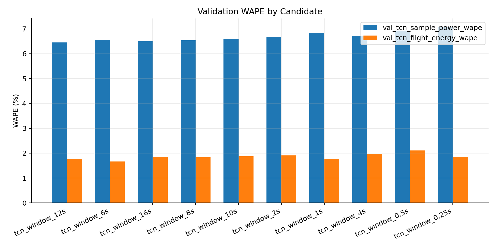

图中比较了 10 个 TCN 时间窗候选的验证集误差。2.0 s 候选的综合选择分数为 `7.38557800`，低于其余候选，因此最终采用 2.0 s、17 步输入窗口。候选并非随时间窗变长而单调改善，说明扩大历史范围后，新增历史信息与模型训练误差之间存在权衡。

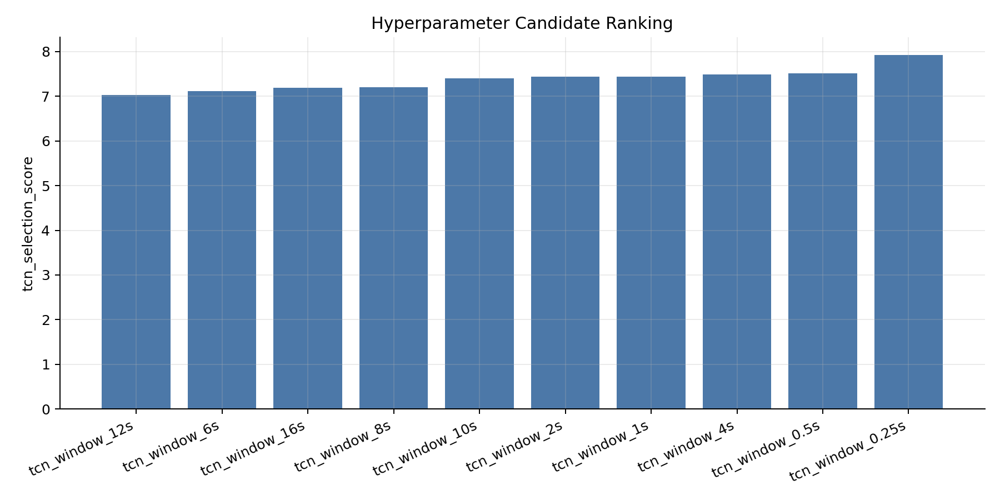

该图展示候选方案的排序结果。TCN 的排序依据包含采样点功率、每秒能量和 flight 总能量三个层次；RLS 的排序依据为 28 个验证 flight 的等权汇总价值函数。最终 TCN 选中 2.0 s，RLS 选中遗忘因子 `0.97`、初始协方差 `10`、预热 `0.1 s`，RLS 汇总分数为 `6.68360866`。

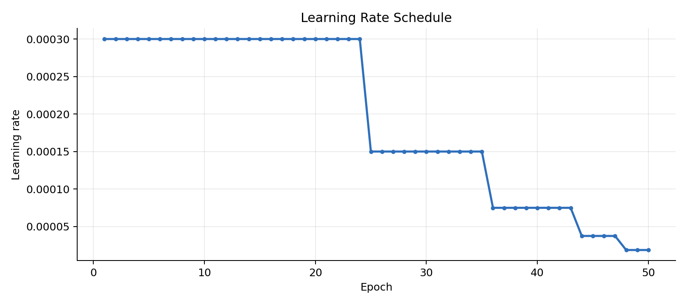

学习率曲线反映训练过程中优化步长的变化。候选模型和最终模型使用同一套学习率调度，便于比较不同时间窗，而不会把学习率变化误认为时间窗带来的差异。

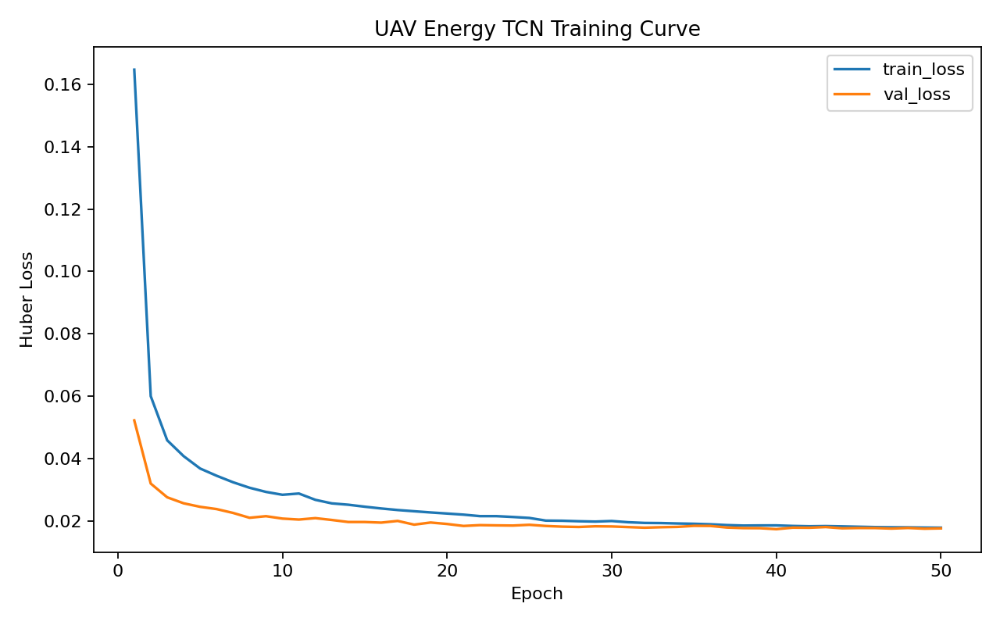

最终训练共运行 80 个 epoch，最佳验证损失为 `0.02064699`，出现在第 30 个 epoch。后续 epoch 仍按要求完成训练，但模型选择使用最佳验证状态，避免最后一轮参数偶然波动影响测试结果。

### 8.2 测试集总体结果

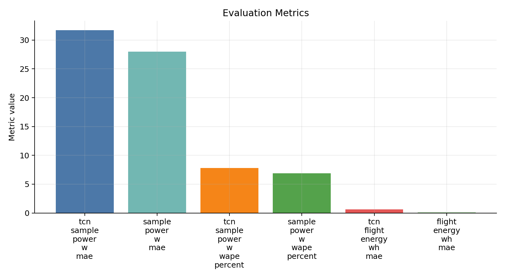

总体评估图同时比较 TCN 原始功率输出和加入秒级能量 RLS 后的结果。RLS 后样本功率 WAPE 由 `8.2143%` 降至 `7.7784%`，flight 能耗 WAPE 由 `2.3879%` 降至 `1.1391%`。flight 能耗 MAE 由 `0.5225 Wh` 降至 `0.2492 Wh`，R2 由 `0.9771` 提升至 `0.9947`，说明能量监督对跨 flight 的总能量一致性改善更明显。

### 8.3 功率预测图

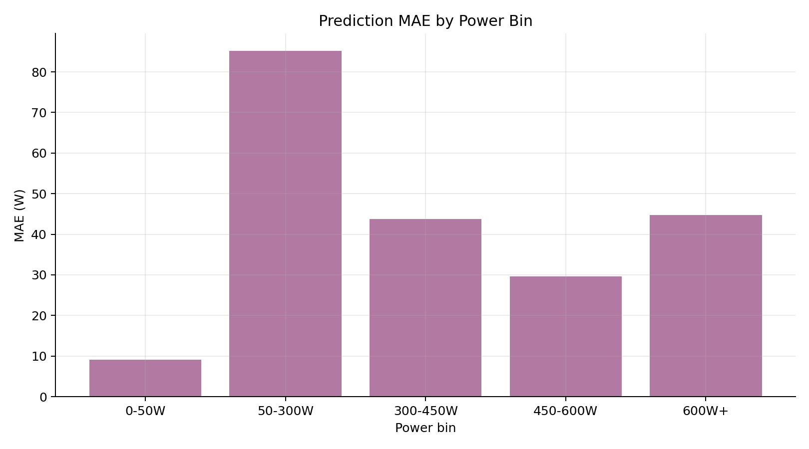

功率分箱图按真实功率区间统计 MAE，用来检查误差是否集中在某一功率范围。低功率段的相对误差容易被接近 0 的分母放大，因此应结合 MAE、WAPE 和散点图共同判断，不能仅凭低功率段的 MAPE 排名评价模型。

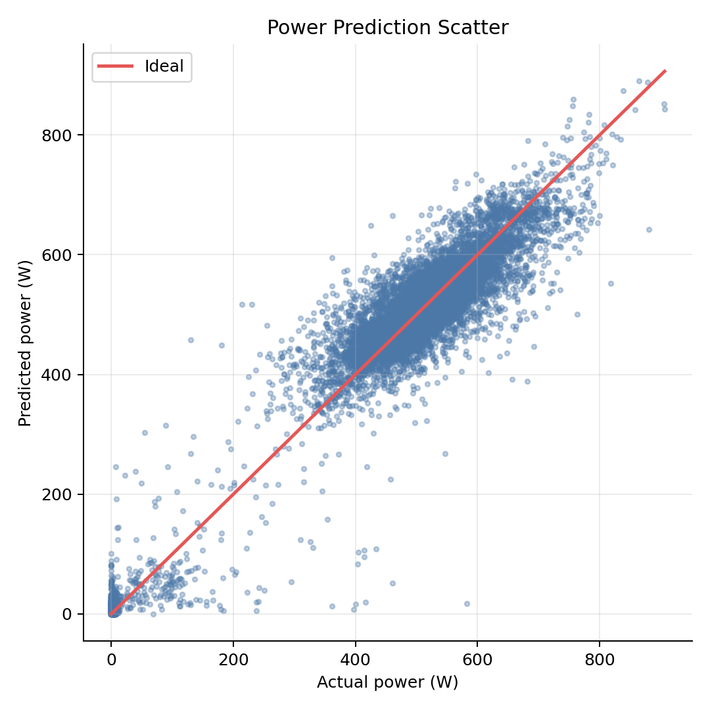

散点图以真实功率为横轴、预测功率为纵轴，并绘制理想线。点云整体围绕理想线分布，与测试集样本功率 R2 `0.9522` 和 RMSE `49.1276 W` 相对应。偏离理想线的点主要反映逐采样点动态变化和传感器噪声；RLS 的校正目标是窗口能量，不应被解释为逐点功率曲线的重新训练。

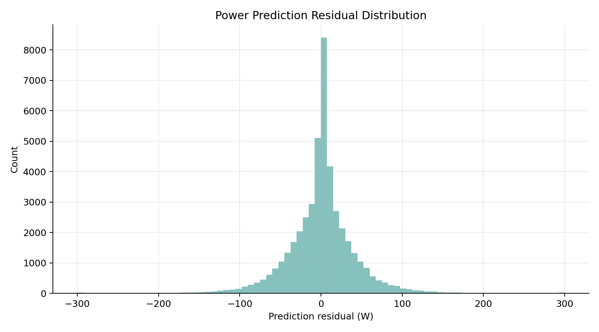

残差直方图用于观察功率误差的中心位置和离散程度。残差主体集中在 0 附近时，表示整体偏置受到控制；两侧较长尾部说明仍存在少量快速变化或高功率工况难以完全拟合。RLS 后样本功率 MAE 为 `31.6002 W`、RMSE 为 `49.1276 W`，因此其改善体现为误差整体收窄，而不是消除全部尖峰误差。

### 8.4 flight 总能量结果

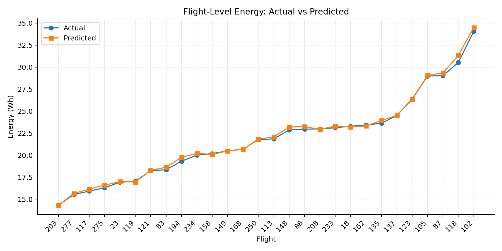

图中逐个比较测试 flight 的真实总能量、TCN 汇总能量和 RLS 校正能量。RLS 曲线更贴近真实值，且 flight 级 R2 达到 `0.9947`。这与算法的监督方式一致：RLS 在每个完整 1 秒窗口结束后利用真实能量更新参数，更新后的参数只传递给下一窗口，因此能逐步修正累计能量偏差。

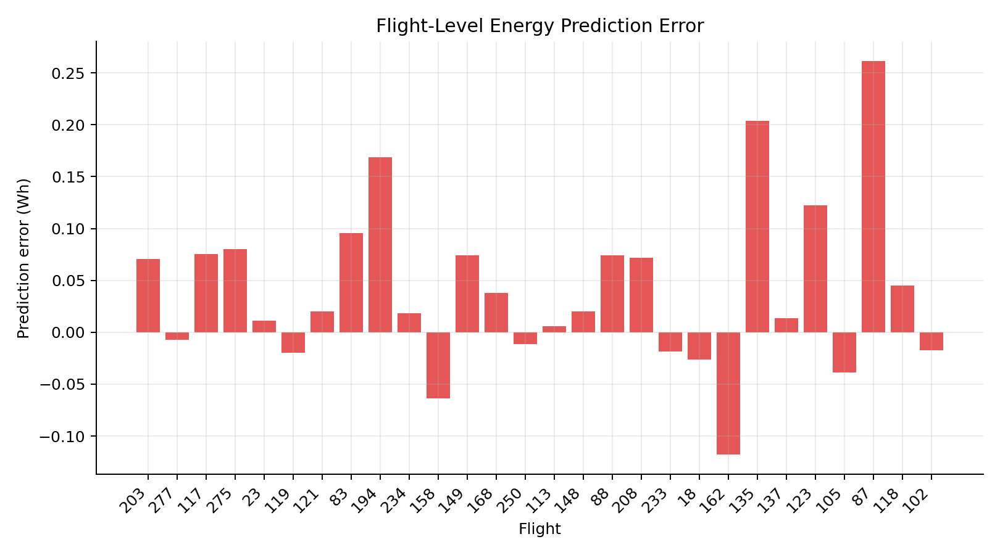

误差图展示每个 flight 的总能量误差及校正前后差异。不同 flight 的误差并不完全一致，这是飞行工况、持续时间和功率变化幅度差异共同造成的；评价时采用全部 28 个测试 flight 汇总的 MAE、RMSE、R2 和 WAPE，而不是只选取误差较小的 flight。

### 8.5 典型 flight 的逐点功率曲线

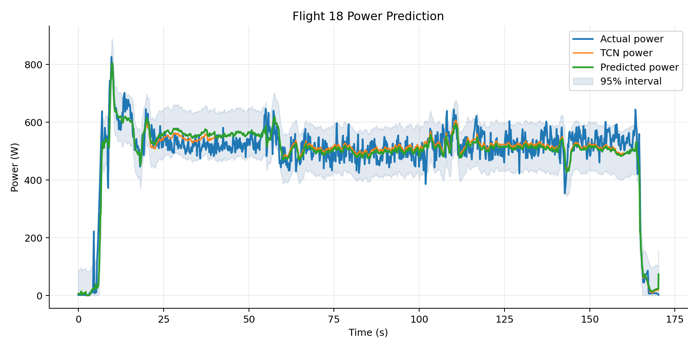

flight 18 的曲线用于观察一个测试 flight 内部的逐采样点功率跟踪情况。TCN 输出保留了原始采样时间轴，RLS 校正曲线在窗口边界后逐步调整，参数更新不会回写已经结束的窗口。

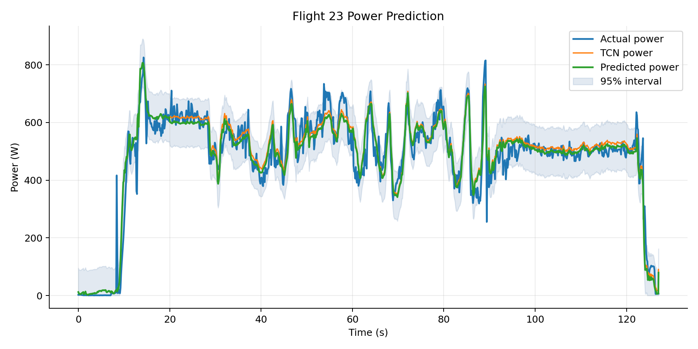

flight 23 展示另一种功率变化过程。曲线之间的局部差异说明 RLS 并非固定比例缩放，而是根据已经结束窗口的能量误差更新仿射参数，再作用于后续窗口。

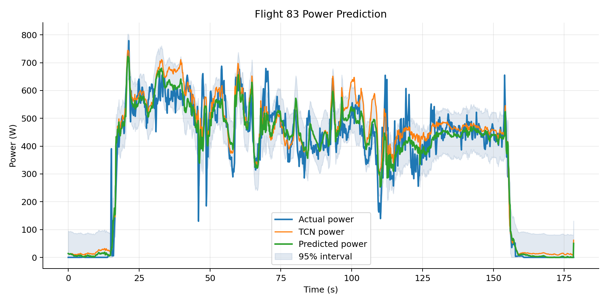

flight 83 用于补充不同 flight 的工况对比。三个典型 flight 的曲线共同说明：TCN 负责逐点功率预测，RLS 负责利用秒级反馈修正后续窗口，二者输出应分别保留，便于区分基础预测误差和在线校正效果。

### 8.6 每秒能量图

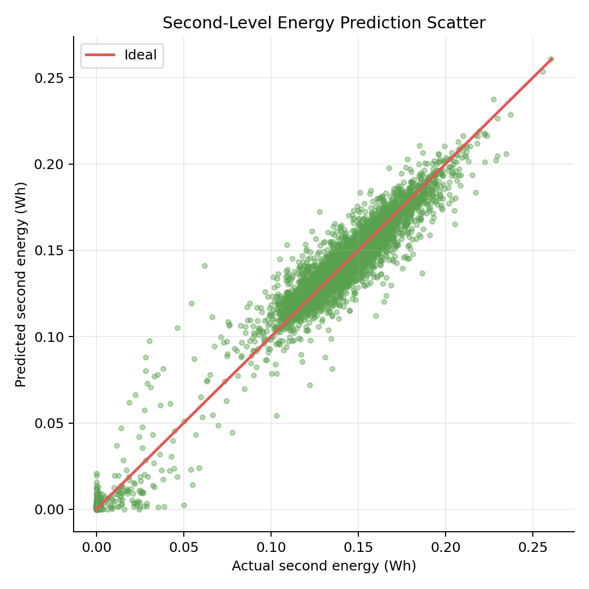

该散点图以真实每秒能量为横轴、RLS 校正后的每秒预测能量为纵轴，并以理想线作为参照。点云越接近理想线，表示窗口级能量积分越准确。每秒能量使用不固定采样间隔 `dt_seconds` 加权计算，因而图中反映的是实际时间积分结果，而不是简单的样本数量求和。

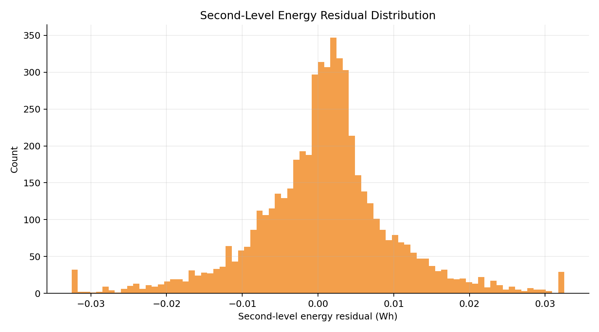

每秒能量残差直方图检查窗口级误差是否围绕 0 集中。与功率残差相比，秒级积分会平滑部分采样噪声，但快速功率变化、窗口边界采样不完整和飞行状态突变仍可能形成尾部。该图与测试集 flight 能耗 WAPE `1.1391%` 一起说明，RLS 的能量反馈对累计能耗校正有效。

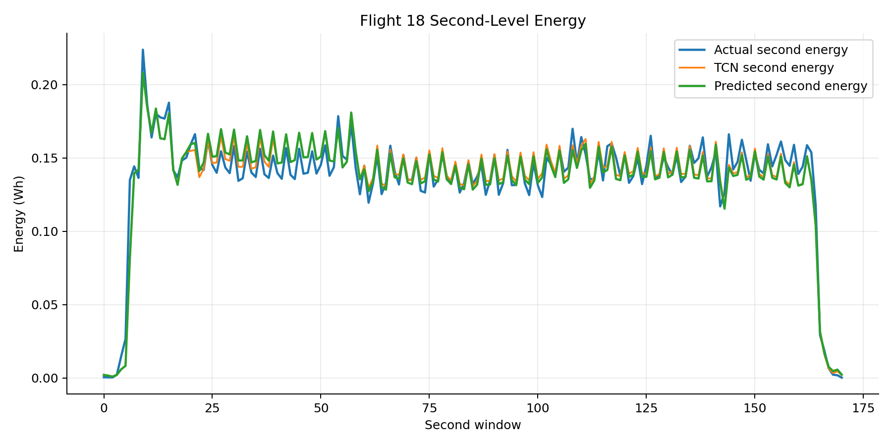

flight 18 的每秒能量曲线把逐点功率压缩为 1 秒窗口积分结果。真实能量只能在窗口结束后形成，因此当前窗口的真实值不会参与当前窗口校正，RLS 更新从下一窗口开始体现。

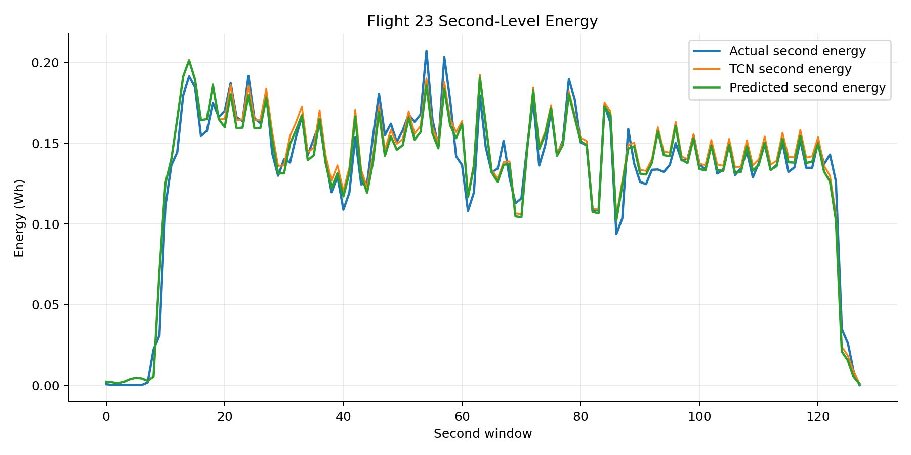

flight 23 的窗口曲线用于观察不同能量水平下的跟踪效果。TCN 原始能量和 RLS 校正能量同时保留，能够区分 TCN 的积分误差与在线仿射修正带来的变化。

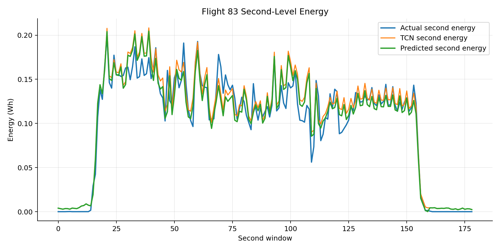

flight 83 的结果补充了典型 flight 对比。每秒能量图比逐点功率图更适合检查能量守恒和窗口级反馈效果，最终累计能量则由这些窗口能量逐段累加得到。

### 8.7 自定义展示航线

本次在 `out/custom` 中生成一条固定的 R1 展示航线，编号为 `999001`，总时长 180 s，输出间隔 1 s。航线剖面由三个阶段组成：0～约 27 s 起飞，约 27～153 s 巡航，约 153～180 s 降落。输入条件为风速 4 m/s、风向 0°、巡航速度 8 m/s、载荷 250 g、飞行高度 50 m。

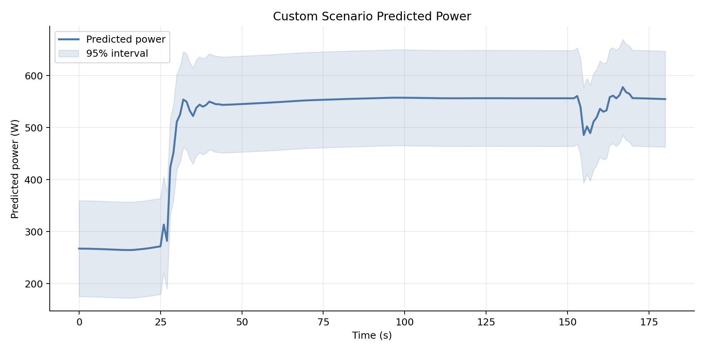

图中展示该航线的逐采样点功率预测和 95% 预测区间。蓝色曲线是经过 checkpoint 中 RLS 仿射参数校正后的预测功率，阴影是功率区间。起飞和降落阶段的垂直速度变化会改变实际速度、相对空速和热负载代理量，因此预测功率随航线阶段发生变化。


图中展示逐点预测功率按 `dt_seconds` 积分后的累计能耗及 95% 区间。本次共 181 个采样点，平均预测功率为 `506.1544 W`，最大预测功率为 `577.6692 W`，累计预测能耗为 `25.4483 Wh`，95% 区间为 `20.8112～30.0854 Wh`。

自定义航线的处理顺序与真实测试一致：先根据工况生成 22 维输入特征；TCN 输出逐采样点功率；再使用固定的 RLS 参数进行功率校正；最后按每个采样点的 `dt_seconds` 计算预测能量并累加。该航线没有真实电压、电流和真实功率，所以不能计算 MAE、RMSE、R2 或 WAPE，结果只用于模型推演、接口测试和算法展示，不替代真实飞行测试。

自定义产物如下：`custom_scenarios_3.0.csv` 保存航线输入，`custom_predictions_3.0.csv` 保存 TCN/RLS 预测和能量字段，`custom_prediction_summary_3.0.json` 保存摘要指标；对应图片位于 `out/figures/custom/`。

## 9. 输出文件

- `out/model/tuning_results_3.0.csv`：10 个 TCN 窗口的 80 轮训练结果和能量选择指标。
- `out/model/rls_tuning_results_3.0.csv`：RLS 候选参数的验证价值函数；当前预选网格为 294 组。
- `out/model/training_log_3.0.csv`：TCN 候选和最终训练日志。
- `out/model/evaluation_3.0.json/csv`：测试集总体指标。
- `out/model/flight_energy_summary_3.0.csv`：按 flight 汇总的真实、TCN 和 RLS 能量。
- `out/model/second_energy_evaluation_3.0.csv`：按 flight 和秒级窗口的能量对比及误差。
- `out/predictions/test_predictions_3.0.csv`：逐采样点功率、每秒能量、累计能量和预测区间。
- `out/figures/prediction/flight_*_power_timeseries.png`：逐点功率对比图。
- `out/figures/prediction/flight_*_second_energy_timeseries.png`：每秒能量真实值与预测值对比图。
- `out/figures/prediction/second_energy_prediction_scatter.png`：真实每秒能量与预测每秒能量的散点图及理想线。
- `out/figures/prediction/second_energy_residual_histogram.png`：每秒能量残差直方图。
- `out/figures/results/flight_energy_actual_vs_predicted.png`：flight 总能量对比图。
- `out/figures/results/flight_energy_error.png`：flight 总能量误差图。
- `out/custom/custom_scenarios_3.0.csv`：固定参数生成的 R1 自定义展示航线输入。
- `out/custom/custom_predictions_3.0.csv`：自定义航线的 TCN 功率、RLS 校正功率、预测能量和累计能量。
- `out/custom/custom_prediction_summary_3.0.json`：自定义航线预测摘要和置信区间。
- `out/figures/custom/custom_power_timeseries.png`：自定义航线功率及预测区间。
- `out/figures/custom/custom_cumulative_energy.png`：自定义航线累计能耗及预测区间。

## 10. 文件调用关系

`main.py` 调度全流程；`config.py` 统一管理路径、参数和版本化文件名；`data_utils.py` 下载、清理数据、计算不规则采样间隔并生成秒级能量表；`model.py` 定义因果 TCN 和窗口能量监督 RLS；`train.py` 执行 TCN 窗口搜索、RLS 搜索和最终训练；`predict.py` 生成逐点、秒级和累计能量字段；`evaluate.py` 生成测试指标及两个能量汇总文件；`visualize.py` 生成训练、功率、秒级能量和 flight 能量图表；`uncertainty.py` 保留 2.1 的预测区间校准功能。

## 11. 3.0 需求与数据流记录

3.0 的约束来自前期设计讨论并全部落实：真实每秒能量只能在窗口结束时得到；当前窗口不能使用当前窗口真实能量更新 RLS；更新后的参数只传给下一个窗口；TCN 输入不增加真实每秒能量，继续使用 2.1 的 22 维输入；每秒能量既参与 TCN/RLS 超参数选择，也作为在线流程的反馈监督，但 TCN 始终输出逐采样点功率；原始采样频率不固定，能量计算必须使用每个样本的 `dt_seconds`；每个 flight 独立重置 RLS；最终同时输出功率曲线、每秒能量曲线、累计能量曲线及真实值对比；3.0 与 2.0 并列保存，不能覆盖 2.0；运行时检查 `out/data`，缺失或不符合标准时从 D 盘原始数据重建；TCN 候选训练和最终训练均为 80 epoch。

数据传输顺序为：原始电压、电流、飞行状态和时间字段进入清洗与特征工程，计算不规则时间间隔和真实功率；真实功率与 `dt_seconds` 相乘后除以 3600 得到采样区间能量，再按 `flight + floor(time)` 汇总成真实每秒能量。TCN 接收 22 维序列特征，经过标准化、因果卷积和残差块后输出逐采样点功率。在线运行时，当前 1 秒窗口内的每个功率点先使用窗口开始前的仿射参数校正，同时保留未校正 TCN 输出；窗口结束后分别积分 TCN 功率、校正功率和真实功率，形成三列每秒能量。RLS 将校正前预测能量与真实能量换算为平均功率，计算窗口误差并更新偏置和缩放参数；更新结果不回写当前窗口，只传递到下一窗口。最后，逐点功率、窗口能量和累计能量分别写入预测表，评估层再生成样本级、秒级、flight 级指标和图表。

## 12. 变量解释

| 变量 | 含义 | 单位 |
|---|---|---|
| $P_{f,i}^{true}$ | flight $f$ 的第 $i$ 个样本真实功率 | W |
| $\Delta t_{f,i}$ | 该样本对应的不规则采样间隔 | s |
| $E_{f,k}^{true}$ | flight $f$ 第 $k$ 个完整 1 秒窗口真实能量 | Wh |
| $E_{f,k}^{TCN}$ | TCN 逐点功率积分得到的窗口能量 | Wh |
| $E_{f,k}^{RLS}$ | RLS 校正功率积分得到的窗口能量 | Wh |
| $\theta_{0,f,k}$ | 当前窗口使用的功率偏置参数 | W |
| $\theta_{1,f,k}$ | 当前窗口使用的功率缩放参数 | 无量纲 |
| $\lambda$ | RLS 遗忘因子，本次为 0.97 | 无量纲 |
| $\mathbf P_{f,k}$ | 当前 flight 的 RLS 协方差矩阵 | 参数协方差 |
| $T_w$ | TCN 输入时间窗，本次最优为 2 s | s |

变量使用 GitHub 可渲染的 $...$ 数学格式，独立公式使用 $$...$$，不再把数学表达式放在代码反引号中。
