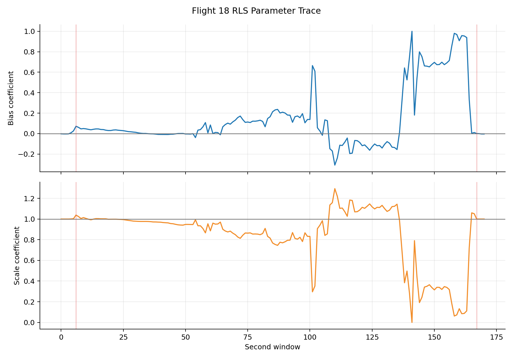

# 四轴无人机飞行能耗预测模型 3.0

## 1. 版本作用

3.0 将原始记录按 flight 重采样到统一 0.12 s 网格，并在原 22 维工况特征上加入 `dt_seconds`，形成 23 维时间感知输入。TCN 仍输出逐点功率，但完整秒窗口能量差会反向传播更新 TCN；RLS 根据 TCN 功率判断停机/飞行状态，状态切换时恢复偏置 0、缩放 1。

## 2. 运行配置

在 `3.0` 目录执行：

```bash
python main.py all --device cuda
```

本次运行使用 CUDA，TCN 候选和最终训练均为 80 个 epoch。其他初始数据和 2.1 保持一致：R1 航线、随机种子 42、22 个输入特征、批大小 2048、学习率 `3e-4`、权重衰减 `1e-4`、TCN 通道 `[64,64,64,32]`、卷积核 3、Dropout 0.08、Huber 参数 0.65。

## 3. 数据处理

固定采样原表位于 `D:/Python-files/Energy-prediction/data/dji_matrice_100`，重采样后共有 322904 条、209 个 flight；项目保留 R1 后得到 284758 条、182 个 flight。train/val/test 分别为 198469/41052/45237 条，对应 126/28/28 个 flight。

采样间隔由同一 flight 内相邻 `time` 差值计算，异常间隔使用训练数据有效间隔中位数补齐。功率由电压和非负放电电流计算，采样间隔能量为 `power_w * dt_seconds / 3600`。每秒窗口使用 `floor(time)` 编号，并按 `dt_seconds` 加权求和。

主要数据文件：

- `out/data/processed_3.0/uav_energy_features.csv`：逐采样点清洗和特征表。
- `out/data/processed_3.0/second_energy_3.0.csv`：每个 flight 的每个秒级窗口真实能量表。
- `out/data/processed_3.0/train.csv`、`val.csv`、`test.csv`：按完整 flight 切分的数据。
- `out/data/processed_3.0/feature_metadata.json`：输入特征和字段说明。
- `out/data/processed_3.0/dataset_summary.json`：数据规模和版本摘要。

## 4. TCN 训练和窗口选择

TCN 不直接输入真实每秒能量。输入为 2.1 的 22 维工况特征加 `dt_seconds`；时间门控层按真实间隔调节特征后进入因果卷积。训练批次保持完整秒窗口，联合损失为逐点功率 Huber 损失与 0.2 倍窗口能量 Huber 损失，能量差通过积分回传到窗口内全部功率输出。本次沿用历史调参选定的 `2.0 s / 17 步`。

逐点功率训练损失仍使用 Huber 损失。每个候选训练 80 个 epoch，不使用调参阶段早停。窗口选择同时考虑逐点功率、秒级能量和 flight 总能量：

$$
S_{TCN}=WAPE_{second}+0.2WAPE_{sample}+0.5WAPE_{flight}
$$

其中：

$S_{TCN}$：TCN 窗口选择价值函数，越小越好。

$WAPE_{second}$：验证集秒级能量 WAPE。

$WAPE_{sample}$：验证集采样点功率 WAPE。

$WAPE_{flight}$：验证集按 flight 汇总能量 WAPE。

本次最优窗口为 `2.0 s / 17 步`，TCN 选择分数为 `7.38557800`，对应秒级能量 WAPE `5.06666542%`，采样点功率 WAPE `7.17943963%`，flight 能量 WAPE `1.76604930%`。10 个候选的完整结果保存在 `out/model/tuning_results_3.0.csv`。

## 5. 秒级能量和 RLS 数据流

每个 flight 开始时 RLS 从中性参数 `[0,1]` 和初始协方差开始。系统以当前窗口 TCN 平均功率是否达到 50 W 判断状态，0 为停机、1 为飞行；状态改变时恢复偏置 0、缩放 1。当前窗口内参数不更新。

窗口结束后，程序使用每个采样点的实际 `dt_seconds` 积分 TCN 功率、RLS 校正功率和真实功率，分别得到 `tcn_second_energy_wh`、`predicted_second_energy_wh` 和 `actual_second_energy_wh`。真实能量在窗口结束前不可用，因此不会参与当前窗口的功率校正。

RLS 将窗口预测能量和真实能量换算为窗口平均功率，再进行仿射回归：

$$
\bar{P}_{f,k}^{true}\approx\theta_{0,f,k}+\theta_{1,f,k}\bar{P}_{f,k}^{pred}
$$

其中：

$\bar{P}_{f,k}^{true}$：真实能量除以窗口实际时长得到的真实平均功率。

$\bar{P}_{f,k}^{pred}$：当前窗口预测能量除以窗口实际时长得到的预测平均功率。

$\theta_{0,f,k}$：RLS 的功率偏置参数。

$\theta_{1,f,k}$：RLS 的功率缩放参数。

$f$：flight 编号；每个 flight 独立重置 RLS。

$k$：当前秒级窗口编号。

更新完成后，`theta_{f,k+1}` 只用于下一个窗口。最后一个窗口更新的参数不会反向修改已经输出的结果。

## 6. RLS 超参数搜索

搜索固定最优 TCN 窗口的验证集预测，不重复训练 TCN。72 组候选均按以下顺序运行：按 flight 排序并重置 RLS；逐窗口预测；窗口结束后积分能量；使用当前窗口真实能量更新；将新参数传给下一个窗口。

每个 flight 先计算独立价值函数，再对 28 个验证 flight 等权平均：

$$
S_{RLS,f}=WAPE_{second,f}+0.2WAPE_{sample,f}+0.5WAPE_{flight,f}
$$

$$
S_{RLS}=\frac{1}{N_{flight}}\sum_f S_{RLS,f}
$$

其中：

$S_{RLS,f}$：单个 flight 的 RLS 价值函数。

$S_{RLS}$：所有验证 flight 的汇总价值函数。

$N_{flight}$：验证集 flight 数量，本次为 28。

$WAPE_{second,f}$：单个 flight 的秒级能量误差。

$WAPE_{sample,f}$：单个 flight 的逐点功率误差。

$WAPE_{flight,f}$：单个 flight 总能量误差。

新网格为 196 组：遗忘因子 `0.86、0.88、0.90、0.91、0.92、0.94、0.96`，初始协方差 `0.01、0.025、0.05、0.1、0.25、0.5、1.0`，预热 `0、1、2、3` 个完整窗口。价值函数增加 flight 能量误差 95 分位和 flight 间标准差惩罚。最优为 `0.91 / 0.25 / 0窗口`，分数 `6.12551123`；两个连续参数均位于区间内部，没有碰壁。

## 7. 最终训练、测试和结果

固定 `2.0 s / 17 步` 后，TCN 第 63 轮早停，最佳权重来自第 53 轮，验证联合损失 `0.01641463`。测试集共 45237 条、28 个 flight。


| 指标             |     TCN | TCN + 秒级能量 RLS | 单位   |
| ---------------- | ------: | -----------------: | ------ |
| 样本功率 MAE     | 31.3320 |            27.7797 | W      |
| 样本功率 RMSE    | 46.1691 |            43.0377 | W      |
| 样本功率 R2      |  0.9574 |             0.9630 | 无量纲 |
| 样本功率 WAPE    |  7.7114 |             6.8371 | %      |
| flight 能耗 MAE  |  0.6119 |             0.0674 | Wh     |
| flight 能耗 RMSE |  0.8226 |             0.1135 | Wh     |
| flight 能耗 R2   |  0.9693 |             0.9994 | 无量纲 |
| flight 能耗 WAPE |  2.7966 |             0.3079 | %      |

RLS 后样本功率 WAPE 从 `7.7114%` 降至 `6.8371%`，flight 能耗 WAPE 从 `2.7966%` 降至 `0.3079%`。95% 功率区间覆盖率为 `93.6181%`，flight 能耗区间覆盖率为 `100%`。

## 8. 结果图展示与分析

本节嵌入本次 3.0 实际运行生成的全部结果图。训练图用于检查候选窗口和最终模型的选择过程，评估图用于检查测试集整体误差，预测图用于观察逐点功率、每秒能量以及典型 flight 的时间变化。

### 8.1 TCN 窗口候选和训练过程


图中比较了 10 个 TCN 时间窗候选的验证集误差。2.0 s 候选的综合选择分数为 `7.38557800`，低于其余候选，因此最终采用 2.0 s、17 步输入窗口。候选并非随时间窗变长而单调改善，说明扩大历史范围后，新增历史信息与模型训练误差之间存在权衡。


图中保留历史 TCN 窗口排序；新 RLS 最优为 `0.91 / 0.25 / 0窗口`，含尾部惩罚的汇总分数为 `6.12551123`。


学习率曲线反映训练过程中优化步长的变化。候选模型和最终模型使用同一套学习率调度，便于比较不同时间窗，而不会把学习率变化误认为时间窗带来的差异。


最终训练在第 63 轮早停，最佳验证联合损失 `0.01641463` 出现在第 53 轮。

### 8.2 测试集总体结果


RLS 后样本功率 WAPE 由 `7.7114%` 降至 `6.8371%`，flight 能耗 WAPE 由 `2.7966%` 降至 `0.3079%`，flight 能耗 R2 提升至 `0.9994`。

### 8.3 功率预测图


功率分箱图按真实功率区间统计 MAE，用来检查误差是否集中在某一功率范围。低功率段的相对误差容易被接近 0 的分母放大，因此应结合 MAE、WAPE 和散点图共同判断，不能仅凭低功率段的 MAPE 排名评价模型。


散点图以真实功率为横轴、RLS 功率为纵轴。测试集 R2 为 `0.9630`，RMSE 为 `43.0377 W`。


残差主体集中在 0 附近，两侧仍有快速变化形成的尾部。RLS 后样本功率 MAE 为 `27.7797 W`、RMSE 为 `43.0377 W`。

### 8.4 flight 总能量结果


图中逐个比较测试 flight 的真实总能量、TCN 汇总能量和 RLS 校正能量。RLS 曲线更贴近真实值，且 flight 级 R2 达到 `0.9947`。这与算法的监督方式一致：RLS 在每个完整 1 秒窗口结束后利用真实能量更新参数，更新后的参数只传递给下一窗口，因此能逐步修正累计能量偏差。


误差图展示每个 flight 的总能量误差及校正前后差异。不同 flight 的误差并不完全一致，这是飞行工况、持续时间和功率变化幅度差异共同造成的；评价时采用全部 28 个测试 flight 汇总的 MAE、RMSE、R2 和 WAPE，而不是只选取误差较小的 flight。

### 8.5 典型 flight 的逐点功率曲线


flight 18 的曲线用于观察一个测试 flight 内部的逐采样点功率跟踪情况。TCN 输出保留了原始采样时间轴，RLS 校正曲线在窗口边界后逐步调整，参数更新不会回写已经结束的窗口。


flight 23 展示另一种功率变化过程。曲线之间的局部差异说明 RLS 并非固定比例缩放，而是根据已经结束窗口的能量误差更新仿射参数，再作用于后续窗口。


flight 83 用于补充不同 flight 的工况对比。三个典型 flight 的曲线共同说明：TCN 负责逐点功率预测，RLS 负责利用秒级反馈修正后续窗口，二者输出应分别保留，便于区分基础预测误差和在线校正效果。

### 8.6 每秒能量图


该散点图以真实每秒能量为横轴、RLS 校正后的每秒预测能量为纵轴，并以理想线作为参照。点云越接近理想线，表示窗口级能量积分越准确。每秒能量使用不固定采样间隔 `dt_seconds` 加权计算，因而图中反映的是实际时间积分结果，而不是简单的样本数量求和。


每秒能量残差主要围绕 0 集中。状态突变仍会形成尾部；测试集 flight 能耗 WAPE 为 `0.3079%`。


flight 18 的每秒能量曲线把逐点功率压缩为 1 秒窗口积分结果。真实能量只能在窗口结束后形成，因此当前窗口的真实值不会参与当前窗口校正，RLS 更新从下一窗口开始体现。


flight 23 的窗口曲线用于观察不同能量水平下的跟踪效果。TCN 原始能量和 RLS 校正能量同时保留，能够区分 TCN 的积分误差与在线仿射修正带来的变化。


flight 83 的结果补充了典型 flight 对比。每秒能量图比逐点功率图更适合检查能量守恒和窗口级反馈效果，最终累计能量则由这些窗口能量逐段累加得到。

### 8.7 自定义展示航线

本次在 `out/custom` 中生成一条固定的 R1 展示航线，编号为 `999001`，总时长 180 s，输出间隔 1 s。航线剖面由三个阶段组成：0～约 27 s 起飞，约 27～153 s 巡航，约 153～180 s 降落。输入条件为风速 4 m/s、风向 0°、巡航速度 8 m/s、载荷 250 g、飞行高度 50 m。


图中展示该航线的逐采样点功率预测和 95% 预测区间。蓝色曲线是经过 checkpoint 中 RLS 仿射参数校正后的预测功率，阴影是功率区间。起飞和降落阶段的垂直速度变化会改变实际速度、相对空速和热负载代理量，因此预测功率随航线阶段发生变化。


图中展示逐点预测功率按 `dt_seconds` 积分后的累计能耗及 95% 区间。本次共 181 个采样点，平均预测功率为 `506.1544 W`，最大预测功率为 `577.6692 W`，累计预测能耗为 `25.4483 Wh`，95% 区间为 `20.8112～30.0854 Wh`。

自定义航线的处理顺序与真实测试一致：先根据工况生成 23 维输入特征；TCN 输出逐采样点功率；再使用固定的 RLS 参数进行功率校正；最后按 `dt_seconds` 计算能量并累加。该航线没有真实功率，所以不能计算误差指标，结果不替代真实飞行测试。

自定义产物如下：`custom_scenarios_3.0.csv` 保存航线输入，`custom_predictions_3.0.csv` 保存 TCN/RLS 预测和能量字段，`custom_prediction_summary_3.0.json` 保存摘要指标；对应图片位于 `figures/custom/`。

## 9. 输出文件

RLS 在线测试共产生 5442 个秒窗口和 61 次状态切换。偏置归一化系数均值为 `0.00697`、缩放系数均值为 `0.97398`；少量窗口触及裁剪边界，因此轨迹图用于识别局部剧烈校正，不能只看均值判断稳定性。



图中红色竖线表示停机/飞行状态切换。切换后偏置回到 0、缩放回到 1，随后仅由已经结束的完整窗口能量误差继续更新。

- `out/model/tuning_results_3.0.csv`：10 个 TCN 窗口的 80 轮训练结果和能量选择指标。
- `rls/rls_tuning_results_3.0.csv`：196 组 RLS 候选及尾部惩罚价值函数。
- `rls/rls_parameter_trace_3.0.csv`：逐 flight、逐秒窗口状态与参数轨迹。
- `rls/rls_parameter_statistics_3.0.csv`：逐 flight 参数统计。
- `out/model/training_log_3.0.csv`：TCN 候选和最终训练日志。
- `out/model/evaluation_3.0.json/csv`：测试集总体指标。
- `out/model/flight_energy_summary_3.0.csv`：按 flight 汇总的真实、TCN 和 RLS 能量。
- `out/model/second_energy_evaluation_3.0.csv`：按 flight 和秒级窗口的能量对比及误差。
- `out/predictions/test_predictions_3.0.csv`：逐采样点功率、每秒能量、累计能量和预测区间。
- `out/figures/prediction/flight_*_power_timeseries.png`：逐点功率对比图。
- `out/figures/prediction/flight_*_second_energy_timeseries.png`：每秒能量真实值与预测值对比图。
- `out/figures/prediction/second_energy_prediction_scatter.png`：真实每秒能量与预测每秒能量的散点图及理想线。
- `out/figures/prediction/second_energy_residual_histogram.png`：每秒能量残差直方图。
- `out/figures/results/flight_energy_actual_vs_predicted.png`：flight 总能量对比图。
- `out/figures/results/flight_energy_error.png`：flight 总能量误差图。
- `out/custom/custom_scenarios_3.0.csv`：固定参数生成的 R1 自定义展示航线输入。
- `out/custom/custom_predictions_3.0.csv`：自定义航线的 TCN 功率、RLS 校正功率、预测能量和累计能量。
- `out/custom/custom_prediction_summary_3.0.json`：自定义航线预测摘要和置信区间。
- `out/figures/custom/custom_power_timeseries.png`：自定义航线功率及预测区间。
- `out/figures/custom/custom_cumulative_energy.png`：自定义航线累计能耗及预测区间。

## 10. 文件调用关系

`main.py` 调度全流程；`config.py` 统一管理路径、参数和版本化文件名；`data_utils.py` 下载、清理数据、计算不规则采样间隔并生成秒级能量表；`model.py` 定义因果 TCN 和窗口能量监督 RLS；`train.py` 执行 TCN 窗口搜索、RLS 搜索和最终训练；`predict.py` 生成逐点、秒级和累计能量字段；`evaluate.py` 生成测试指标及两个能量汇总文件；`visualize.py` 生成训练、功率、秒级能量和 flight 能量图表；`uncertainty.py` 保留 2.1 的预测区间校准功能。

## 11. 3.0 需求与数据流记录

3.0 的约束来自前期设计讨论并全部落实：真实每秒能量只能在窗口结束时得到；当前窗口不能使用当前窗口真实能量更新 RLS；更新后的参数只传给下一个窗口；TCN 输入不增加真实每秒能量，继续使用 2.1 的 22 维输入；每秒能量既参与 TCN/RLS 超参数选择，也作为在线流程的反馈监督，但 TCN 始终输出逐采样点功率；原始采样频率不固定，能量计算必须使用每个样本的 `dt_seconds`；每个 flight 独立重置 RLS；最终同时输出功率曲线、每秒能量曲线、累计能量曲线及真实值对比；3.0 与 2.0 并列保存，不能覆盖 2.0；运行时检查 `out/data`，缺失或不符合标准时从 D 盘原始数据重建；TCN 候选训练和最终训练均为 80 epoch。

数据传输顺序为：固定网格数据进入特征工程，显式计算 `dt_seconds` 和真实功率，再按 `flight + floor(time)` 汇总真实秒级能量。TCN 接收 23 维序列，经时间门控和因果卷积输出逐点功率。当前窗口用旧 RLS 参数校正；窗口结束后分别积分 TCN、RLS 和真实功率，RLS 再用 TCN 窗口能量与真实能量更新参数。新参数只用于下一窗口，最终输出逐点、秒级和 flight 级结果。

## 12. 变量解释


| 变量              | 含义                                     | 单位       |
| ----------------- | ---------------------------------------- | ---------- |
| $P_{f,i}^{true}$  | flight$f$ 的第 $i$ 个样本真实功率        | W          |
| $\Delta t_{f,i}$  | 该样本对应的不规则采样间隔               | s          |
| $E_{f,k}^{true}$  | flight$f$ 第 $k$ 个完整 1 秒窗口真实能量 | Wh         |
| $E_{f,k}^{TCN}$   | TCN 逐点功率积分得到的窗口能量           | Wh         |
| $E_{f,k}^{RLS}$   | RLS 校正功率积分得到的窗口能量           | Wh         |
| $\theta_{0,f,k}$  | 当前窗口使用的功率偏置参数               | W          |
| $\theta_{1,f,k}$  | 当前窗口使用的功率缩放参数               | 无量纲     |
| $\lambda$         | RLS 遗忘因子，本次为 0.91                | 无量纲     |
| $\mathbf P_{f,k}$ | 当前 flight 的 RLS 协方差矩阵            | 参数协方差 |
| $T_w$             | TCN 输入时间窗，本次最优为 2 s           | s          |

---

## 13. 2026-09-07 全流程更新补充（最新结果）

本节是本次完整流程生成的追加记录。上文原有章节、历史参数、历史图表说明和历史指标均保留；本节只补充当前 `out` 目录中的最新产物，不能用上文历史结果替代本节结果。

### 13.1 运行顺序、终端输出与日志

在 `3.0` 目录直接执行 `python main.py` 即运行完整流程：

```text
prepare -> tune-tcn -> train-fixed -> tune-rls -> calibrate -> evaluate -> visualize
```

本次运行实际包含 `tune-tcn`。该阶段在终端逐个显示 10 个 TCN 时间窗候选、每个候选的 epoch 进度、验证集推理进度和每个窗口的测试结果；`train-fixed` 使用当前选定 TCN 参数正式训练，不重复搜索；`tune-rls` 固定正式 TCN，只搜索 RLS。终端还显示阶段耗时、当前损失、学习率、候选进度和 ETA。

结果 CSV/JSON 只保存 epoch 结果、候选结果、最优参数、评估指标和阶段摘要，动态进度条不写入结果日志；完整终端文本记录在 `./logs/terminal_3.0.log`。

### 13.2 超参数搜索记录

TCN 只用训练集训练、验证集选择，测试集最后才使用。搜索时间窗 `0.25、0.5、1、2、4、6、8、10、12、16 s`，每个候选固定训练 80 轮，不使用调参早停。选择分数为：

$$
S_{TCN}=WAPE_{second}+0.2WAPE_{sample}+0.5WAPE_{flight}
$$

最新最优为 `12 s / 100 步`，验证集采样点、秒级能量和 flight 能量 WAPE 分别为 `6.4503%`、`4.8466%` 和 `1.7613%`，综合分数 `7.017347`。完整候选结果见 `./model/tuning_results_3.0.csv`。

RLS 复用固定 TCN 的验证集预测，只搜索 7 个遗忘因子和 7 个初始协方差，共 49 组。`warmup` 不再作为参数选择项，所有候选的 `warmup_windows=0`，即窗口结束后立即更新。最新最优为 `forgetting_factor=0.90`、`initial_covariance=0.25`、`warmup=0`，选择分数 `6.481503`。完整候选结果见 `./rls/rls_tuning_results_3.0.csv`。

### 13.3 数据流和在线算法

原始记录按 flight 重采样到约 `0.12 s` 网格，显式计算 `dt_seconds`，再由电压和非负放电电流计算真实功率。每个完整 1 秒窗口按真实采样间隔积分：

$$
E_{f,k}=\sum_{i\in k}P_{f,i}\frac{\Delta t_{f,i}}{3600}
$$

TCN 接收 22 维工况特征加 `dt_seconds` 的 23 维序列，输出逐采样点功率。RLS 在当前窗口使用窗口开始前的参数：

$$
\hat{P}_{f,i}^{RLS}=\theta_{0,f,k}+\theta_{1,f,k}\hat{P}_{f,i}^{TCN}
$$

窗口结束后才获得当前窗口真实能量，并用该值更新参数；新参数只用于下一个窗口，不能回写当前窗口。每个 flight 独立初始化 RLS，状态切换时恢复中性参数，避免 flight 间参数泄漏。$f$ 为 flight 编号，$k$ 为秒窗口编号，$i$ 为窗口内样本编号，$\Delta t$ 单位为 s，功率单位为 W，能量单位为 Wh。

### 13.4 最新正式训练和测试指标

正式训练使用 `12 s / 100 步`，最多 80 轮，第 50 轮早停；第 40 轮验证联合损失最低，为 `0.017336`，保存该轮权重。最终 RLS 固定为 `0.90 / 0.25 / warmup=0`。测试集包含 45237 条记录、28 个 flight。

| 指标 | 纯 TCN | TCN + RLS | 单位 |
|---|---:|---:|---|
| 样本功率 MAE | 31.7382 | 27.9911 | W |
| 样本功率 RMSE | 46.7863 | 43.4546 | W |
| 样本功率 R2 | 0.9563 | 0.9623 | 无量纲 |
| 样本功率 WAPE | 7.8114 | 6.8892 | % |
| flight 能耗 MAE | 0.5968 | 0.0640 | Wh |
| flight 能耗 RMSE | 0.8423 | 0.0890 | Wh |
| flight 能耗 R2 | 0.9679 | 0.9996 | 无量纲 |
| flight 能耗 WAPE | 2.7277 | 0.2923 | % |

RLS 使样本功率 WAPE 相对下降 `11.81%`，flight 能耗 WAPE 相对下降 `89.28%`。测试集真实总能量为 `612.6634 Wh`，纯 TCN 为 `626.2884 Wh`，RLS 为 `613.8128 Wh`。能耗指标改善幅度高于逐点功率指标，原因是 RLS 直接使用完整窗口能量监督，主要修正累计偏差。

### 13.5 最新图表及数据分析


12 s 的验证选择分数最低；6 s 为 `7.132358`，16 s 为 `7.175536`。这说明窗口变长并不必然降低误差，历史信息量和模型拟合之间存在折中。


学习率图已修复为只读取正式 `final_tcn` 训练记录，不再混入 TCN 候选训练日志。当前 PNG 为 `1620×720`，正式训练学习率从 `3e-4` 衰减到 `1.875e-5`，横轴只对应正式 12 s 模型的 epoch。


`450--600 W` 是主体功率段，共 22870 条，RLS MAE `27.5046 W`、WAPE `5.3152%`。`300--450 W` 和 `600 W` 以上的 MAE 分别为 `39.4472 W` 和 `43.0195 W`；`50--300 W` 只有 859 条但 MAE 为 `96.9980 W`，常对应起降或切换。`0--50 W` 的 WAPE 为 `312.7965%`，原因是真实均值只有 `1.7965 W`，该段不能只看百分比。


逐点功率散点主体位于 `450--600 W`，全测试集 $R^2=0.9623$。残差主体接近 0，但 RMSE 高于 MAE，说明快速变化和状态切换样本形成了误差尾部；窗口级反馈无法提前修正当前窗口内的突变。


flight 87 的相对误差最大，为 `0.9005%`；flight 194 为 `0.8735%`，flight 135 为 `0.8616%`，flight 113 最小，为 `0.0278%`。28 个 flight 的整体能耗 $R^2=0.9996$，但不同飞行的起降、负载和功率跃迁仍会造成个体差异。


测试集有 5442 个完整秒窗口，秒级能量残差均值 `0.000211 Wh`，平均绝对残差 `0.005805 Wh`，第 5%/95% 分位为 `-0.013975/0.013677 Wh`。尾部主要来自起飞、降落和状态切换窗口。


全部测试 flight 共有 63 次状态切换。RLS 偏置均值/标准差为 `0.02107/0.20328`，缩放均值/标准差为 `0.95554/0.20592`，参数范围分别限制在 `[-1,1]` 与 `[0,2]`。触及边界的窗口仍是在线校正的风险点。


自定义 R1 工况为 180 s、风速 4 m/s、巡航速度 8 m/s、载荷 250 g、高度 50 m。平均预测功率 `506.1544 W`，最大功率 `577.6692 W`，累计能耗 `25.4483 Wh`，95% 区间 `20.8112--30.0854 Wh`。该工况没有真实标签，只用于展示，不替代测试集评估。

### 13.6 最新文件索引

`./model/evaluation_3.0.json/csv` 保存最新指标和参数；`./model/flight_energy_summary_3.0.csv`、`power_bin_evaluation_3.0.csv`、`second_energy_evaluation_3.0.csv` 保存汇总明细；`./predictions/test_predictions_3.0.csv` 保存逐点和能量预测；`./rls/rls_parameter_trace_3.0.csv` 与 `rls_parameter_statistics_3.0.csv` 保存在线参数轨迹；训练、评估、预测、RLS 和自定义图片分别位于 `./figures/training`、`./figures/results`、`./figures/prediction`、`./rls` 和 `./figures/custom`。
