# 实验 3.2 输出、算法与结果报告

## 目录

- [A. 方法与数学建模](#a-方法与数学建模)
  - [A.1 问题背景与预测对象](#a1-问题背景与预测对象)
  - [A.2 数据来源与无泄漏切分](#a2-数据来源与无泄漏切分)
  - [A.3 特征与时间积分](#a3-特征与时间积分)
  - [A.4 时间感知 TCN](#a4-时间感知-tcn)
    - [A.4.1 序列样本与标准化](#a41-序列样本与标准化)
    - [A.4.2 时间间隔门控](#a42-时间间隔门控)
    - [A.4.3 张量布局与因果卷积](#a43-张量布局与因果卷积)
    - [A.4.4 一个 TCN 残差块的完整计算](#a44-一个-tcn-残差块的完整计算)
    - [A.4.5 四个残差块的逐层配置](#a45-四个残差块的逐层配置)
    - [A.4.6 末时刻特征、主头与输入捷径](#a46-末时刻特征主头与输入捷径)
  - [A.5 联合功率和能量损失](#a5-联合功率和能量损失)
  - [A.6 优化器、梯度处理与停止条件](#a6-优化器梯度处理与停止条件)
  - [A.7 TCN 超参数搜索](#a7-tcn-超参数搜索)
  - [A.8 RLS 在线能量反馈校正](#a8-rls-在线能量反馈校正)
  - [A.9 RLS 超参数搜索](#a9-rls-超参数搜索)
  - [A.10 RLS 能量窗变量分析](#a10-rls-能量窗变量分析)
  - [A.11 预测区间](#a11-预测区间)
  - [A.12 评价指标](#a12-评价指标)
  - [A.13 数据流和文件流](#a13-数据流和文件流)
- [B. 本次完整运行摘要](#b-本次完整运行摘要)
- [C. 当前可视化结果与逐图分析](#c-当前可视化结果与逐图分析)
  - [C.1 训练过程与时间窗搜索](#c1-训练过程与时间窗搜索)
  - [C.2 总体预测与误差评估](#c2-总体预测与误差评估)
  - [C.3 三个代表 flight 的时间序列](#c3-三个代表-flight-的时间序列)
  - [C.4 自定义工况预测](#c4-自定义工况预测)
  - [C.5 RLS 在线参数变化](#c5-rls-在线参数变化)
  - [C.6 十一类航线总览](#c6-十一类航线总览)
  - [C.7 十一类航线的静态曲线与动态轨迹](#c7-十一类航线的静态曲线与动态轨迹)
- [D. 产物完整性与复现边界](#d-产物完整性与复现边界)

## A. 方法与数学建模

### A.1 问题背景与预测对象

实验以四轴无人机飞行遥测和工况参数为输入，预测每个采样点的电功率，并按真实采样间隔积分得到能量。对 flight $f$ 的第 $i$ 个采样点，监督标签为：

$$
P_{f,i}^{true}=\max(V_{f,i}I_{f,i}^{discharge},0)
$$

其中：

- $P_{f,i}^{true}$：真实放电功率，单位 W。
- $V_{f,i}$：电池电压，单位 V。
- $I_{f,i}^{discharge}$：非负放电电流，单位 A。
- $f$：完整飞行编号；$i$：flight 内按时间排序的采样点编号。

模型需要同时控制三个尺度的误差：逐采样点功率、反馈窗口能量和整次 flight 总能量。测试集只用于最终评估，TCN 与 RLS 的参数选择均只使用训练集和验证集。

### A.2 数据来源与无泄漏切分

程序读取 `D:/Python-files/Energy-prediction/data/dji_matrice_100/flights.csv` 和 `parameters.csv`，处理结果写入 [`data/processed_3.2/`](./data/processed_3.2/)。特征工程覆盖原始数据中的全部 11 种 route，不从项目内旧 `data/` 目录读取副本。

切分以完整 flight 为最小单位，并按 route 分层。对 flight 数不少于 3 的 route，验证集与测试集数量分别按比例向上取整，同时至少保留 1 个训练 flight；不足 3 个 flight 的 route 全部进入训练集，避免模型从未见过该 route。随机数种子固定为 42，同一 flight 不会跨集合，从而避免相邻采样点泄漏。

### A.3 特征与时间积分

特征包含电池状态、速度、加速度、角速度、风速风向、载荷、高度、航线独热编码，以及相对空速、横风分量、动态加速度、机动强度、热负载、视觉和通信能耗代理量。`dt_seconds` 由同一 flight 内相邻时间戳计算，即使原始表已接近 0.12 s 固定网格，也不把数组下标当作真实时间。

采样区间能量为：

$$
E_{f,i}=P_{f,i}\frac{\Delta t_{f,i}}{3600}
$$

窗口能量为：

$$
E_{f,k}=\sum_{i\in\mathcal I_{f,k}}P_{f,i}\frac{\Delta t_{f,i}}{3600}
$$

其中：

- $E_{f,i}$：单个采样区间能量，单位 Wh。
- $E_{f,k}$：flight $f$ 的第 $k$ 个时间窗口能量，单位 Wh。
- $\Delta t_{f,i}$：采样点覆盖的真实时间长度，单位 s。
- $\mathcal I_{f,k}$：属于窗口 $k$ 的采样点集合。
- 3600：把 W·s 换算为 Wh 的单位因子。

### A.4 时间感知 TCN

本节按 [`model.py`](../model.py) 的实际前向顺序，说明一个样本从输入表到标准化功率输出的全部计算。设批量大小为 $B$，时间窗长度为 $T$，输入特征数为 $D$。本次运行的特征元数据记录了 $D=33$，最终通道配置为 $(64,64,64,32)$，卷积核宽度 $K=3$，Dropout 丢弃率为 $p=0.08$；$T$ 由候选时间窗按训练集典型采样周期折算得到，最优候选为 2 s、17 步。

#### A.4.1 序列样本与标准化

`build_sequence_arrays` 先按 `flight`、`time` 排序，取每个采样点的 33 维特征向量。标准化参数只由训练集计算：

$$
x^{std}_{f,i,d}=\frac{x_{f,i,d}-\mu^{x}_{d}}{\sigma^{x}_{d}},\qquad
y^{std}_{f,i}=\frac{\mathcal T(P^{true}_{f,i})-\mu^{y}}{\sigma^{y}}
$$

其中：

- $x_{f,i,d}$：flight $f$ 的第 $i$ 个采样点第 $d$ 个原始输入特征。
- $x^{std}_{f,i,d}$：标准化后的输入特征。
- $\mu^{x}_{d}$、$\sigma^{x}_{d}$：训练集第 $d$ 个特征的均值和标准差；当标准差过小时代码将其置为 1。
- $P^{true}_{f,i}$：真实放电功率，单位 W。
- $\mathcal T(\cdot)$：目标变换；当前配置 `target_transform="none"`，因此 $\mathcal T(P)=P$，代码仍保留 `log1p` 变换接口。
- $\mu^{y}$、$\sigma^{y}$：训练集目标变换值的均值和标准差。

以当前点 $i$ 为监督目标构造窗口：

$$
\mathbf X_{f,i}=\left[\mathbf x^{std}_{f,i-T+1},\ldots,\mathbf x^{std}_{f,i}\right]
\in\mathbb R^{T\times D}
$$

当 $i<T$ 时，窗口左侧不足的部分复制该 flight 的首个样本 $\mathbf x^{std}_{f,1}$；这相当于边界处的 edge padding。窗口只包含当前点和历史点，不读取 $i$ 之后的数据。批量输入记为 $\mathbf X\in\mathbb R^{B\times T\times D}$。

其中：

- $\mathbf x^{std}_{f,j}$：第 $j$ 个时间位置的 $D$ 维标准化特征向量。
- $\mathbf X_{f,i}$：以 $i$ 为末端的历史窗口。
- $B$：批量大小。
- $T$：窗口采样步数。
- $D$：每个采样点的输入特征数。
- $\mathbb R^{T\times D}$：窗口张量的形状。

#### A.4.2 时间间隔门控

`dt_seconds` 是输入特征中的一个维度。代码取出其标准化值 $d_{b,t}$，在最后一维补成 1 维输入，经 `Linear(1,8)`、SiLU、`Linear(8,1)` 得到标量门控：

$$
\begin{aligned}
\mathbf h_{b,t}&=\operatorname{SiLU}(\mathbf W_{g1}d_{b,t}+\mathbf b_{g1}),\\
z_{b,t}&=\mathbf W_{g2}\mathbf h_{b,t}+b_{g2},\\
g_{b,t}&=1+0.2\tanh(z_{b,t}),\\
\widetilde{x}_{b,t,d}&=g_{b,t}x^{std}_{b,t,d}.
\end{aligned}
$$

由于 $\tanh(z)\in[-1,1]$，所以 $g_{b,t}\in[0.8,1.2]$。同一时间点的门控系数通过广播乘到全部 $D$ 个特征上；它不会改变特征维度，只对该时间点整体放大或缩小。

其中：

- $d_{b,t}$：第 $b$ 个窗口在时间位置 $t$ 的标准化 `dt_seconds`。
- $\mathbf W_{g1}\in\mathbb R^{8\times1}$、$\mathbf b_{g1}\in\mathbb R^{8}$：第一层线性门控参数。
- $\mathbf h_{b,t}\in\mathbb R^{8}$：门控隐层向量。
- $\mathbf W_{g2}\in\mathbb R^{1\times8}$、$b_{g2}\in\mathbb R$：第二层线性门控参数。
- $z_{b,t}$：未限制范围的门控预激活值。
- $g_{b,t}$：时间门控系数。
- $x^{std}_{b,t,d}$、$\widetilde{x}_{b,t,d}$：门控前后的第 $d$ 个特征。
- $\operatorname{SiLU}(u)=u/(1+e^{-u})$：平滑激活函数。

#### A.4.3 张量布局与因果卷积

PyTorch 的 `Conv1d` 需要 $(B,C,L)$ 布局，因此门控后的 $\widetilde{\mathbf X}$ 先转置为 $\mathbf Z^{(0)}\in\mathbb R^{B\times C_0\times T}$，其中 $C_0=D$、$L=T$。第 $l$ 个卷积层的输入通道数为 $C_{l-1}$，输出通道数为 $C_l$，膨胀率为 $r_l$。左侧补零长度为：

$$
p_l=(K-1)r_l
$$

卷积不使用右侧填充。对输出位置 $t$：

$$
u^{(l)}_{b,c,t}=b^{(l)}_c+
\sum_{q=1}^{C_{l-1}}\sum_{a=0}^{K-1}
W^{(l)}_{c,q,a}\,z^{(l-1)}_{b,q,\,t-p_l+a r_l}
$$

当索引 $t-p_l+a r_l\le0$ 时取左侧补入的 0。由于最大索引不超过 $t$，当前位置的卷积只使用当前及历史位置，不使用未来位置。卷积输出长度仍为 $T$。

其中：

- $\mathbf Z^{(0)}$：转置后的门控输入张量。
- $C_0$：初始通道数，等于输入特征数 $D$。
- $C_{l-1}$、$C_l$：第 $l$ 层卷积的输入、输出通道数。
- $L$：卷积序列长度，本模型中 $L=T$。
- $K$：卷积核宽度，本模型中 $K=3$。
- $r_l$：第 $l$ 层膨胀率。
- $p_l$：第 $l$ 层左侧补零长度。
- $W^{(l)}_{c,q,a}$、$b^{(l)}_c$：卷积核权重和偏置。
- $u^{(l)}_{b,c,t}$：卷积在批次 $b$、通道 $c$、位置 $t$ 的输出。
- $z^{(l-1)}_{b,q,t}$：上一层第 $q$ 个通道的特征。
- $a$：卷积核采样索引，取 $0,\ldots,K-1$。

#### A.4.4 一个 TCN 残差块的完整计算

`TCNBlock` 对同一膨胀率连续执行两次“因果卷积 → GroupNorm → SiLU → Dropout”，然后与捷径相加并使用 ReLU。设块输入为 $\mathbf Z^{in}$，先计算第一层卷积：

$$
\mathbf U_1=\operatorname{CausalConv}_{K,r}(\mathbf Z^{in}),\quad
\mathbf V_1=\operatorname{GN}(\mathbf U_1),\quad
\mathbf A_1=\operatorname{SiLU}(\mathbf V_1),\quad
\mathbf D_1=\operatorname{Dropout}_p(\mathbf A_1)
$$

再计算第二层：

$$
\mathbf U_2=\operatorname{CausalConv}_{K,r}(\mathbf D_1),\quad
\mathbf V_2=\operatorname{GN}(\mathbf U_2),\quad
\mathbf A_2=\operatorname{SiLU}(\mathbf V_2),\quad
\mathbf D_2=\operatorname{Dropout}_p(\mathbf A_2)
$$

GroupNorm 在代码中是 `GroupNorm(1, C)`，即每个样本只有一个组，统计该样本全部 $C$ 个通道和全部 $T$ 个时间位置：

$$
\mu_b=\frac{1}{CT}\sum_{c=1}^{C}\sum_{t=1}^{T}u_{b,c,t},\qquad
\sigma_b^2=\frac{1}{CT}\sum_{c=1}^{C}\sum_{t=1}^{T}(u_{b,c,t}-\mu_b)^2
$$

$$
v_{b,c,t}=\gamma_c\frac{u_{b,c,t}-\mu_b}{\sqrt{\sigma_b^2+\varepsilon}}+\beta_c
$$

这与 BatchNorm 不同：统计量不跨样本计算，因此批量大小改变时不会引入批次统计偏移。SiLU 的计算为 $\operatorname{SiLU}(v)=v\sigma(v)$，其中 $\sigma(v)=1/(1+e^{-v})$。训练阶段 Dropout 使用随机掩码：

$$
\operatorname{Dropout}_p(a)=\frac{m\odot a}{1-p},\qquad m\sim\operatorname{Bernoulli}(1-p)
$$

推理阶段关闭随机掩码，直接令 $\operatorname{Dropout}_p(a)=a$。

如果输入输出通道不同，捷径使用 `Conv1d(1\times1)`：

$$
\mathbf S_{b,c,t}=\sum_{q=1}^{C_{in}}W^{s}_{c,q}\,Z^{in}_{b,q,t}+b^{s}_c;
$$

通道相同时捷径为恒等映射 $\mathbf S=\mathbf Z^{in}$。最终块输出为：

$$
\mathbf Z^{out}=\operatorname{ReLU}(\mathbf D_2+\mathbf S),\qquad
\operatorname{ReLU}(x)=\max(0,x)
$$

其中：

- $r$：当前残差块使用的膨胀率。
- $\mathbf U_1、\mathbf U_2$：两次因果卷积输出。
- $\mathbf V_1、\mathbf V_2$：GroupNorm 输出。
- $\mathbf A_1、\mathbf A_2$：SiLU 输出。
- $\mathbf D_1、\mathbf D_2$：Dropout 输出。
- $C$：当前 GroupNorm 的通道数。
- $u_{b,c,t}$、$v_{b,c,t}$：归一化前后的单个特征值。
- $\mu_b$、$\sigma_b^2$：第 $b$ 个样本的归一化均值和方差。
- $\gamma_c$、$\beta_c$：按通道学习的缩放和平移参数。
- $\varepsilon$：防止除零的数值稳定项。
- $m$：Dropout 随机掩码。
- $\odot$：逐元素乘法。
- $p$：Dropout 丢弃率。
- $\mathbf S$：残差捷径输出。
- $C_{in}$：捷径卷积的输入通道数。
- $W^s_{c,q}$、$b^s_c$：$1\times1$ 捷径卷积参数。

#### A.4.5 四个残差块的逐层配置

四个块由 `TemporalConvNet` 按顺序堆叠。每个块内部的两层卷积使用同一个膨胀率，时间长度始终保持 $T$；只有通道数按配置变化。

| 块 | 输入通道 $C_{in}$ | 输出通道 $C_{out}$ | 两层卷积膨胀率 $r$ | 左侧补零 $p=(K-1)r$ | 捷径 |
| --- | ---: | ---: | ---: | ---: | --- |
| Block 1 | $D=33$ | 64 | 1 | 2 | $1\times1$ 卷积 |
| Block 2 | 64 | 64 | 2 | 4 | 恒等映射 |
| Block 3 | 64 | 64 | 4 | 8 | 恒等映射 |
| Block 4 | 64 | 32 | 8 | 16 | $1\times1$ 卷积 |

因此，四个块的通道变化为：

$$
\mathbf Z^{(0)}_{B\times33\times T}
\rightarrow\mathbf Z^{(1)}_{B\times64\times T}
\rightarrow\mathbf Z^{(2)}_{B\times64\times T}
\rightarrow\mathbf Z^{(3)}_{B\times64\times T}
\rightarrow\mathbf Z^{(4)}_{B\times32\times T}
$$

其中：

- $\mathbf Z^{(l)}$：第 $l$ 个残差块输出。
- $C_{in}$、$C_{out}$：该块捷径的输入、输出通道数。
- $B$：批量维度；表中的 $B\times C\times T$ 是张量形状。

由于每个块有 2 层卷积，卷积分支的理论感受野为：

$$
R=1+\sum_{l=1}^{4}2(K-1)r_l
 =1+2\times2\times(1+2+4+8)=61
$$

其中：

- $R$：末时刻卷积表示最多可覆盖的采样步数。
- $r_l$：四个块的膨胀率，依次为 $1,2,4,8$。
- 1：末端当前位置本身占用的一个采样步。

因此，窗口超过 61 步后，卷积分支的可见历史不会继续扩大；本次搜索中的最长 16 s 候选为 133 步，超出该感受野的部分不会增加末时刻卷积分支的有效信息。长窗候选之间的排序只适用于当前固定深度和随机初始化，不能外推为任意深度 TCN 的结论。

#### A.4.6 末时刻特征、主头与输入捷径

TCN 只取最后一个时间位置的 32 通道表示：

$$
\mathbf h_b=\mathbf Z^{(4)}_{b,:,T}\in\mathbb R^{32}
$$

主分支 `head` 依次执行 `Linear(32,16)`、SiLU、Dropout、`Linear(16,1)`：

$$
\mathbf a_b=\operatorname{SiLU}(\mathbf W_h\mathbf h_b+\mathbf b_h),\qquad
o_b=\mathbf w_o^T\operatorname{Dropout}_p(\mathbf a_b)+b_o
$$

为保留当前采样点的原始输入信息，输入捷径取门控后序列的末时刻向量 $\widetilde{\mathbf x}_{b,T}\in\mathbb R^D$，先做 LayerNorm，再经过 `Linear(D,16)` 和 SiLU：

$$
\mu_b^{skip}=\frac{1}{D}\sum_{d=1}^{D}\widetilde{x}_{b,T,d},\qquad
(\sigma_b^{skip})^2=\frac{1}{D}\sum_{d=1}^{D}(\widetilde{x}_{b,T,d}-\mu_b^{skip})^2
$$

$$
\ell_{b,d}=\gamma_d^{skip}\frac{\widetilde{x}_{b,T,d}-\mu_b^{skip}}
{\sqrt{(\sigma_b^{skip})^2+\varepsilon}}+\beta_d^{skip},qquad
\mathbf r_b=\operatorname{SiLU}(\mathbf W_{skip}\boldsymbol\ell_b+\mathbf b_{in})
$$

输入捷径的 `skip_head` 为 `Linear(16,1)`：

$$
s_b=\mathbf w_{skip}^T\mathbf r_b+b_{skip,o},\qquad
\widehat y_b^{std}=o_b+s_b
$$

最终得到的是标准化目标空间中的功率预测。当前 `target_transform="none"` 时，反标准化为：

$$
\widehat P_b=\widehat y_b^{std}\sigma^y+\mu^y
$$

若配置为 `log1p`，代码先执行 $\widehat P_b=\exp(\widehat y_b^{std}\sigma^y+\mu^y)-1$，再截断为不小于 0 的功率。该输出才进入后续的秒级能量积分、Huber 联合损失和 RLS 校正。

其中：

- $\mathbf h_b$：第 $b$ 个样本的末时刻卷积表示，维度 32。
- $\mathbf W_h、\mathbf b_h$：主头第一层线性映射参数，输出维度 16。
- $\mathbf w_o、b_o$：主头最后一层映射参数，输出 1 个标量。
- $o_b$：主分支的标准化功率输出。
- $\mu_b^{skip}$、$(\sigma_b^{skip})^2$：输入捷径 LayerNorm 的均值和方差。
- $\ell_{b,d}$：LayerNorm 后第 $d$ 个特征。
- $\gamma_d^{skip}$、$\beta_d^{skip}$：输入捷径 LayerNorm 参数。
- $\mathbf W_{skip}$、$\mathbf b_{in}$：输入捷径的 `Linear(D,16)` 参数。
- $\mathbf r_b$：输入捷径的 16 维隐藏向量。
- $\mathbf w_{skip}$、$b_{skip,o}$：`skip_head` 参数。
- $s_b$：输入捷径的标量输出。
- $\widehat y_b^{std}$：模型输出的标准化功率。
- $\widehat P_b$：反标准化后的功率预测，单位 W。

整个前向计算可以概括为：

$$
\mathbf X
\xrightarrow{\text{标准化与左填充}}
\mathbf X^{std,pad}
\xrightarrow{\text{时间门控}}
\mathbf Z^{(0)}
\xrightarrow{\text{4 个 TCN 残差块}}
\mathbf h_b
\xrightarrow{\text{主头}}
o_b,
\qquad
\widetilde{\mathbf x}_{b,T}
\xrightarrow{\text{LayerNorm+输入捷径}}
s_b
\xrightarrow{\text{相加与反标准化}}
\widehat P_b
$$

该结构中，卷积分支负责从 61 步理论感受野内提取多尺度时序模式；时间门控把真实采样间隔显式注入每个时间点；输入捷径保留末时刻工况；主头和捷径相加后共同决定当前采样点的功率预测。

### A.5 联合功率和能量损失

逐点误差在标准化功率域使用 Huber 损失，阈值 $\delta=0.65$：

$$
h_\delta(e)=
\begin{cases}
\frac{1}{2}e^2,& |e|\le\delta\\
\delta(|e|-\frac{1}{2}\delta),& |e|>\delta
\end{cases}
$$

低于 100 W 的样本权重为 1.8，高于 650 W 的样本权重为 1.5，其余为 1.0。逐点损失为：

$$
L_{power}=\frac{1}{N}\sum_{n=1}^{N}w_nh_\delta(\hat y_n-y_n)
$$

完整秒窗口在原始功率域按 `dt_seconds` 积分。预测能量与真实能量之差除以 $P_{scale}/3600$ 后再计算 Smooth L1：

$$
L_{energy}=\operatorname{SmoothL1}_\delta\left(\frac{\hat E_{f,k}-E_{f,k}^{true}}{P_{scale}/3600},0\right)
$$

$$
L=L_{power}+0.2L_{energy}
$$

其中：

- $e$：标准化预测与标签之差。
- $w_n$：功率区间平衡权重。
- $N$：当前批次采样点数。
- $\hat E_{f,k}$、$E_{f,k}^{true}$：预测与真实秒级能量，单位 Wh。
- $P_{scale}$：训练集功率尺度，单位 W。
- $L$：用于反向传播的联合损失。

批采样器保证同一个完整秒窗口不被拆到两个批次。能量由预测功率张量通过 `scatter_add` 聚合，因而 $L_{energy}$ 的梯度会沿积分关系回传到窗口内每个功率输出；不完整末窗口不参与能量损失。

### A.6 优化器、梯度处理与停止条件

TCN 使用 AdamW，基础学习率 `3e-4`，权重衰减 `1e-4`，批量上限 2048。CUDA 环境启用 FP16 自动混合精度和 `GradScaler`；反向传播后先反缩放，再将全模型梯度范数裁剪到 5.0，随后更新参数。

`ReduceLROnPlateau` 监控验证联合损失，连续 3 轮未改善时把学习率乘 0.5。TCN 候选比较关闭早停，每个候选固定跑满 80 轮，以相同训练预算比较；正式训练最多 80 轮，若验证损失连续 10 轮未刷新最佳值则提前停止，并恢复验证损失最低轮次的权重。

### A.7 TCN 超参数搜索

本次搜索窗口为 0.25、0.5、1、2、4、6、8、10、12、16 s。秒数按训练集典型采样周期换算为步数，每组保持相同网络通道、核宽、Dropout、学习率、权重衰减和 Huber 阈值。候选选择分数为：

$$
S_{TCN}=WAPE_{second}+0.2WAPE_{sample}+0.5WAPE_{flight}
$$

其中：

- $S_{TCN}$：TCN 候选选择分数，越小越好。
- $WAPE_{second}$：验证集秒级能量 WAPE，单位 %。
- $WAPE_{sample}$：验证集逐采样点功率 WAPE，单位 %。
- $WAPE_{flight}$：验证集整 flight 能量 WAPE，单位 %。

选择过程不读取测试集。最优候选保存为外部阶段权重，随后 `train-fixed` 用同一窗口从头执行正式训练。

### A.8 RLS 在线能量反馈校正

RLS 使用 TCN 功率到真实功率的归一化仿射映射。对反馈窗口 $k$：

$$
\boldsymbol\phi_k=
\begin{bmatrix}
1\\
\bar P_k^{TCN}/P_{scale}
\end{bmatrix},\qquad
\hat P_{k}^{RLS}=P_{scale}\boldsymbol\phi_k^T\boldsymbol\theta_k
$$

窗口结束后才计算真实平均功率并更新：

$$
\mathbf K_k=\frac{\mathbf C_k\boldsymbol\phi_k}{\lambda+\boldsymbol\phi_k^T\mathbf C_k\boldsymbol\phi_k}
$$

$$
\boldsymbol\theta_{k+1}=\boldsymbol\theta_k+\mathbf K_k\left(\frac{\bar P_k^{true}}{P_{scale}}-\boldsymbol\phi_k^T\boldsymbol\theta_k\right)
$$

$$
\mathbf C_{k+1}=\frac{\mathbf C_k-\mathbf K_k\boldsymbol\phi_k^T\mathbf C_k}{\lambda}
$$

其中：

- $\bar P_k^{TCN}$、$\bar P_k^{true}$：TCN 和真实窗口能量除以窗口时长得到的平均功率，单位 W。
- $\boldsymbol\theta_k=[\theta_{0,k},\theta_{1,k}]^T$：窗口开始时的归一化偏置和缩放参数。
- $\mathbf C_k$：RLS 协方差矩阵。
- $\mathbf K_k$：RLS 增益。
- $\lambda$：遗忘因子。

每个 flight 开始时使用中性参数 $[0,1]$ 和初始协方差。程序按窗口内 TCN 平均功率是否达到 50 W 区分停机与飞行，状态切换时再次恢复中性参数。偏置裁剪到 $[-1,1]$，缩放裁剪到 $[0,2]$，校正功率下限为 0 W。

在线顺序是“使用旧参数预测当前窗口 -> 窗口结束后积分 -> 读取真实能量 -> 更新下一窗口参数”。只有持续时间达到目标窗长 95% 的窗口才更新；末尾不完整窗口仍输出预测，但不更新参数。该顺序保证当前窗口标签不会提前进入当前窗口预测。

### A.9 RLS 超参数搜索

RLS 固定正式 TCN 的验证集输出，只搜索 7 个遗忘因子 `[0.86,0.88,0.90,0.91,0.92,0.94,0.96]` 与 7 个初始协方差 `[0.01,0.025,0.05,0.1,0.25,0.5,1.0]` 的 49 组笛卡尔积。`warmup_windows` 固定为 0；参考能量窗固定为 1 s，不参与搜索。

每个 flight 的分数为：

$$
S_f=WAPE_{window,f}+0.2WAPE_{power,f}+0.5APE_{flight,f}
$$

总分加入尾部和跨 flight 波动惩罚：

$$
S_{RLS}=\frac{1}{F}\sum_{f=1}^{F}S_f+0.25Q_{0.95}(APE_{flight})+0.1\sigma(S_f)
$$

其中：

- $S_f$：单个 flight 的窗口能量、逐点功率和总能量综合分数。
- $F$：验证集 flight 数量。
- $Q_{0.95}(APE_{flight})$：flight 总能量绝对百分比误差的 95% 分位。
- $\sigma(S_f)$：不同 flight 综合分数的总体标准差。

该目标不会只优化总样本加权均值，还会惩罚少数 flight 的大能量误差。测试集不参与最优 RLS 参数选择。

### A.10 RLS 能量窗变量分析

RLS 能量窗不是超参数。程序先固定验证集选出的遗忘因子和初始协方差，再分别以 1、2、5、10、20 s 运行验证集和测试集。每个窗长独立计算逐点功率、反馈窗口能量和 flight 总能量的 MAE、RMSE、MAPE、$R^2$、WAPE，并统计完整窗口数、状态切换数、参数均值/标准差和裁剪边界触达次数。

这种设计把“RLS 记忆速度”和“真实能量反馈频率”分开：前者属于模型参数选择，后者用于分析反馈延迟与能量平滑之间的折中。测试集窗口结果只用于报告，不反向选择模型或参考窗。

### A.11 预测区间

验证集在线 RLS 与固定 RLS 的绝对功率残差分别保存。给定置信度 $c$ 和 $n$ 个校准残差，采用有限样本保序分位数：

$$
r_c=e_{(\min(\lceil(n+1)c\rceil,n))}
$$

$$
[\hat P_i^{lower},\hat P_i^{upper}]=[\max(\hat P_i-r_c,0),\hat P_i+r_c]
$$

其中：

- $e_{(j)}$：按升序排列后的第 $j$ 个绝对残差，单位 W。
- $r_c$：置信度 $c$ 对应的功率区间半径，单位 W。
- $\hat P_i^{lower}$、$\hat P_i^{upper}$：功率区间上下界，单位 W。

能量区间由功率上下界逐点积分并累加。这种累加是假定同一方向边界持续成立的保守构造，不等同于对 flight 总能量单独完成保序校准。

### A.12 评价指标

对真实值 $y_i$、预测值 $\hat y_i$ 和样本数 $N$：

$$
MAE=\frac{1}{N}\sum_i|\hat y_i-y_i|,\qquad
RMSE=\sqrt{\frac{1}{N}\sum_i(\hat y_i-y_i)^2}
$$

$$
MAPE=\frac{100}{N}\sum_i\frac{|\hat y_i-y_i|}{\max(|y_i|,\epsilon)},\qquad
WAPE=100\frac{\sum_i|\hat y_i-y_i|}{\max(\sum_i|y_i|,\epsilon)}
$$

$$
R^2=1-\frac{\sum_i(y_i-\hat y_i)^2}{\sum_i(y_i-\bar y)^2}
$$

其中：

- MAE、RMSE：功率任务单位为 W，能量任务单位为 Wh。
- MAPE、WAPE：百分比指标，单位 %。
- $R^2$：决定系数，无量纲。
- $\epsilon=10^{-6}$：避免真实值为零时除零。

低功率或近零能量窗口的 MAPE 会被小分母放大，必须与 MAE、样本数和真实量级一起解释，不能只凭百分比判断模型失效。

### A.13 数据流和文件流

```text
原始 flights.csv + parameters.csv
-> data_utils.py 清洗、特征工程、dt_seconds、flight切分
-> out/data/processed_3.2/{train,val,test}.csv
-> train.py 搜索10个TCN窗口
-> 外部 best_energy_tcn_rls_3.2.pt
-> train.py 正式TCN训练（最多80轮）
-> 外部 final_energy_tcn_rls_3.2.pt
-> 固定TCN的49组RLS搜索
-> 固定RLS参数的5种能量窗变量分析
-> uncertainty.py 验证集残差校准
-> evaluate.py 测试指标与分层明细
-> predict.py 测试集/全航线预测
-> visualize.py 常规SVG
-> route_visualization.py 各route的SVG/HTML/GIF
-> out/outreadme.md 当前输出解释
```

## B. 本次完整运行摘要

本次运行时间为 2026-09-14 23:48:14 至 2026-09-15 05:48:48（总耗时 21633.22 s）。流程包含数据准备、10 个 TCN 候选、固定窗口正式训练、49 组 RLS 参数搜索、5 个能量窗变量对比、校准、评估、全航线预测和航线可视化。日志文件为 [`logs/terminal_3.2.log`](./logs/terminal_3.2.log)，本节数值均从最终 CSV/JSON 读取。

### B.1 数据和训练状态

- 清洗后保留 322904 条记录、209 个 flight、33 个输入特征；按完整 flight 切分为训练 221220 条/141 flight、验证 48841 条/34 flight、测试 52843 条/34 flight。
- TCN 搜索窗口为 0.25、0.5、1、2、4、6、8、10、12、16 s，对应 2、4、8、17、33、50、67、83、100、133 步；每个候选均执行 80 轮，搜索分数最低的是 2 s（7.708195）。
- 正式 2 s 模型在第 31 轮按验证损失连续 10 轮未改善触发早停，最佳轮为第 21 轮，最佳验证损失 0.0226905；这不改变候选阶段固定 80 轮的比较预算。
- RLS 搜索固定参考窗 1 s，49 组笛卡尔积全部完成；最优为 `rls_ff0.86_cov1`，选择分数 9604.822160。RLS 能量窗没有进入该搜索。
- 95% 功率区间半径为 91.91 W；测试采样覆盖率 94.83%，flight 能量区间覆盖率 97.06%。

### B.2 测试集主要指标

| 任务 | 方法 | MAE | RMSE | MAPE (%) | WAPE (%) | R² |
| --- | --- | ---: | ---: | ---: | ---: | ---: |
| 采样功率 | TCN | 29.468 W | 45.891 W | 247.721 | 7.752 | 0.9630 |
| 采样功率 | TCN+RLS | 28.260 W | 50.304 W | 71.712 | 7.434 | 0.9555 |
| flight 总能量 | TCN | 0.449 Wh | 0.591 Wh | 2.675 | 2.281 | 0.9938 |
| flight 总能量 | TCN+RLS | 0.126 Wh | 0.336 Wh | 4.970 | 0.639 | 0.9980 |

RLS 将采样功率 WAPE 降低 0.318 个百分点，将 flight 能量 WAPE 降低 1.642 个百分点；功率 RMSE 和 R² 略有下降，说明在线校正主要改善系统性偏差和累计能量，而不是保证每个瞬时尖峰都更平滑。MAPE 在接近零功率/能量样本上受小分母放大，不能脱离 MAE、WAPE 和真实量级单独解释。

### B.3 RLS 能量窗变量分析

下表来自 [`rls_energy_window_comparison_3.2.csv`](./model/rls_energy_window_comparison_3.2.csv)。遗忘因子 0.86、初始协方差 1.0 在所有行保持不变，能量窗仅作为独立变量；窗口越长，反馈次数减少，但每次反馈包含的能量误差绝对值增大。

| 集合 | 窗长 (s) | 完整窗数 | 功率 WAPE (%) | 窗口能量 MAE (Wh) | 窗口能量 WAPE (%) | flight 能量 MAE (Wh) | flight 能量 WAPE (%) | flight R² | 状态切换 |
| --- | ---: | ---: | ---: | ---: | ---: | ---: | ---: | ---: | ---: |
| 验证 | 1 | 5844 | 7.251 | 0.00604 | 5.509 | 0.1481 | 0.782 | 0.9967 | 68 |
| 验证 | 2 | 2917 | 7.071 | 0.01029 | 4.711 | 0.1171 | 0.618 | 0.9991 | 68 |
| 验证 | 5 | 1157 | 7.100 | 0.02174 | 4.012 | 0.1415 | 0.747 | 0.9991 | 64 |
| 验证 | 10 | 571 | 7.231 | 0.03895 | 3.640 | 0.1685 | 0.889 | 0.9988 | 58 |
| 验证 | 20 | 275 | 7.281 | 0.06752 | 3.218 | 0.1840 | 0.971 | 0.9988 | 35 |
| 测试 | 1 | 6324 | 7.434 | 0.00595 | 5.652 | 0.1258 | 0.639 | 0.9980 | 60 |
| 测试 | 2 | 3156 | 7.260 | 0.00992 | 4.723 | 0.0793 | 0.403 | 0.9998 | 60 |
| 测试 | 5 | 1252 | 7.351 | 0.02051 | 3.936 | 0.0922 | 0.9997 | 0.9997 | 60 |
| 测试 | 10 | 618 | 7.458 | 0.03622 | 3.527 | 0.1094 | 0.9997 | 0.9997 | 58 |
| 测试 | 20 | 301 | 7.555 | 0.06434 | 3.219 | 0.1258 | 0.6387 | 0.9995 | 35 |

验证集的 flight 能量 WAPE 在 2 s 达到 0.618%，测试集在 2 s 达到 0.403%，因此 2 s 是本次数据上累计能量精度与反馈频率的折中点。5--20 s 的窗口能量相对 WAPE 继续下降，但单窗 MAE 和反馈延迟增大，且测试 flight WAPE 回升；该现象说明“窗口能量更平滑”不等于“单次飞行能量更准确”。

## C. 当前可视化结果与逐图分析

本章按“训练过程 → 总体评估 → 代表样本 → 自定义工况 → 在线参数 → 航线对比”的顺序展开。全部 40 张 SVG 和 11 张 GIF 均直接展示；交互 HTML 因 Markdown 无法内嵌，保留在对应航线下作为补充入口。每幅图按照“数据与读图方法 → 观察结果 → 结论边界”说明。

### C.1 训练过程与时间窗搜索

#### 图 C-1 TCN 训练集与验证集损失曲线

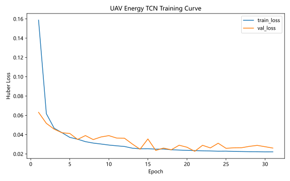

**图表说明：** 数据来自 `model/training_log_3.2.csv`；横轴为 Epoch，纵轴为标准化目标空间中的 Huber 损失，曲线区分训练集与验证集。

**结果分析：** 训练损失由第 1 轮的 0.1587 持续降至约 0.022；验证损失在第 21 轮达到最低值 0.02269，此后未形成持续改善并于第 31 轮早停。因此最终权重采用第 21 轮，而非最后一轮。

#### 图 C-2 最终训练阶段学习率变化

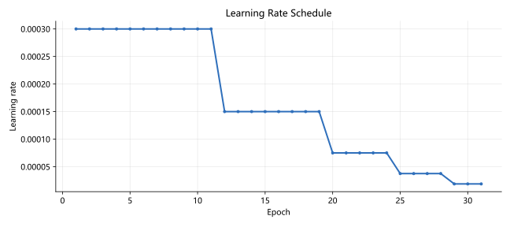

**图表说明：** 数据来自 `model/training_log_3.2.csv`；横轴为 Epoch，纵轴为学习率。

**结果分析：** 学习率由 3.0×10⁻⁴逐级降至 1.875×10⁻⁵。第 21 轮最佳点出现在学习率衰减后，说明减小步长帮助模型继续收敛；后续再次衰减仍未刷新最佳值，与早停判断一致。

#### 图 C-3 TCN 时间窗候选综合得分排序

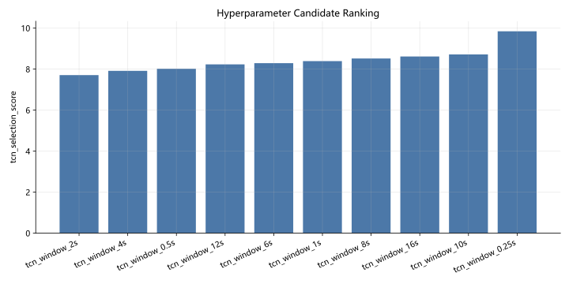

**图表说明：** 数据来自 `model/tuning_results_3.2.csv`；横轴为 10 个时间窗候选，纵轴为综合选择分数，越低越好。

**结果分析：** 2 s、17 步候选以 7.7082 的最低分入选；0.5 s 和 4 s 分别为 8.0188 和 7.9150。0.25 s 历史信息不足，而 8 s 以上候选未继续改善；该结论仅适用于当前网络结构和本次训练。

#### 图 C-4 各时间窗候选的验证集 WAPE

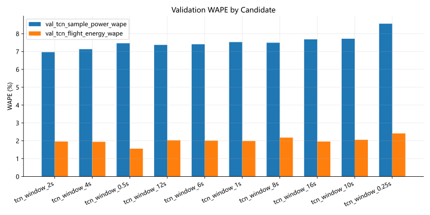

**图表说明：** 数据来自 `model/tuning_results_3.2.csv`；横轴为时间窗，纵轴为 WAPE（%），序列区分采样功率、秒级能量和 flight 总能量。

**结果分析：** 2 s 候选的三项 WAPE 分别为 6.963%、5.335% 和 1.962%，在三个尺度间保持均衡。候选选择因此没有只追求逐点功率，而是同时约束积分后的能量误差。

### C.2 总体预测与误差评估

#### 图 C-5 TCN 与 TCN+RLS 总体评价指标

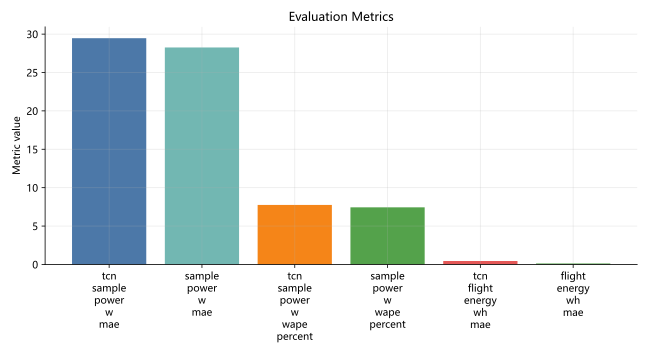

**图表说明：** 数据来自 `model/evaluation_3.2.csv` 和 `.json`，对比采样功率与 flight 总能量指标。

**结果分析：** RLS 将功率 MAE 从 29.468 W 降至 28.260 W，并将 flight 能量 MAE 从 0.449 Wh 降至 0.126 Wh、WAPE 从 2.281% 降至 0.639%。但功率 RMSE 从 45.891 W 升至 50.304 W，说明少数较大瞬时误差仍被放大。

#### 图 C-6 各 flight 实际能量与预测能量对比

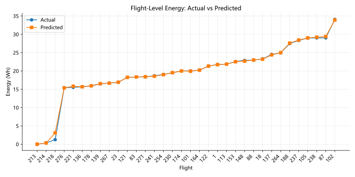

**图表说明：** 数据来自 `model/flight_energy_summary_3.2.csv`；横轴为 flight，纵轴为累计能量（Wh），图例区分实际、TCN 和 RLS。

**结果分析：** 多数正常飞行样本中 RLS 更接近实际值，与 flight 能量 R²=0.9980 一致。A1–A3 的实际能量很低，小绝对偏差会形成很大的百分比误差，因此这些样本应优先比较 Wh 绝对误差。

#### 图 C-7 各 flight 累计能量预测误差

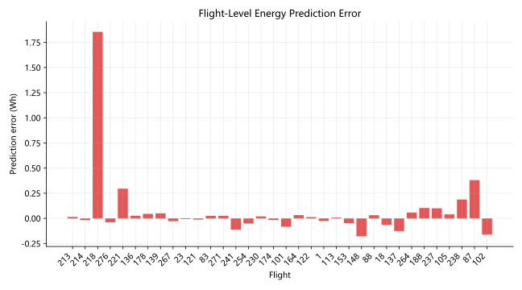

**图表说明：** 数据来自 `flight_energy_summary_3.2.csv` 的 `energy_error_wh`；纵轴为 RLS 预测减实际能量（Wh）。

**结果分析：** 多数误差集中于零线附近，没有在全部 flight 上向同一方向累积；少数长尾样本使 RMSE 0.336 Wh 高于 MAE 0.126 Wh。该图用于定位异常 flight，不能用平均指标替代。

#### 图 C-8 不同真实功率区间的 MAE

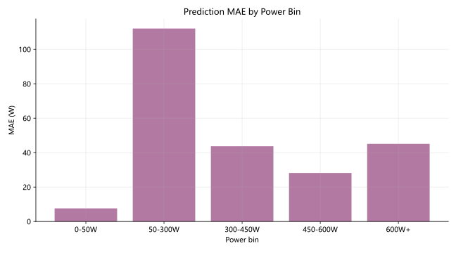

**图表说明：** 数据来自 `model/power_bin_evaluation_3.2.csv`；横轴为真实功率分箱，纵轴为 MAE（W）。

**结果分析：** 450–600 W 箱含 24929 行且 MAE 为 28.181 W，是总体指标的主要来源；50–300 W 箱仅 881 行但 MAE 达 112.096 W。分箱样本量和分母差异明显，必须结合 WAPE 解释。

#### 图 C-9 真实功率与预测功率散点

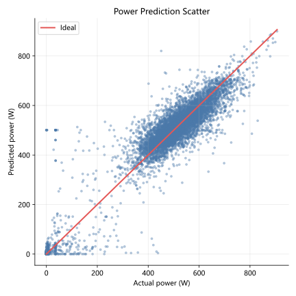

**图表说明：** 数据来自 `predictions/test_predictions_3.2.csv`；横轴为真实功率、纵轴为预测功率（W），对角线为理想预测。

**结果分析：** 主体点云沿对角线分布，与功率 R² 超过 0.95 一致。RLS 降低整体偏差但仍保留少数离群点，这解释了 MAE 改善而 RMSE 上升；近零功率点还会显著放大 MAPE。

#### 图 C-10 功率残差分布

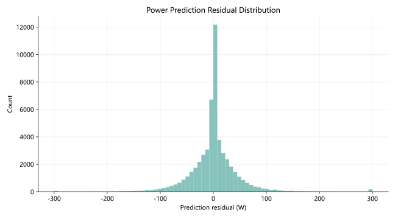

**图表说明：** 数据来自 `test_predictions_3.2.csv`；横轴为预测减真实功率的残差（W），纵轴为频数。

**结果分析：** 残差主体集中于零附近，RLS 的中心偏差更小，因而 MAE 和 WAPE 下降；尾部仍有较大正负误差。直方图无法定位误差发生时段，需要与时间序列图联合判断。

#### 图 C-11 秒级能量真实值与预测值散点

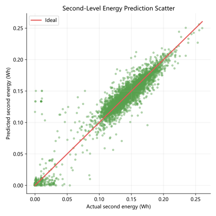

**图表说明：** 数据来自 `model/second_energy_evaluation_3.2.csv`；横纵轴分别为实际与预测秒窗能量（Wh）。

**结果分析：** 多数窗口靠近理想对角线，说明部分功率误差在秒级积分中抵消。原点附近窗口较多，小绝对误差会被低能量分母放大，因此应同时观察绝对偏离与 WAPE。

#### 图 C-12 秒级能量残差分布

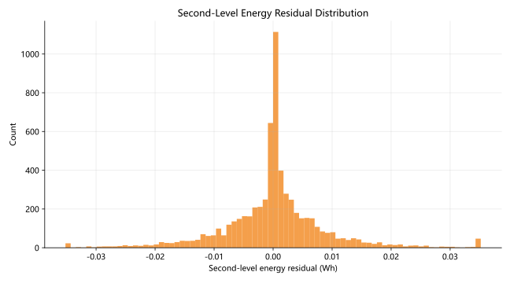

**图表说明：** 数据来自 `second_energy_evaluation_3.2.csv`；横轴为秒级能量残差（Wh），纵轴为窗口频数。

**结果分析：** 峰值靠近零，表明多数秒窗累计偏差较小；尾部主要反映功率突变与启停阶段。RLS 的目标是逐窗消除系统偏差，并不保证每个秒窗都优于 TCN。

#### 图 C-13 不同 RLS 能量窗的预测散点

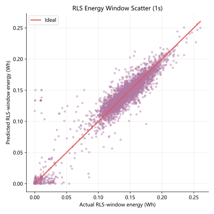

**图表说明：** 数据来自 `model/rls_energy_window_comparison_3.2.csv` 及窗长明细；横纵轴分别为实际与预测窗口能量（Wh）。

**结果分析：** 窗长增加后单点能量尺度扩大、更新次数减少。散点接近对角线只说明窗口拟合，不能直接证明 flight 总能量最优，仍需结合后续误差和窗口数量图。

#### 图 C-14 不同 RLS 能量窗的残差分布

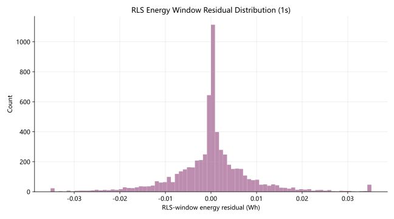

**图表说明：** 数据来源与图 C-13 相同；横轴为窗口能量残差（Wh），图例区分 1、2、5、10、20 s。

**结果分析：** 长窗的绝对残差尺度增大，但测试集窗口 WAPE 从 1 s 的 5.652% 降至 20 s 的 3.219%，体现积分平滑，而非逐点预测能力提升。

#### 图 C-15 RLS 能量窗绝对误差对比

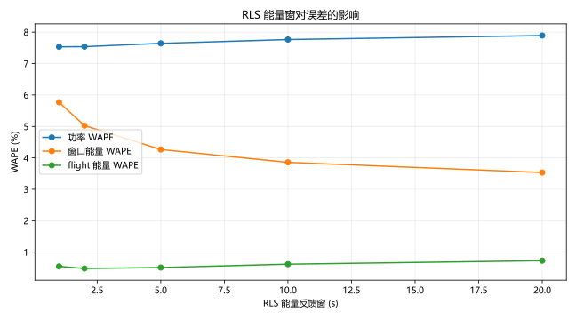

**图表说明：** 横轴为窗长（s），纵轴为窗口级和 flight 级 MAE、RMSE（Wh），数据来自能量窗对比表。

**结果分析：** 测试集 2 s 的 flight 能量 MAE 最低，为 0.0793 Wh；1 s 为 0.1258 Wh，5 s 为 0.0922 Wh。最频繁更新不等于最低累计误差，短窗更容易受局部噪声影响。

#### 图 C-16 RLS 能量窗相对误差与决定系数

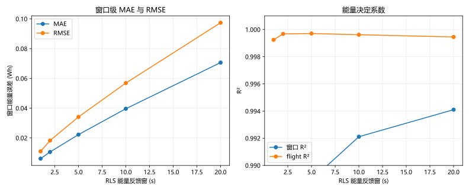

**图表说明：** 横轴为窗长（s），纵轴展示窗口/flight WAPE 和 flight R²。

**结果分析：** 窗口 WAPE 随窗长增加而下降，但 flight 指标并非单调；测试集 2 s 的 flight WAPE 为 0.403%，优于 1 s 的 0.639%。高 R² 还可能掩盖低能量 flight 的大比例误差。

#### 图 C-17 RLS 能量窗数量与反馈频率

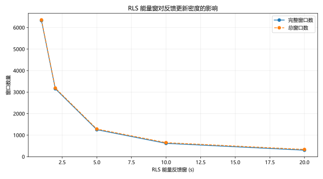

**图表说明：** 横轴为窗长（s），纵轴为总窗口数和完整窗口数，区分验证集与测试集。

**结果分析：** 测试集完整窗口从 1 s 的 6324 个降至 20 s 的 301 个。长窗降低更新噪声与计算次数，却延长响应周期，因此窗长应同时满足误差与在线性要求。

### C.3 三个代表 flight 的时间序列

#### 图 C-18 Flight 1（R5）功率时间序列

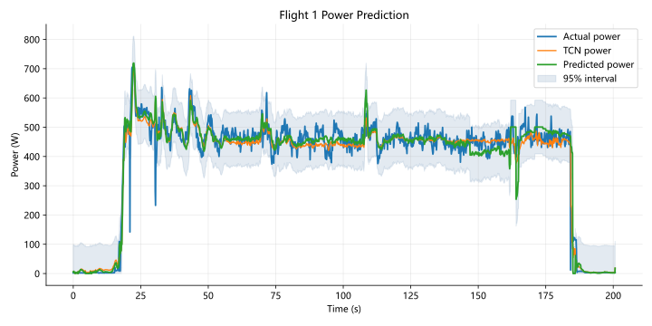

**图表说明：** 数据来自 `test_predictions_3.2.csv`；横轴为时间（s），纵轴为功率（W），曲线区分实际、TCN 和 RLS。

**结果分析：** 实际平均功率为 390.01 W，TCN 与 RLS 分别为 385.07 W 和 389.55 W。RLS 主要修正整体低估，使累计能量误差由 -0.276 Wh 缩小到 -0.026 Wh。

#### 图 C-19 Flight 1（R5）秒级能量时间序列

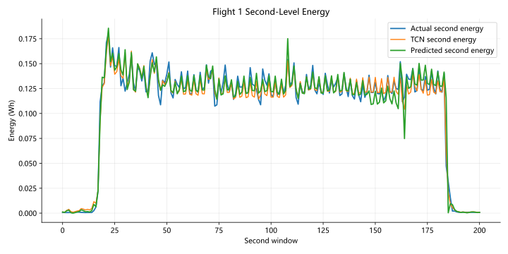

**图表说明：** 数据来自 `second_energy_evaluation_3.2.csv`；横轴为秒窗，纵轴为窗口能量（Wh）。

**结果分析：** 稳定飞行后 RLS 整体更贴近实际；全程实际与 RLS 能量为 21.762 Wh 和 21.736 Wh，绝对百分比误差 0.120%。起飞初期低能量窗口仍有较明显相对误差。

#### 图 C-20 Flight 18（R1）功率时间序列

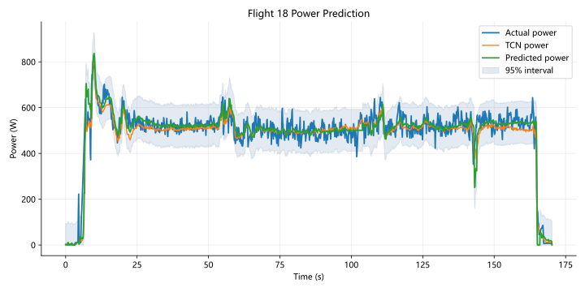

**图表说明：** 坐标和图例同图 C-18，数据来自测试预测表。

**结果分析：** 实际平均功率 491.98 W，TCN 为 479.49 W，存在整体低估；RLS 修正到 490.63 W。在线尺度修正对持续性偏差有效，但瞬态尖峰仍取决于 TCN 基础预测。

#### 图 C-21 Flight 18（R1）秒级能量时间序列

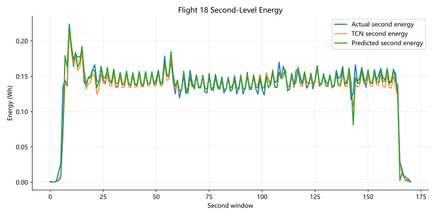

**图表说明：** 横轴为秒窗，纵轴为能量（Wh），数据来自秒级能量评估表。

**结果分析：** RLS 将总能量由 TCN 的 22.696 Wh 修正到 23.223 Wh，更接近实际的 23.287 Wh；最终绝对误差为 0.064 Wh。

#### 图 C-22 Flight 23（R1）功率时间序列

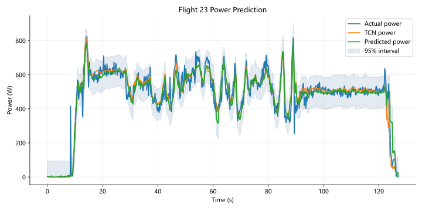

**图表说明：** 数据来自测试预测表；该 flight 设定速度 12 m/s、载荷 0.25 kg、高度 50 m。

**结果分析：** 实际、TCN 和 RLS 平均功率分别为 479.09、482.62 和 478.87 W。此处原始模型略高估，说明 RLS 会依据反馈双向调整，并非固定增加预测。

#### 图 C-23 Flight 23（R1）秒级能量时间序列

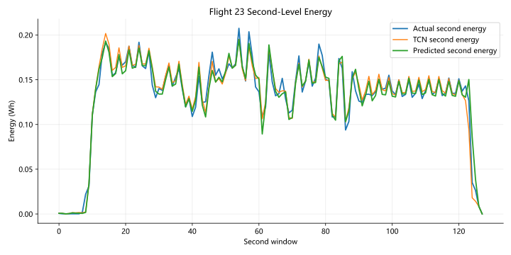

**图表说明：** 数据来自秒级能量评估表；纵轴为秒窗能量（Wh）。

**结果分析：** 三条曲线整体接近。RLS 将总能量从 17.053 Wh 修正到 16.920 Wh，实际为 16.928 Wh，绝对误差仅 0.0074 Wh，表明基础误差较小时校正幅度保持较小。

### C.4 自定义工况预测

#### 图 C-24 自定义工况功率时间序列

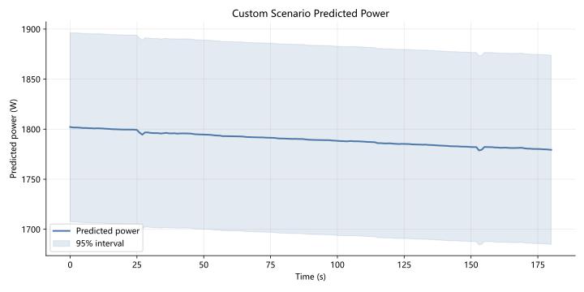

**图表说明：** 数据来自 `custom/custom_scenarios_3.2.csv` 和 `custom_predictions_3.2.csv`；横轴为时间（s），纵轴为预测功率（W）。

**结果分析：** 181 个采样点的平均预测功率为 1789.84 W、最大值为 1802.20 W，明显高于测试集常见范围。该图用于检查接口和趋势，不是测试精度证据，外推可信度受训练数据覆盖限制。

#### 图 C-25 自定义工况累计能量曲线

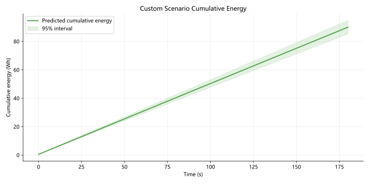

**图表说明：** 横轴为时间（s），纵轴为累计能量（Wh），上下界由 95% 功率预测区间积分得到。

**结果分析：** 累计能量随时间近似线性增长，最终预测为 89.989 Wh，区间为 85.240–94.739 Wh。该区间未额外覆盖输入超出训练分布造成的模型不确定性。

### C.5 RLS 在线参数变化

#### 图 C-26 Flight 1 的 RLS 偏置与缩放轨迹

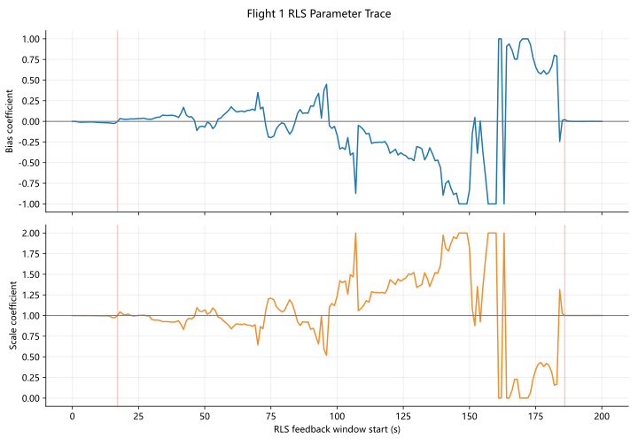

**图表说明：** 数据来自 `rls/rls_parameter_trace_3.2.csv`；横轴为窗口序号，纵轴为无量纲偏置和缩放参数。

**结果分析：** 201 个窗口中偏置均值 -0.040、缩放均值 1.053，且都曾触及裁剪边界。均值仍接近零偏置和单位缩放，但局部更新较强。

#### 图 C-27 Flight 2 的 RLS 偏置与缩放轨迹

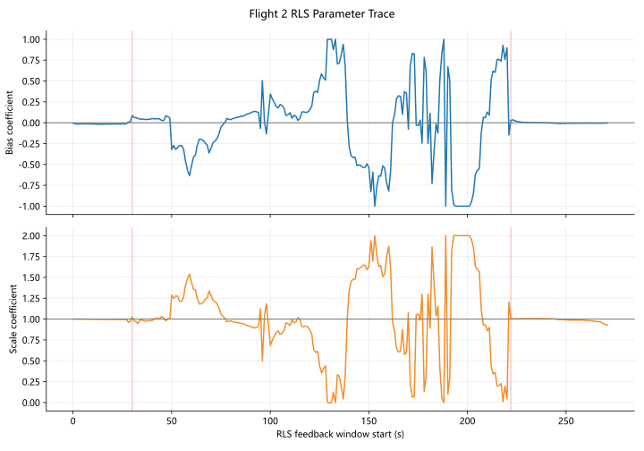

**图表说明：** 数据来源和坐标含义同图 C-26。

**结果分析：** 272 个窗口的偏置、缩放均值分别为 -0.012 和 1.013，但标准差为 0.414 和 0.430，且触及边界。平均值接近初值并不代表更新过程平稳。

#### 图 C-28 Flight 3 的 RLS 偏置与缩放轨迹

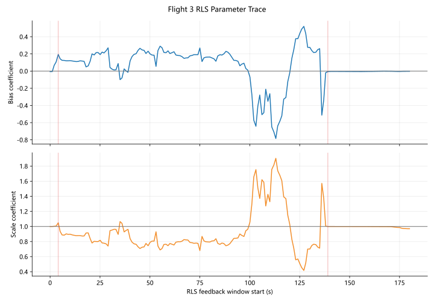

**图表说明：** 数据来源和坐标含义同图 C-26。

**结果分析：** 偏置范围 -0.785–0.520、缩放范围 0.417–1.903，未触及全局极限；两项标准差也低于 Flight 1、2，参数调整相对温和。

### C.6 十一类航线总览

#### 图 C-29 十一类代表航线的三维轨迹与累计能量

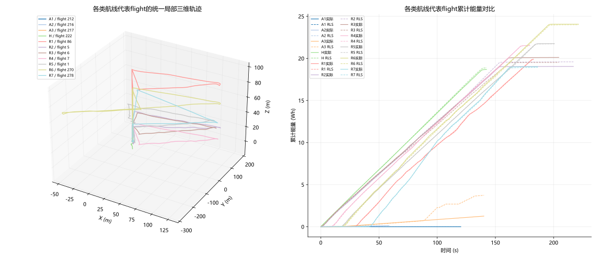

**图表说明：** 数据来自 `routes/route_products_summary_3.2.json` 和各航线对齐 CSV；左侧为统一参考点下的三维轨迹，右侧为累计能量（Wh）。

**结果分析：** R1–R7 与 H 的能量主要为 18.7–24.1 Wh，RLS 大多贴近实际；A1–A3 能量明显更低，其中 A3 实际为 1.262 Wh、RLS 为 3.759 Wh，暴露低能量航线的在线校正风险。

### C.7 十一类航线的静态曲线与动态轨迹

每类航线均提供一张功率/累计能量 SVG、一张可直接播放的 GIF 和一个可旋转缩放的交互 HTML。SVG 上面板横轴为时间（s）、纵轴为功率（W），下面板纵轴为累计能量（Wh）；GIF 左侧推进功率曲线，右侧同步显示三维轨迹。下列产物继续使用独立图题，避免只给文件地址。

#### 图 C-30 A1 航线 Flight 212 功率与累计能量

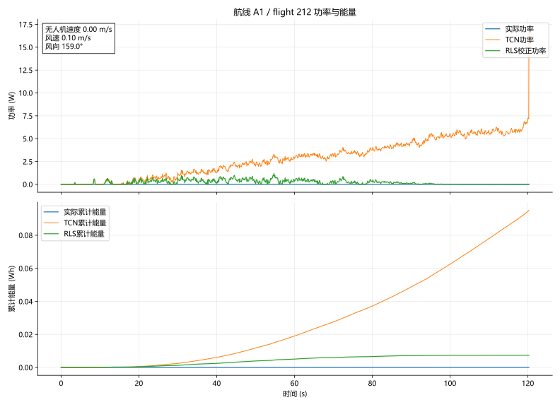

**图表说明：** 航程 120.3 s；上图对比实际、TCN、RLS 功率，下图对比累计能量。实际、TCN、RLS 末端能量分别为 0.000006、0.095154、0.007370 Wh。

**结果分析：** 实际能量接近零。RLS 明显降低了 TCN 的绝对偏差，但相对误差仍会因分母极小而被放大；该航线应以 Wh 绝对误差为主。

#### 图 C-31 A1 航线 Flight 212 三维动态轨迹

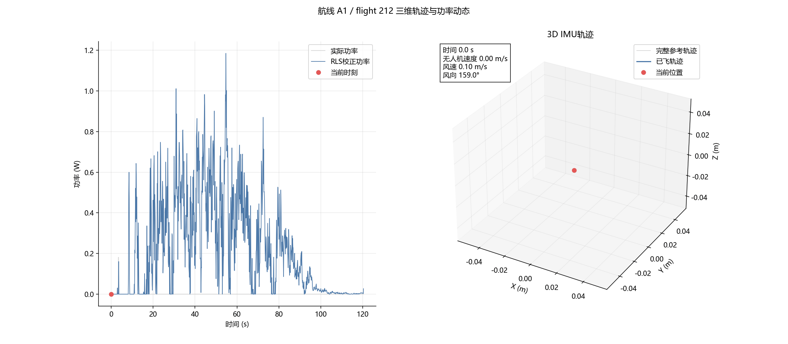

**图表说明：** GIF 将左侧功率推进过程与右侧 IMU 三维轨迹按时间同步；灰线为完整轨迹，蓝线为已飞轨迹，动态点为当前时刻。可进一步打开[交互式三维轨迹](./routes/route_A1/flight_212/flight_212_imu_trajectory.html)旋转、缩放并查看悬停信息。

**结果分析：** 动图用于把功率变化与空间运动阶段对应起来，便于判断误差是否集中于起飞、转弯或降落。它只展示本航线一个代表 flight，不能代替该航线全部 flight 的统计结果；总量结论仍以上一幅静态图和结构化评估表为准。

#### 图 C-32 A2 航线 Flight 216 功率与累计能量

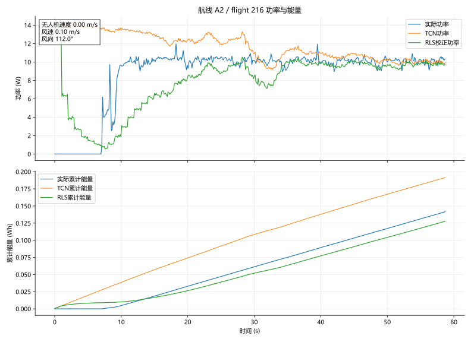

**图表说明：** 航程 58.7 s；上图对比实际、TCN、RLS 功率，下图对比累计能量。实际、TCN、RLS 末端能量分别为 0.141569、0.191469、0.127667 Wh。

**结果分析：** RLS 将累计能量由 0.191469 Wh 修正至 0.127667 Wh，更接近实际；短航程下单个窗口占比较大，局部修正对总量影响明显。

#### 图 C-33 A2 航线 Flight 216 三维动态轨迹

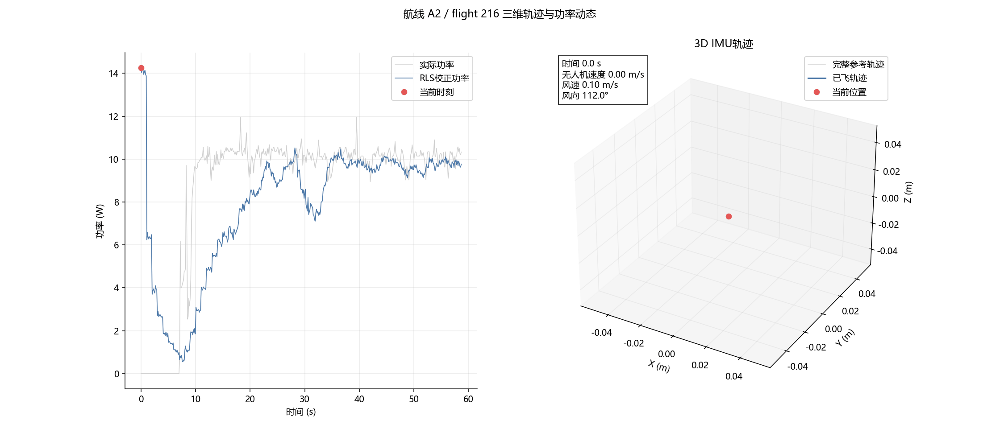

**图表说明：** GIF 将左侧功率推进过程与右侧 IMU 三维轨迹按时间同步；灰线为完整轨迹，蓝线为已飞轨迹，动态点为当前时刻。可进一步打开[交互式三维轨迹](./routes/route_A2/flight_216/flight_216_imu_trajectory.html)旋转、缩放并查看悬停信息。

**结果分析：** 动图用于把功率变化与空间运动阶段对应起来，便于判断误差是否集中于起飞、转弯或降落。它只展示本航线一个代表 flight，不能代替该航线全部 flight 的统计结果；总量结论仍以上一幅静态图和结构化评估表为准。

#### 图 C-34 A3 航线 Flight 217 功率与累计能量

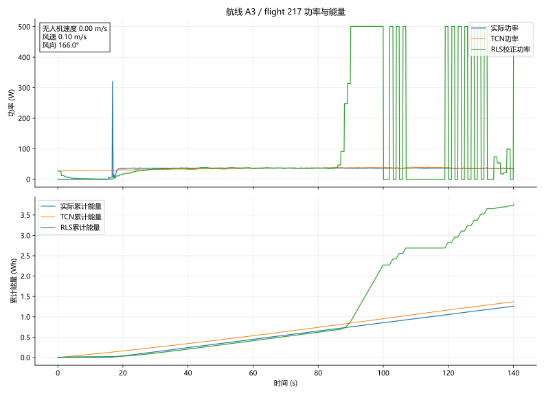

**图表说明：** 航程 140.1 s；上图对比实际、TCN、RLS 功率，下图对比累计能量。实际、TCN、RLS 末端能量分别为 1.261676、1.371379、3.758692 Wh。

**结果分析：** TCN 原始能量已接近实际，RLS 却产生明显高估，说明低功率、低能量阶段的反馈可能导致过度校正，是本组代表航线中最需警惕的失败样本。

#### 图 C-35 A3 航线 Flight 217 三维动态轨迹

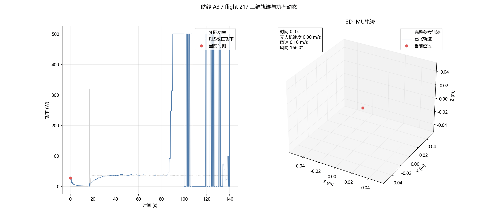

**图表说明：** GIF 将左侧功率推进过程与右侧 IMU 三维轨迹按时间同步；灰线为完整轨迹，蓝线为已飞轨迹，动态点为当前时刻。可进一步打开[交互式三维轨迹](./routes/route_A3/flight_217/flight_217_imu_trajectory.html)旋转、缩放并查看悬停信息。

**结果分析：** 动图用于把功率变化与空间运动阶段对应起来，便于判断误差是否集中于起飞、转弯或降落。它只展示本航线一个代表 flight，不能代替该航线全部 flight 的统计结果；总量结论仍以上一幅静态图和结构化评估表为准。

#### 图 C-36 H 航线 Flight 222 功率与累计能量

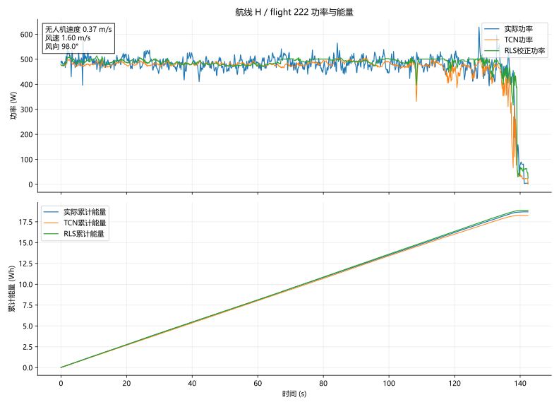

**图表说明：** 航程 142.4 s；上图对比实际、TCN、RLS 功率，下图对比累计能量。实际、TCN、RLS 末端能量分别为 18.694820、18.267509、18.888881 Wh。

**结果分析：** RLS 修正了 TCN 的整体低估，但略微越过实际值；最终偏差约 0.194 Wh，说明反馈有效但并非完全无偏。

#### 图 C-37 H 航线 Flight 222 三维动态轨迹

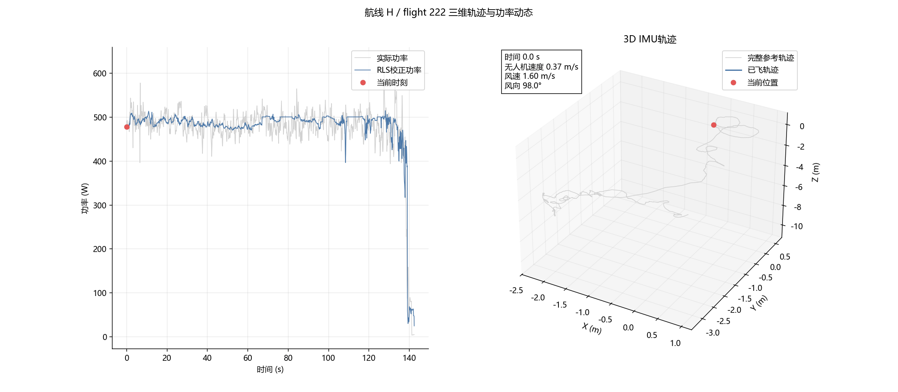

**图表说明：** GIF 将左侧功率推进过程与右侧 IMU 三维轨迹按时间同步；灰线为完整轨迹，蓝线为已飞轨迹，动态点为当前时刻。可进一步打开[交互式三维轨迹](./routes/route_H/flight_222/flight_222_imu_trajectory.html)旋转、缩放并查看悬停信息。

**结果分析：** 动图用于把功率变化与空间运动阶段对应起来，便于判断误差是否集中于起飞、转弯或降落。它只展示本航线一个代表 flight，不能代替该航线全部 flight 的统计结果；总量结论仍以上一幅静态图和结构化评估表为准。

#### 图 C-38 R1 航线 Flight 86 功率与累计能量

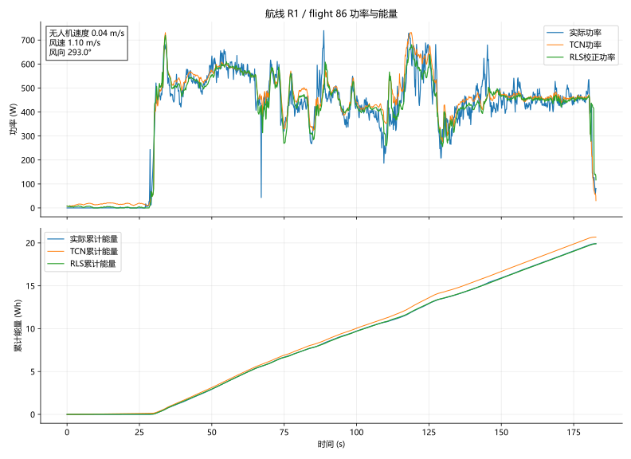

**图表说明：** 航程 182.7 s；上图对比实际、TCN、RLS 功率，下图对比累计能量。实际、TCN、RLS 末端能量分别为 19.904715、20.682399、19.911337 Wh。

**结果分析：** RLS 将 TCN 约 0.778 Wh 的高估压低至约 0.007 Wh，功率和累计能量曲线共同显示持续飞行阶段的系统偏差得到有效消除。

#### 图 C-39 R1 航线 Flight 86 三维动态轨迹

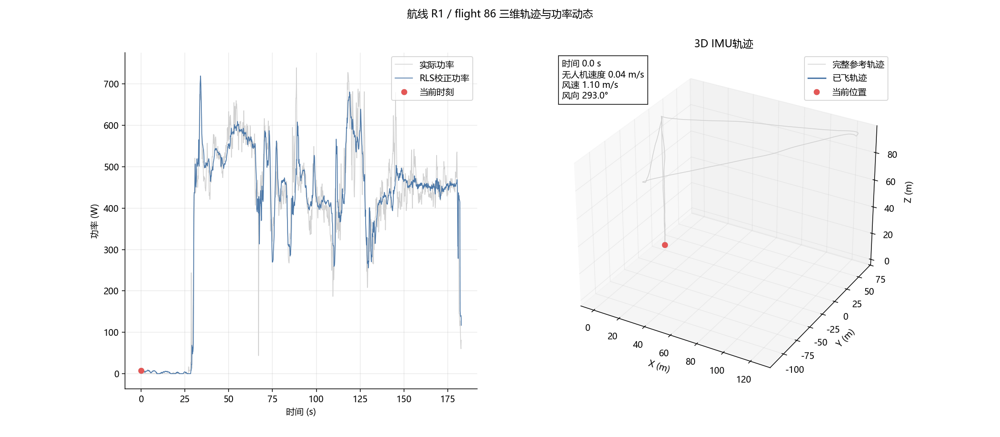

**图表说明：** GIF 将左侧功率推进过程与右侧 IMU 三维轨迹按时间同步；灰线为完整轨迹，蓝线为已飞轨迹，动态点为当前时刻。可进一步打开[交互式三维轨迹](./routes/route_R1/flight_86/flight_86_imu_trajectory.html)旋转、缩放并查看悬停信息。

**结果分析：** 动图用于把功率变化与空间运动阶段对应起来，便于判断误差是否集中于起飞、转弯或降落。它只展示本航线一个代表 flight，不能代替该航线全部 flight 的统计结果；总量结论仍以上一幅静态图和结构化评估表为准。

#### 图 C-40 R2 航线 Flight 5 功率与累计能量

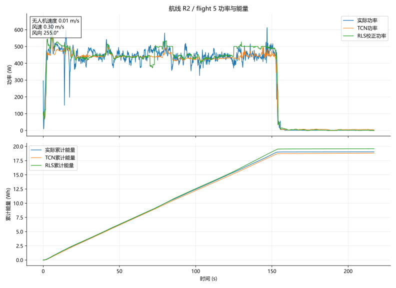

**图表说明：** 航程 217 s；上图对比实际、TCN、RLS 功率，下图对比累计能量。实际、TCN、RLS 末端能量分别为 19.052936、18.826747、19.594042 Wh。

**结果分析：** TCN 略低估而 RLS 转为高估，最终偏差约 0.541 Wh；说明校正方向正确并不必然代表修正幅度合适。

#### 图 C-41 R2 航线 Flight 5 三维动态轨迹

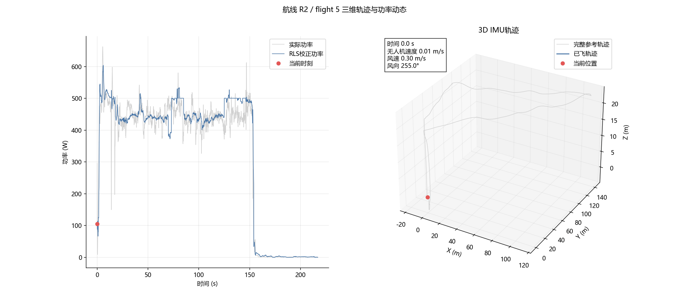

**图表说明：** GIF 将左侧功率推进过程与右侧 IMU 三维轨迹按时间同步；灰线为完整轨迹，蓝线为已飞轨迹，动态点为当前时刻。可进一步打开[交互式三维轨迹](./routes/route_R2/flight_5/flight_5_imu_trajectory.html)旋转、缩放并查看悬停信息。

**结果分析：** 动图用于把功率变化与空间运动阶段对应起来，便于判断误差是否集中于起飞、转弯或降落。它只展示本航线一个代表 flight，不能代替该航线全部 flight 的统计结果；总量结论仍以上一幅静态图和结构化评估表为准。

#### 图 C-42 R3 航线 Flight 6 功率与累计能量

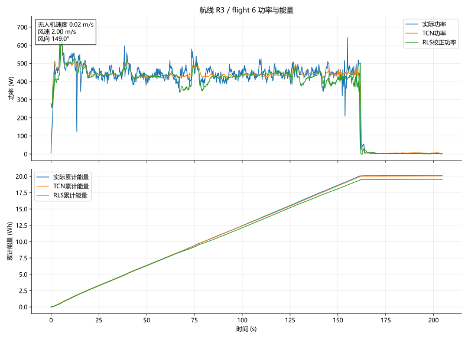

**图表说明：** 航程 204.5 s；上图对比实际、TCN、RLS 功率，下图对比累计能量。实际、TCN、RLS 末端能量分别为 20.116680、20.071892、19.525708 Wh。

**结果分析：** TCN 原始累计能量更接近实际，RLS 形成约 -0.591 Wh 的低估。该例表明在线反馈可能损害原本较好的基础预测。

#### 图 C-43 R3 航线 Flight 6 三维动态轨迹

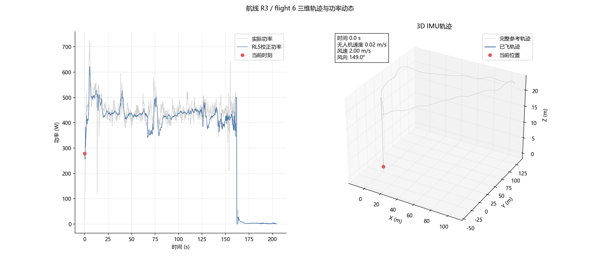

**图表说明：** GIF 将左侧功率推进过程与右侧 IMU 三维轨迹按时间同步；灰线为完整轨迹，蓝线为已飞轨迹，动态点为当前时刻。可进一步打开[交互式三维轨迹](./routes/route_R3/flight_6/flight_6_imu_trajectory.html)旋转、缩放并查看悬停信息。

**结果分析：** 动图用于把功率变化与空间运动阶段对应起来，便于判断误差是否集中于起飞、转弯或降落。它只展示本航线一个代表 flight，不能代替该航线全部 flight 的统计结果；总量结论仍以上一幅静态图和结构化评估表为准。

#### 图 C-44 R4 航线 Flight 7 功率与累计能量

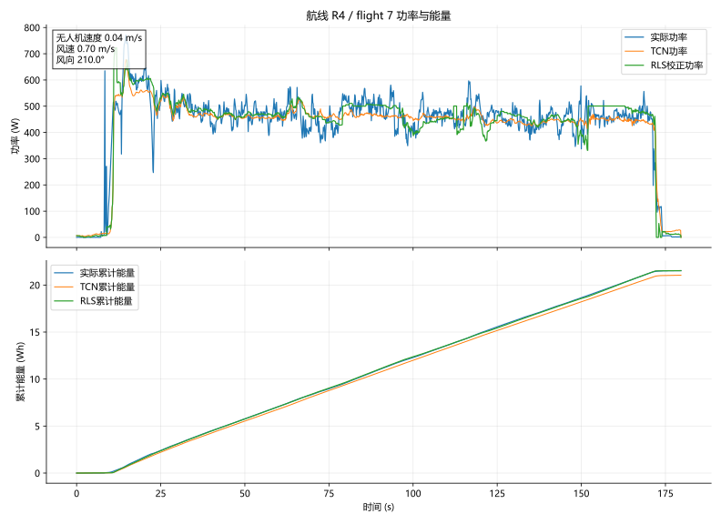

**图表说明：** 航程 179.6 s；上图对比实际、TCN、RLS 功率，下图对比累计能量。实际、TCN、RLS 末端能量分别为 21.525185、21.047458、21.534446 Wh。

**结果分析：** RLS 将约 -0.478 Wh 的 TCN 低估修正至约 0.009 Wh，累计曲线末端几乎重合，是在线校正效果较稳定的样本。

#### 图 C-45 R4 航线 Flight 7 三维动态轨迹

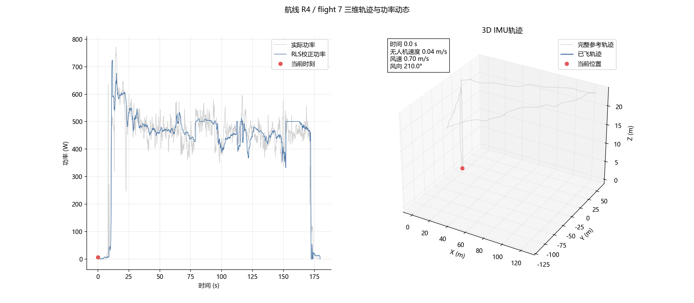

**图表说明：** GIF 将左侧功率推进过程与右侧 IMU 三维轨迹按时间同步；灰线为完整轨迹，蓝线为已飞轨迹，动态点为当前时刻。可进一步打开[交互式三维轨迹](./routes/route_R4/flight_7/flight_7_imu_trajectory.html)旋转、缩放并查看悬停信息。

**结果分析：** 动图用于把功率变化与空间运动阶段对应起来，便于判断误差是否集中于起飞、转弯或降落。它只展示本航线一个代表 flight，不能代替该航线全部 flight 的统计结果；总量结论仍以上一幅静态图和结构化评估表为准。

#### 图 C-46 R5 航线 Flight 1 功率与累计能量

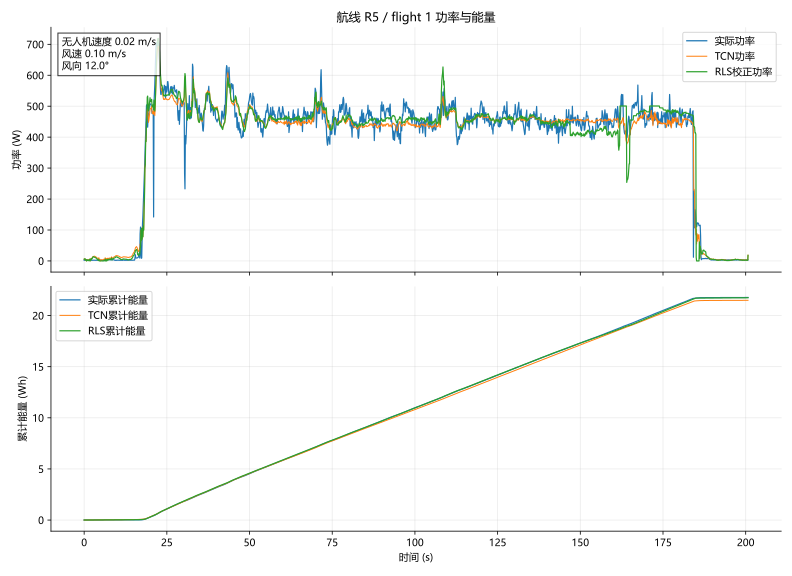

**图表说明：** 航程 200.7 s；上图对比实际、TCN、RLS 功率，下图对比累计能量。实际、TCN、RLS 末端能量分别为 21.762434、21.486584、21.736414 Wh。

**结果分析：** RLS 将累计误差由约 -0.276 Wh 缩小到 -0.026 Wh；该结果与前述 Flight 1 秒级图一致，形成从局部窗口到全程累计的相互验证。

#### 图 C-47 R5 航线 Flight 1 三维动态轨迹

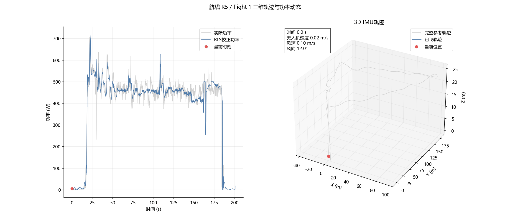

**图表说明：** GIF 将左侧功率推进过程与右侧 IMU 三维轨迹按时间同步；灰线为完整轨迹，蓝线为已飞轨迹，动态点为当前时刻。可进一步打开[交互式三维轨迹](./routes/route_R5/flight_1/flight_1_imu_trajectory.html)旋转、缩放并查看悬停信息。

**结果分析：** 动图用于把功率变化与空间运动阶段对应起来，便于判断误差是否集中于起飞、转弯或降落。它只展示本航线一个代表 flight，不能代替该航线全部 flight 的统计结果；总量结论仍以上一幅静态图和结构化评估表为准。

#### 图 C-48 R6 航线 Flight 270 功率与累计能量

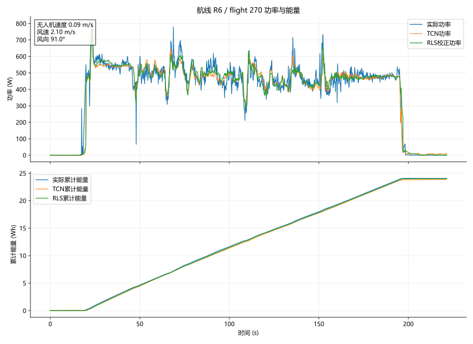

**图表说明：** 航程 221.4 s；上图对比实际、TCN、RLS 功率，下图对比累计能量。实际、TCN、RLS 末端能量分别为 24.067533、23.848202、24.004800 Wh。

**结果分析：** RLS 将 TCN 低估由约 0.219 Wh 缩小到 0.063 Wh，长航程累计过程中没有出现明显漂移。

#### 图 C-49 R6 航线 Flight 270 三维动态轨迹

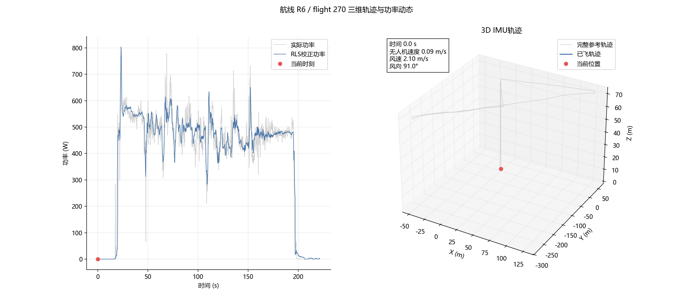

**图表说明：** GIF 将左侧功率推进过程与右侧 IMU 三维轨迹按时间同步；灰线为完整轨迹，蓝线为已飞轨迹，动态点为当前时刻。可进一步打开[交互式三维轨迹](./routes/route_R6/flight_270/flight_270_imu_trajectory.html)旋转、缩放并查看悬停信息。

**结果分析：** 动图用于把功率变化与空间运动阶段对应起来，便于判断误差是否集中于起飞、转弯或降落。它只展示本航线一个代表 flight，不能代替该航线全部 flight 的统计结果；总量结论仍以上一幅静态图和结构化评估表为准。

#### 图 C-50 R7 航线 Flight 278 功率与累计能量

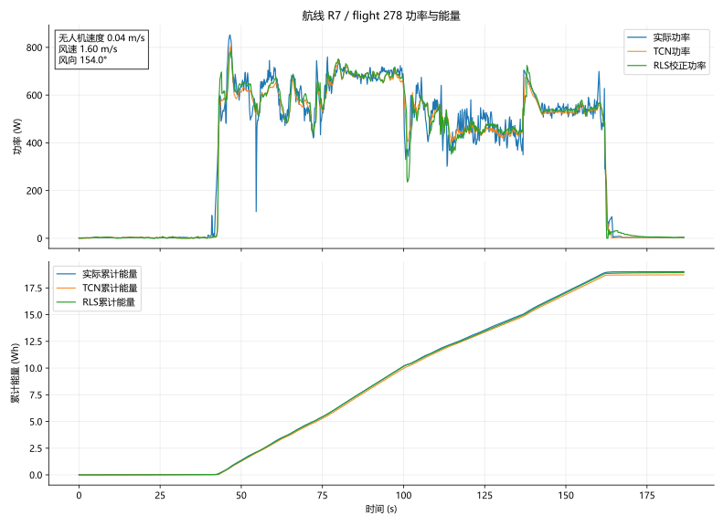

**图表说明：** 航程 186.4 s；上图对比实际、TCN、RLS 功率，下图对比累计能量。实际、TCN、RLS 末端能量分别为 19.021313、18.725086、18.931740 Wh。

**结果分析：** RLS 将低估幅度缩小到约 0.090 Wh，改善方向明确，但末端仍略低于实际能量。

#### 图 C-51 R7 航线 Flight 278 三维动态轨迹

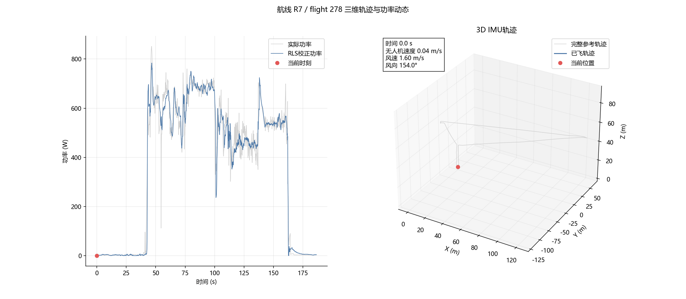

**图表说明：** GIF 将左侧功率推进过程与右侧 IMU 三维轨迹按时间同步；灰线为完整轨迹，蓝线为已飞轨迹，动态点为当前时刻。可进一步打开[交互式三维轨迹](./routes/route_R7/flight_278/flight_278_imu_trajectory.html)旋转、缩放并查看悬停信息。

**结果分析：** 动图用于把功率变化与空间运动阶段对应起来，便于判断误差是否集中于起飞、转弯或降落。它只展示本航线一个代表 flight，不能代替该航线全部 flight 的统计结果；总量结论仍以上一幅静态图和结构化评估表为准。

## D. 产物完整性与复现边界

最终 `out/` 清单为 40 个 SVG、11 个交互 HTML、11 个 GIF、0 个 PNG；所有图片类产物均已改为 SVG，未发现旧 PNG 被 README 引用。每条航线目录同时包含功率能量 SVG、交互 HTML、3D GIF、对齐 CSV 和摘要 JSON；总览 SVG 位于 `routes/all_routes_trajectory_energy.svg`。模型权重为 `D:/Python-files/Energy-prediction/model/best_energy_tcn_rls_3.2.pt` 与 `final_energy_tcn_rls_3.2.pt`，项目内结构化结果和图表位于本目录相对路径。

README 中的相对链接已按最终文件名检查；运行摘要中的绝对路径仅来自程序写出的元数据，不作为跨机器复现路径。原始数据和处理后 CSV、模型权重、预测 CSV 等体积较大或包含实验数据，按项目 `.gitignore` 规则不纳入本次代码提交；克隆项目后需先配置原始数据路径，再运行 `python main.py prepare`。复现实验时，`tune-tcn`/`all` 会清空并重建终端日志，其他模式只追加日志；RLS 能量窗仍必须作为独立变量分析，不得改回 TCN/RLS 超参搜索。
