# 实验 4.0 输出、算法与结果报告

## 目录

- [A. 方法与数学建模](#a-方法与数学建模)
  - [A.1 工程背景与预测对象](#a1-工程背景与预测对象)
  - [A.2 数据来源、重采样与监督标签](#a2-数据来源重采样与监督标签)
  - [A.3 历史飞行数据到规划输入的映射](#a3-历史飞行数据到规划输入的映射)
  - [A.4 任务前 23 维输入契约](#a4-任务前-23-维输入契约)
  - [A.5 完整 flight 切分与留出条件](#a5-完整-flight-切分与留出条件)
  - [A.6 序列构造与标准化](#a6-序列构造与标准化)
  - [A.7 规划特征 TCN](#a7-规划特征-tcn)
  - [A.8 损失、优化与 GPU 训练](#a8-损失优化与-gpu-训练)
  - [A.9 TCN 时间窗选择](#a9-tcn-时间窗选择)
  - [A.10 基础动力功率与已知附加功率](#a10-基础动力功率与已知附加功率)
  - [A.11 任务前动态不确定性](#a11-任务前动态不确定性)
  - [A.12 RLS 在线剩余路线校正](#a12-rls-在线剩余路线校正)
  - [A.13 完整窗口约束与截断尾窗](#a13-完整窗口约束与截断尾窗)
  - [A.14 RLS 参数搜索与区间校准](#a14-rls-参数搜索与区间校准)
  - [A.15 调度决策接口](#a15-调度决策接口)
  - [A.16 评价指标](#a16-评价指标)
  - [A.17 数据流和文件流](#a17-数据流和文件流)
- [B. 本次 GPU 完整运行摘要](#b-本次-gpu-完整运行摘要)
  - [B.1 数据、设备与训练状态](#b1-数据设备与训练状态)
  - [B.2 TCN 与 RLS 参数选择](#b2-tcn-与-rls-参数选择)
  - [B.3 测试集点预测与任务能耗](#b3-测试集点预测与任务能耗)
  - [B.4 区间覆盖与剩余任务评估](#b4-区间覆盖与剩余任务评估)
  - [B.5 未见条件与任务长度分层](#b5-未见条件与任务长度分层)
  - [B.6 RLS 能量窗敏感性](#b6-rls-能量窗敏感性)
  - [B.7 任务前与在线接口示例](#b7-任务前与在线接口示例)
  - [B.8 RLS 未来能耗校正示例](#b8-rls-未来能耗校正示例)
  - [B.9 启动阶段偏差专项诊断](#b9-启动阶段偏差专项诊断)
  - [B.10 当前限制](#b10-当前限制)
- [C. 当前可视化结果与逐图分析](#c-当前可视化结果与逐图分析)
  - [C.1 训练过程与 TCN 时间窗搜索](#c1-训练过程与-tcn-时间窗搜索)
  - [C.2 总体误差与 RLS 窗口比较](#c2-总体误差与-rls-窗口比较)
  - [C.3 三个代表 flight 的时间序列](#c3-三个代表-flight-的时间序列)
  - [C.4 散点与残差诊断](#c4-散点与残差诊断)
  - [C.5 新路线任务前接口](#c5-新路线任务前接口)
  - [C.6 RLS 参数与未来能耗校正](#c6-rls-参数与未来能耗校正)
  - [C.7 八类正常航线总览](#c7-八类正常航线总览)
  - [C.8 八类正常航线逐项展示](#c8-八类正常航线逐项展示)
- [D. 产物清单、完整性与复现边界](#d-产物清单完整性与复现边界)

## A. 方法与数学建模

### A.1 工程背景与预测对象

实验 4.0 面向无人机任务分配与充电决策，不再把模型限定为飞行结束后的误差统计工具。上层调度器给出候选任务，中层轨迹规划器把“起点、终点、航迹和完成时间”等约束离散为每 0.2 s 的位置、速度、加速度和环境状态。任务执行前，TCN 只读取这些可规划或可预报的量，输出逐步功率、逐步能耗、累计能耗、任务总能耗、任务级区间和电池可行性。飞行开始后，RLS 每收到一个已经结束的完整窗口实际能耗，便更新一次偏置、缩放和协方差，并重新计算尚未执行的整段路线。

模型的监督目标是无人机基础飞行动力功率，而不是包含人为代理量的混合标签。对 flight $f$ 在离散时刻 $i$ 的历史记录，先由电池测量生成只用于离线监督和评估的总功率：

$$
I_{f,i}^{\mathrm{dis}}=\max(I_{f,i},0),\qquad
P_{f,i}^{\mathrm{total}}=\max(V_{f,i}I_{f,i}^{\mathrm{dis}},0)
$$

$$
P_{f,i}^{\mathrm{base}}=\max\left(P_{f,i}^{\mathrm{total}}-P_{f,i}^{\mathrm{aux}},0\right)
$$

其中：

- $I_{f,i}^{\mathrm{dis}}$：截断为非负值的放电电流，单位 A。
- $V_{f,i}$：电池电压，单位 V。
- $P_{f,i}^{\mathrm{total}}$：离线真实总功率标签，单位 W。
- $P_{f,i}^{\mathrm{aux}}$：规划阶段已知的任务设备额定功率之和，单位 W。
- $P_{f,i}^{\mathrm{base}}$：TCN 的基础动力功率监督目标，单位 W。
- $f$：完整飞行或任务编号；$i$：任务内的 0.2 s 时间步编号。

电压、电流、真实功率和真实能耗不进入任务前输入。历史数据没有可核验的设备额定功率记录，因此本次训练样本的 $P_{f,i}^{\mathrm{aux}}$ 均为 0 W；部署时可把相机、通信、计算或投递装置的已知额定功率相加为一个 `auxiliary_power_w`，在 TCN 输出端确定性叠加。这样不会再让 `thermal_load_proxy`、`vision_energy_proxy_w` 和 `communication_energy_proxy_w` 这类经验公式参与精度评价。

### A.2 数据来源、重采样与监督标签

原始数据来自 `D:/Python-files/Energy-prediction/data/dji_matrice_100_data/4.0/raw/flights.csv`。4.0 只把 H、R1--R7 当作正常飞行数据，A1、A2、A3 是地面辅助测试，未进入训练集、验证集、测试集、总体指标或航线展示。处理后的独立数据位于 `D:/Python-files/Energy-prediction/data/dji_matrice_100_data/4.0/processed/`，不读取 3.2 的 scaler、权重、预测表或置信区间文件。

原始记录并非统一 0.2 s。程序按每个完整 flight 的真实时间戳排序、去重，再构造间隔 0.2 s 的新时间网格。连续字段按时间线性插值；风向角先执行 $2\pi$ 圆周展开，再插值并映射回 $[0,360)$，避免 359° 与 1° 被错误插值到 180°。每个新时间步对应的原始左右索引、原始时间范围和能量处理方式记录在 4.0 数据目录 `processed/resample_map_4.0.csv`。

固定离散步能量采用矩形积分：

$$
E_{f,i}=P_{f,i}\frac{\Delta t}{3600},\qquad \Delta t=0.2\ \mathrm{s}
$$

任务累计能量和总能量分别为：

$$
E_{f,1:j}^{\mathrm{cum}}=\sum_{i=1}^{j}E_{f,i},\qquad
E_f^{\mathrm{total}}=\sum_{i=1}^{N_f}E_{f,i}
$$

其中：

- $E_{f,i}$：第 $i$ 个 0.2 s 区间能耗，单位 Wh。
- $E_{f,1:j}^{\mathrm{cum}}$：截至时间步 $j$ 的累计能耗，单位 Wh。
- $E_f^{\mathrm{total}}$：整条任务总能耗，单位 Wh。
- $N_f$：flight $f$ 重采样后的时间步数。
- 3600：把 W·s 换算为 Wh 的单位因子。

这一实现不把数组下标当作物理时间，也不再以“5 帧”代替 0.2 s。元数据同时记录原始采样间隔的中位数、最小值、最大值和样本数。

### A.3 历史飞行数据到规划输入的映射

部署时，三轴速度、三轴加速度、位置和高度来自中层轨迹规划器；风速、风向来自与规划器坐标统一后的天气预报；载荷质量来自任务要求。离线训练没有当时的原始规划指令，因此采用一项明确假设：把历史实飞的轨迹、速度、去重力加速度和环境记录视作“当时规划轨迹的可观测替代”。这一假设使训练字段与未来接口同构，但不意味着历史实飞状态与未来规划指令完全同分布。

历史三轴速度和线加速度不再由姿态四元数旋转到 ENU，而是直接使用原始机体系 X/Y/Z 分量，保持与未来规划器输出的机体系状态一致。原始 `linear_acceleration_z` 包含重力项，按代码约定逐点加 $g=9.80665\ \mathrm{m/s^2}$ 得到不含重力的机体系 Z 轴加速度；X/Y 加速度直接保留。位置字段单独由经纬度换算为任务起点局部 ENU 坐标，局部平面位置近似为：

$$
x=(\lambda-\lambda_0)111320\cos\varphi_0,\qquad
y=(\varphi-\varphi_0)110540
$$

其中：

- $x$、$y$：相对任务起点的东向和北向坐标，单位 m。
- $\lambda$、$\lambda_0$：当前和起点经度，单位 °。
- $\varphi$、$\varphi_0$：当前和起点纬度，单位 °。
- 111320、110540：经纬度到局部米制坐标的近似换算系数，单位 m/°。

风向接口使用全局规划坐标中的“风矢量吹向”角。若预报源给出气象学“来向”，接入层必须先加 180°。四元数只提取机体系 X 轴相对全局规划坐标的航向，将全局风向减到机体系相对角；机体系 X 轴沿机头，Y 轴按 ROS FLU 约定指向左侧。设相对风角为 $\theta_r=\psi-\theta_w$，机体系风分量和派生空气动力量为：

$$
 w_x=u_w\cos\theta_r,\qquad w_y=u_w\sin\theta_r
$$

$$
v_{\mathrm{air}}=\sqrt{(v_x-w_x)^2+(v_y-w_y)^2+v_z^2}
$$

$$
v_{\mathrm{head}}=-\frac{v_xw_x+v_yw_y}{\max\left(\sqrt{v_x^2+v_y^2},10^{-6}\right)},\qquad
v_{\mathrm{cross}}=\frac{|v_xw_y-v_yw_x|}{\max\left(\sqrt{v_x^2+v_y^2},10^{-6}\right)}
$$

其中：

- $u_w$：风速，单位 m/s。
- $\theta_w$：全局规划坐标中的风矢量吹向角；$\psi$：机体系 X 轴相对同一全局坐标的航向角。
- $\theta_r$：转换到机体系后的相对风角；$w_x$、$w_y$：机体系 X/Y 风分量，单位 m/s。
- $v_x$、$v_y$、$v_z$：规划机体系三轴速度，单位 m/s。
- $v_{\mathrm{air}}$：相对空速模长，单位 m/s。
- $v_{\mathrm{head}}$：逆风分量，正值表示逆风，单位 m/s。
- $v_{\mathrm{cross}}$：侧风分量绝对值，单位 m/s。

公开数据只说明 `wind_angle` 相对 north，没有说明是真北还是磁北。4.0 在部署契约中要求全局风向与 `planned_heading_deg` 使用同一全局规划坐标，并在接口内转换成机体系相对风；若上游无法给出坐标基准、航向或来向/去向约定，风向相关输入的物理含义便不完整。

### A.4 任务前 23 维输入契约

TCN 的最终输入为 23 维。速度模长、水平速度、加速度模长和单步距离均可由三轴状态确定，不重复进入模型；`segment_distance_m` 仍保留在路线表中，用于累计距离和结果查询。逐维定义以 4.0 数据目录 `processed/feature_metadata_4.0.json` 为准。

| 维度 | 字段 | 单位 | 物理含义 | 历史训练来源 | 部署来源 |
| ---: | --- | --- | --- | --- | --- |
| 1 | `time_s` | s | 任务开始后的相对时间 | 原始时间减 flight 首时刻 | 规划器时间轴 |
| 2 | `dt_seconds` | s | 固定离散步长 | 重采样后固定 0.2 | 固定 0.2 |
| 3 | `task_progress` | 1 | 当前时刻占计划总时长比例 | `time_s/task_duration_s` | 完整候选路线派生 |
| 4 | `task_duration_s` | s | 计划任务总时长 | flight 末时刻 | 调度与轨迹规划结果 |
| 5 | `planned_position_x_m` | m | 相对起点的东向位置 | 经度换算 | ENU 规划位置 |
| 6 | `planned_position_y_m` | m | 相对起点的北向位置 | 纬度换算 | ENU 规划位置 |
| 7 | `planned_altitude_m` | m | 计划飞行高度 | 原始 `position_z` | 规划高度轨迹 |
| 8 | `planned_vx_mps` | m/s | 机体系 X 轴规划速度 | 直接使用原始 `velocity_x` | 规划器机体系 X 轴速度 |
| 9 | `planned_vy_mps` | m/s | 机体系 Y 轴规划速度 | 直接使用原始 `velocity_y` | 规划器机体系 Y 轴速度 |
| 10 | `planned_vz_mps` | m/s | 机体系 Z 轴规划速度 | 直接使用原始 `velocity_z` | 规划器机体系 Z 轴速度 |
| 11 | `planned_ax_mps2` | m/s² | 机体系 X 轴规划线加速度 | 直接使用原始 `linear_acceleration_x` | 规划器机体系 X 轴无重力加速度 |
| 12 | `planned_ay_mps2` | m/s² | 机体系 Y 轴规划线加速度 | 直接使用原始 `linear_acceleration_y` | 规划器机体系 Y 轴无重力加速度 |
| 13 | `planned_az_mps2` | m/s² | 机体系 Z 轴不含重力的规划线加速度 | 原始 `linear_acceleration_z + 9.80665` | 规划器机体系 Z 轴无重力加速度 |
| 14 | `cumulative_distance_m` | m | 从任务起点累计的计划距离 | 三轴速度模长乘 0.2 s 后累计 | 完整规划轨迹派生 |
| 15 | `cumulative_climb_m` | m | 累计上升高度 | 高度正差分累计 | 规划高度轨迹派生 |
| 16 | `cumulative_descent_m` | m | 累计下降高度 | 高度负差分绝对值累计 | 规划高度轨迹派生 |
| 17 | `wind_speed_mps` | m/s | 规划位置和时刻的预报风速 | 历史风速记录 | 风场预报 |
| 18 | `wind_sin` | 1 | 机体系相对风角的 Y 轴单位分量 | 航向减全局风向后取正弦 | 规划航向与全局风向统一后派生 |
| 19 | `wind_cos` | 1 | 机体系相对风角的 X 轴单位分量 | 航向减全局风向后取余弦 | 规划航向与全局风向统一后派生 |
| 20 | `relative_air_speed_mps` | m/s | 机体系规划速度与相对风矢量的模长 | 机体系速度与机体系风分量派生 | 速度与预报风派生 |
| 21 | `headwind_mps` | m/s | 沿机体系水平速度反方向的风分量 | 机体系速度与相对风点积派生 | 速度与预报风派生 |
| 22 | `crosswind_mps` | m/s | 垂直于机体系水平速度的侧风绝对值 | 机体系速度与相对风叉积派生 | 速度与预报风派生 |
| 23 | `payload_kg` | kg | 有效任务载荷质量 | 原始载荷由 g 换算 | 任务要求 |

接口还保留 `task_id`、`route`、`wind_direction_deg`、`segment_distance_m` 和 `auxiliary_power_w`，但它们不属于 TCN 的 23 维输入。`task_id` 用于批量候选任务分组，`route` 只用于追踪和统计，`wind_direction_deg` 转换成正弦和余弦后不再重复输入，`segment_distance_m` 是路线派生量，`auxiliary_power_w` 在预测端确定性相加。

明确删除的输入包括：原始设定 `speed`、`planned_speed_mps`、`planned_horizontal_speed_mps`、`planned_acceleration_mps2`、路线独热编码、四个全零设备状态、无标定额定功率字段以及三个功率伪代理。任务前接口还会拒绝电压、电流、真实功率、真实能耗、实际速度、实际加速度和实际 IMU 字段。

### A.5 完整 flight 切分与留出条件

切分单位是完整 flight。同一飞行的相邻时间步不会跨训练、验证和测试集合。随机种子固定为 42。除常规按 route 分层切分外，程序把以下条件强制留给测试集：

- route 属于 R2、R3、R4、R7，用于未见路线测试；
- flight 平均风速不小于 6 m/s，用于未见高风速测试；
- 载荷不小于 0.75 kg，用于未见载荷测试；
- 任务时长大于 300 s，用于超长任务测试。

这些规则只读取 route 和任务前物理输入，不读取功率标签。测试集不参与 TCN 时间窗选择、RLS 参数选择、任务前区间拟合或在线区间倍率校准。R1 的样本数量较多，但总体评价同时给出逐 flight、逐 route、留出条件和任务长度分层，避免只由 R1 决定结论。

### A.6 序列构造与标准化

标准化参数只由训练集计算。对第 $d$ 维输入和基础动力功率目标：

$$
x_{f,i,d}^{\mathrm{std}}=\frac{x_{f,i,d}-\mu_d^x}{\sigma_d^x},\qquad
y_{f,i}^{\mathrm{std}}=\frac{P_{f,i}^{\mathrm{base}}-\mu^y}{\sigma^y}
$$

其中：

- $x_{f,i,d}$：第 $d$ 个规划输入的原始值。
- $x_{f,i,d}^{\mathrm{std}}$：标准化后的输入。
- $\mu_d^x$、$\sigma_d^x$：训练集第 $d$ 维均值和标准差。
- $\mu^y$、$\sigma^y$：训练集基础动力功率均值和标准差。
- 标准差小于 $10^{-6}$ 时置为 1，避免除零。

以当前时刻 $i$ 为监督目标，因果序列为：

$$
\mathbf X_{f,i}=\left[\mathbf x_{f,i-T+1}^{\mathrm{std}},\ldots,\mathbf x_{f,i}^{\mathrm{std}}\right]\in\mathbb R^{T\times23}
$$

其中：

- $T$：TCN 时间窗步数。
- $\mathbf X_{f,i}$：只含当前及历史规划状态的输入窗口。
- 当 flight 开始处不足 $T$ 步时，左侧重复该 flight 的首行，不读取未来数据。

### A.7 规划特征 TCN

[`model.py`](../model.py) 中的 `PlanningTCN` 包含两个残差块，通道配置为 $(32,32)$，卷积核宽度为 3，膨胀率依次为 1 和 2，Dropout 为 0.05。批量输入先从 $(B,T,23)$ 转置为 $(B,23,T)$。第 $l$ 个因果卷积的左填充为：

$$
p_l=(K-1)r_l
$$

卷积输出为：

$$
u_{b,c,t}^{(l)}=b_c^{(l)}+\sum_{q=1}^{C_{l-1}}\sum_{a=0}^{K-1}W_{c,q,a}^{(l)}z_{b,q,t-p_l+ar_l}^{(l-1)}
$$

其中：

- $B$：批量大小；$T$：时间窗步数；$K=3$：卷积核宽度。
- $r_l$：第 $l$ 个残差块的膨胀率；$p_l$：只加在左侧的填充步数。
- $C_{l-1}$、$C_l$：卷积输入和输出通道数。
- 超出序列左边界的索引取 0；最大索引不超过 $t$，因此不读取未来时刻。

每个残差块连续执行两次“因果卷积、GroupNorm、SiLU、Dropout”，再与捷径相加并使用 ReLU：

$$
\mathbf D_1=\operatorname{Dropout}\left(\operatorname{SiLU}\left(\operatorname{GN}\left(\operatorname{CausalConv}(\mathbf Z^{\mathrm{in}})\right)\right)\right)
$$

$$
\mathbf D_2=\operatorname{Dropout}\left(\operatorname{SiLU}\left(\operatorname{GN}\left(\operatorname{CausalConv}(\mathbf D_1)\right)\right)\right)
$$

$$
\mathbf Z^{\mathrm{out}}=\operatorname{ReLU}\left(\mathbf D_2+\mathbf S\right)
$$

其中：

- $\mathbf S$：残差捷径；输入输出通道不一致时使用 $1\times1$ 卷积，否则为恒等映射。
- `GroupNorm(1,C)`：在单个样本的通道和时间位置上归一化，不使用跨样本批统计。

两个块各有两层卷积，理论感受野为：

$$
R=1+2(K-1)(1+2)=13\ \text{步}=2.6\ \mathrm{s}
$$

TCN 取最后时刻的 32 通道表示，经 `Linear(32,32)`、SiLU 和 `Linear(32,1)` 输出标准化基础动力功率。反标准化并截断为非负值后，才与已知附加功率相加。搜索窗长超过 2.6 s 时，输入序列更长，但在当前两块网络下末端表示的理论卷积感受野仍为 13 步；长窗候选的结果只说明当前实现的验证表现，不能推断更深 TCN 的结论。

### A.8 损失、优化与 GPU 训练

训练损失为标准化基础动力功率的 Smooth L1：

$$
L_{\delta}(e)=\begin{cases}\frac{1}{2}e^2,& |e|<1\\|e|-\frac{1}{2},& |e|\ge1\end{cases}
$$

$$
L=\frac{1}{N}\sum_{n=1}^{N}L_{\delta}\left(\widehat y_n^{\mathrm{std}}-y_n^{\mathrm{std}}\right)
$$

其中：

- $e$：单个样本在标准化目标空间中的残差。
- $N$：当前批次样本数。
- $\widehat y_n^{\mathrm{std}}$、$y_n^{\mathrm{std}}$：标准化预测和标签。

优化器为 AdamW，学习率 $3\times10^{-4}$，权重衰减 $10^{-4}$，批量大小 2048；反向传播后把全模型梯度范数裁剪到 2.0。4.0 强制训练和推理使用 CUDA，若请求 CPU 或系统未检测到 CUDA，程序直接报错。本次 TCN 候选各训练 20 轮，选定窗口后的正式模型训练 80 轮；学习率保持代码配置值，不把图中恒定学习率误写成调度器衰减。

### A.9 TCN 时间窗选择

候选时间窗为 0.6、1、2、3、4、5、8、10 s，在 0.2 s 网格上分别对应 3、5、10、15、20、25、40、50 步。每个候选保持相同网络结构、优化器和 20 轮训练预算，按验证集基础动力功率 WAPE 从小到大排序：

$$
\operatorname{WAPE}=\frac{\sum_i|y_i-\widehat y_i|}{\max\left(\sum_i|y_i|,10^{-6}\right)}\times100\%
$$

验证集最优时间窗随后从头训练 80 轮，保存为 4.0 独立权重。测试集只在全部参数冻结后使用。

### A.10 基础动力功率与已知附加功率

任务前接口将 TCN 预测与设备额定功率分开：

$$
\widehat P_i^{\mathrm{total}}=\widehat P_i^{\mathrm{base}}+P_i^{\mathrm{aux}}
$$

$$
\widehat E_i^{\mathrm{total}}=\left(\widehat P_i^{\mathrm{base}}+P_i^{\mathrm{aux}}\right)\frac{0.2}{3600}
$$

其中：

- $\widehat P_i^{\mathrm{base}}$：TCN 预测的基础飞行动力功率，单位 W。
- $P_i^{\mathrm{aux}}$：相机、通信、计算和投递装置等已知额定功率之和，单位 W。
- $\widehat P_i^{\mathrm{total}}$：供调度使用的总功率预测，单位 W。
- $\widehat E_i^{\mathrm{total}}$：0.2 s 时间步总能耗预测，单位 Wh。

附加功率不是 TCN 特征，也不由 RLS 当作需要学习的基础动力误差。RLS 更新时先从实际窗口总能耗中扣除同窗口已知附加能耗，再与 TCN 基础能耗配对。

### A.11 任务前动态不确定性

任务前区间使用验证集基础功率残差建立异方差模型。条件变量为风速、风向正弦、风向余弦、载荷质量、任务总时长、任务进度和由三轴速度临时计算的速度模长。设标准化后的七维条件向量为 $\mathbf z_i$，残差绝对值满足：

$$
\log\max(|r_i|,10^{-3})=\beta_0+\boldsymbol\beta^T\mathbf z_i
$$

$$
\widetilde\sigma_i=\exp\left(\beta_0+\boldsymbol\beta^T\mathbf z_i\right)\sqrt{\frac{\pi}{2}}
$$

其中：

- $r_i=P_i^{\mathrm{base}}-\widehat P_i^{\mathrm{base}}$：验证集基础功率残差，单位 W。
- $\boldsymbol\beta$：带 $10^{-3}$ 岭惩罚估计的条件残差系数。
- $\widetilde\sigma_i$：未完成全局尺度校准的条件标准差。

代码再把 $\widetilde\sigma_i$ 的均方根缩放到验证残差 RMSE，并设置不低于验证绝对残差 10% 分位数和全局 RMSE 的 10%。逐步能量标准差为：

$$
\sigma_{E,i}=\sigma_{P,i}\frac{0.2}{3600}
$$

任务级基础半径不按时间步固定半径线性相加，而先合成方差：

$$
s_f=\sqrt{\sum_{i=1}^{N_f}\sigma_{E,i}^2},\qquad
q_f=\frac{|E_f^{\mathrm{true}}-\widehat E_f^{\mathrm{base}}|}{\max(s_f,10^{-12})}
$$

验证集完整 flight 的 $q_f$ 按有限样本共形排序，在目标置信度下取倍率 $q_{\mathrm{task}}$，任务区间为：

$$
\left[\max\left(\widehat E_f^{\mathrm{base}}-q_{\mathrm{task}}s_f,0\right),\widehat E_f^{\mathrm{base}}+q_{\mathrm{task}}s_f\right]+E_f^{\mathrm{aux}}
$$

这里的区间是当前验证分布下的经验覆盖结果，不是任意新路线的理论保证。逐时间步输出使用正态分位数形成局部区间；累计和任务总量使用完整 flight 校准倍率，二者不能混为同一种覆盖口径。

### A.12 RLS 在线剩余路线校正

飞行开始时 RLS 使用中性状态：

$$
\boldsymbol\theta_0=\begin{bmatrix}b_0\\s_0\end{bmatrix}=\begin{bmatrix}0\\1\end{bmatrix}
$$

对第 $k$ 个完整反馈窗口，任务前 TCN 基础能耗为 $\widehat E_k^{\mathrm{base}}$，外部计量总能耗扣除已知附加能耗后为 $E_k^{\mathrm{base,true}}$。回归向量和更新前预测为：

$$
\boldsymbol\phi_k=\begin{bmatrix}1\\\widehat E_k^{\mathrm{base}}\end{bmatrix},\qquad
\widehat E_k^{\mathrm{RLS}}=\boldsymbol\phi_k^T\boldsymbol\theta_{k-1}
$$

$$
\mathbf K_k=\frac{\mathbf P_{k-1}\boldsymbol\phi_k}{\lambda+\boldsymbol\phi_k^T\mathbf P_{k-1}\boldsymbol\phi_k},\qquad
e_k=E_k^{\mathrm{base,true}}-\boldsymbol\phi_k^T\boldsymbol\theta_{k-1}
$$

$$
\boldsymbol\theta_k=\boldsymbol\theta_{k-1}+\mathbf K_ke_k,\qquad
\mathbf P_k=\frac{\mathbf P_{k-1}-\mathbf K_k\boldsymbol\phi_k^T\mathbf P_{k-1}}{\lambda}
$$

其中：

- $b_k$：每个完整窗口的能耗偏置，单位 Wh/窗口。
- $s_k$：TCN 基础能耗缩放系数，无量纲。
- $\lambda$：遗忘因子；$\mathbf P_k$：RLS 参数协方差状态。
- $\mathbf K_k$：RLS 增益；$e_k$：刚结束窗口的能耗残差，单位 Wh。

偏置被限制在当前实际基础窗口能耗的正负范围内，缩放系数限制在 0.25--1.75。偏置先验标准差固定为 0.01 Wh，因此初始协方差为 $\operatorname{diag}(c_0\times0.01^2,c_0)$，避免把偏置和无量纲缩放赋予相同数值尺度。

完成第 $k$ 个窗口后，已执行部分保持实际观测值。若剩余路线的 TCN 基础能耗为 $\widehat E_{k+1:N}^{\mathrm{base}}$，剩余等效完整窗口数为 $H_k$，则新的剩余预测和最终任务能耗为：

$$
\widehat E_{k+1:N}^{\mathrm{RLS}}=b_kH_k+s_k\widehat E_{k+1:N}^{\mathrm{base}}
$$

$$
\widehat E_N^{\mathrm{final}}=E_{1:k}^{\mathrm{observed}}+\widehat E_{k+1:N}^{\mathrm{RLS}}+E_{k+1:N}^{\mathrm{aux}}
$$

新参数只作用于当前窗口之后的全部未执行时间步，不回写已经执行的部分，也不使用当前窗口真实标签修正当前窗口自身预测。

### A.13 完整窗口约束与截断尾窗

部署反馈窗固定为 1 s，即 5 个 0.2 s 时间步。只有同时满足“步数等于 5”和“持续时间等于 1 s”的窗口才允许执行 RLS 更新。flight 末尾不足 5 步的截断尾窗仍保留任务前预测、实际离线标签和能耗汇总，但不调用 `update_window()`、不增加 `update_count`、不写入 RLS 参数更新轨迹；在线接口若收到截断尾窗更新请求会抛出异常。

截断窗口预测仍可使用已有 RLS 状态。设它占完整窗口的比例为 $\rho\in(0,1)$，则偏置按比例缩放：

$$
\widehat E_{\mathrm{partial}}^{\mathrm{RLS}}=\rho b_k+s_k\widehat E_{\mathrm{partial}}^{\mathrm{base}}
$$

这一处理避免不足 1 s 的尾部被错误加上一个完整窗口偏置。逐窗口表中的 `window_steps`、`window_duration_s`、`expected_window_steps` 和 `is_complete_window` 可直接审计这一约束。

### A.14 RLS 参数搜索与区间校准

RLS 搜索包含 7 个遗忘因子和 7 个初始协方差，共 49 组：

$$
\lambda\in\{0.85,0.88,0.90,0.93,0.96,0.98,0.99\},\qquad
c_0\in\{0.05,0.10,0.25,0.50,1.00,2.00,4.00\}
$$

每组都在验证集完整 flight 上模拟严格完整窗口更新，以 flight 总能耗 WAPE 选择部署参数。测试集不参与选择。

在线区间同时维护指数移动残差均值和方差：

$$
m_k=0.85m_{k-1}+0.15e_k,\qquad
v_k=0.85v_{k-1}+0.15(e_k-m_{k-1})^2
$$

对剩余路线回归向量 $\boldsymbol\phi_R=[H,E_R^{\mathrm{base}}]^T$，区间使用：

$$
\widetilde v_k=\max\left(v_k,(0.25|m_k|)^2,10^{-8}\right)
$$

$$
\sigma_R^2=\widetilde v_k\boldsymbol\phi_R^T\mathbf P_k\boldsymbol\phi_R+\widetilde v_kH,\qquad
r_R=c_Rz_{1-\alpha/2}\sqrt{\sigma_R^2}
$$

其中：

- $m_k$、$v_k$：最近窗口残差的指数移动均值和方差。
- $H$：剩余等效窗口数，可包含一个截断尾窗比例。
- $c_R$：验证集交叉拟合得到的剩余任务区间倍率。
- $z_{1-\alpha/2}$：双侧置信区间正态分位数。

区间倍率使用验证 flight 的 5 折完整-flight 交叉拟合。每一折只在其余 flight 上选 RLS 参数，再在本折保留 flight 上计算 post-update 非一致性分数；同一 flight 不会同时参与对应折的参数选择和区间打分。当前窗口和剩余任务分别校准倍率。观测稳定时协方差和残差可能下降，区间通常收缩；若新窗口残差变大，$v_k$ 会增加，区间允许重新扩大，不强制单调变窄。

固定部署参数之外，报告还比较 1、2、5、10、20 s 五种反馈窗。该比较复用同一组 RLS 参数，只用于分析误差、反馈延迟和更新密度，不反向改变 1 s 部署窗口，也不构成第二轮模型选择。

### A.15 调度决策接口

任务前接口接收一条或多条完整候选轨迹。单任务输出包括逐步功率、逐步能耗、上下界、累计曲线、总能耗区间和安全储备。默认安全储备与任务可行判据为：

$$
E^{\mathrm{reserve}}=\max\left(0.1E^{\mathrm{upper}},1\ \mathrm{Wh}\right)
$$

$$
E^{\mathrm{available}}\ge E^{\mathrm{upper}}+E^{\mathrm{return,upper}}+E^{\mathrm{reserve}}
$$

飞行中接口把 $E^{\mathrm{upper}}$ 换成当前 RLS 状态下的剩余任务上界。若不满足判据，任务前返回 `charge_or_replace`，在线阶段返回 `return_or_charge`。这些结果是调度器可读取的 JSON 字段，不依赖人工查看图片。

当前实现输出继续、返航或充电所需的能量判据，但尚未单独实现“降级执行”和“暂停派遣”的多级规则，也没有在离线评估中模拟一组电池容量分布，因此“任务可行性判断错误率、充电触发过早率、充电触发过晚率”目前没有正式统计值。报告不把未实现指标写成已完成结果。

### A.16 评价指标

$$
\operatorname{MAE}=\frac{1}{n}\sum_{i=1}^{n}|\widehat y_i-y_i|,\qquad
\operatorname{RMSE}=\sqrt{\frac{1}{n}\sum_{i=1}^{n}(\widehat y_i-y_i)^2}
$$

$$
\operatorname{WAPE}=\frac{\sum_{i=1}^{n}|\widehat y_i-y_i|}{\max(\sum_{i=1}^{n}|y_i|,10^{-6})}\times100\%,\qquad
R^2=1-\frac{\sum_i(y_i-\widehat y_i)^2}{\sum_i(y_i-\bar y)^2}
$$

$$
U=\frac{1}{n}\sum_{i=1}^{n}\mathbb I(\widehat y_i<y_i)\times100\%
$$

$$
C=\frac{1}{n}\sum_{i=1}^{n}\mathbb I(L_i\le y_i\le U_i)\times100\%,\qquad
W=\frac{1}{n}\sum_{i=1}^{n}(U_i-L_i)
$$

其中：

- $n$：评价样本、窗口或 flight 数量。
- $L_i$、$U_i$：预测区间下界和上界。
- $U$：能量低估率；这里的 $U$ 与区间上界符号只在各自公式内使用。
- $C$：经验覆盖率；$W$：平均区间宽度，功率口径单位 W，能量口径单位 Wh。

0--50 W 区间含有大量接近零的真实功率，百分比指标会因分母很小而放大。读图时需同时检查 MAE、样本数、flight 总能耗和区间覆盖，不能只凭单个 WAPE 判断模型失效。

### A.17 数据流和文件流

```text
原始 flights.csv
-> data_utils.py 排除A1/A2/A3、按真实时间戳重采样到0.2 s
-> 位置转任务起点局部ENU、机体系速度/加速度直接保留、Z轴加9.80665去重力、航向转换机体系相对风
-> D:/Python-files/Energy-prediction/data/dji_matrice_100_data/4.0/processed/{train,val,test}_4.0.csv（23维TCN输入）
-> train.py 在GPU上搜索8个TCN时间窗（每组20轮）
-> 最优窗口正式GPU训练80轮，保存4.0独立权重
-> 验证集条件残差模型与完整flight任务区间校准
-> 49组RLS参数验证搜索
-> 5折验证flight交叉拟合在线区间倍率
-> evaluate.py 严格完整窗口测试评估
-> 固定RLS参数比较1/2/5/10/20 s反馈窗
-> task_api.py 任务前与飞行中结构化接口
-> visualize.py 中文SVG、GIF和交互HTML
-> out/outreadme.md 当前运行的算法、数值与逐产物解释
```

## B. 本次 GPU 完整运行摘要

本节只记录最终复跑生成的当前数据、权重和 `out/` 产物。运行设备、起止时间和各阶段耗时来自 [`terminal_4.0.log`](./logs/terminal_4.0.log)；指标来自 [`evaluation_4.0.json`](./model/evaluation_4.0.json) 及其配套 CSV。旧运行值不作为本节结论。

### B.1 数据、设备与训练状态

本轮完整流程于 2026-09-16 18:49:12 开始，19:00:55 完成，总耗时 703.38 s；随后于 19:05:53--19:09:07 和 19:20:29--19:25:39 两次单独重跑高分辨率可视化，最后一次用于确认路线 GIF 的 120 帧、统一轨迹语义和中文字体显示。训练设备为 NVIDIA GeForce RTX 3060 Laptop GPU（6.00 GiB），PyTorch 为 `2.11.0+cu128`；日志中的 `device=cuda` 和显卡名称均来自实际运行，不是配置预填值。

| 项目 | 最终值 | 说明 |
| --- | ---: | --- |
| 正常飞行记录 | 200 个 flight / 188,879 行 | 仅 H、R1--R7；A1、A2、A3 已排除 |
| 训练集 | 124 个 flight / 113,822 行 | scaler 与 TCN 权重拟合 |
| 验证集 | 29 个 flight / 26,318 行 | TCN/RLS 选择及区间校准 |
| 测试集 | 47 个 flight / 48,739 行 | 冻结模型后的最终评价 |
| TCN 输入 | 23 维 | `segment_distance_m` 只保留为路线派生量，不进入 TCN |
| 原始采样间隔 | 中位数 0.120 s | 最小 0.040 s，最大 0.120 s，共 314,580 个有效间隔 |
| 统一离散步长 | 0.200 s | 按真实时间戳插值，能量按固定时间积分 |
| 可视化产物 | 39 个 SVG、9 个 GIF、8 个 HTML | 全部直接位于 `4.0/out/`，无 PNG、无 `runs/` |

数据规模来自 4.0 数据目录 `processed/dataset_summary_4.0.json`，每一维的含义、单位、历史来源和部署来源见同目录的 `feature_metadata_4.0.json`。后者已明确区分 23 维 TCN 输入、接口字段、路线派生字段和离线标签。

### B.2 TCN 与 RLS 参数选择

8 个 TCN 时间窗均在 GPU 上训练 20 轮，并仅按验证集基础动力功率 WAPE 排序：

| 时间窗 | 步数 | 验证 WAPE | 验证 MAE | 最佳验证损失 |
| ---: | ---: | ---: | ---: | ---: |
| **5.0 s** | **25** | **7.4293%** | **29.9766 W** | 0.022693 |
| 4.0 s | 20 | 7.4825% | 30.1914 W | 0.024146 |
| 3.0 s | 15 | 7.6389% | 30.8224 W | 0.023777 |
| 10.0 s | 50 | 7.6772% | 30.9770 W | 0.025856 |
| 8.0 s | 40 | 7.7718% | 31.3586 W | 0.024766 |
| 1.0 s | 5 | 7.8517% | 31.6811 W | 0.026478 |
| 2.0 s | 10 | 7.8941% | 31.8521 W | 0.025532 |
| 0.6 s | 3 | 8.2465% | 33.2741 W | 0.026693 |

因此正式模型使用 5.0 s / 25 步输入窗，完整训练 80 轮。正式训练最低验证损失为 0.020960，出现在第 68 轮；保存的是验证损失最优状态，而不是强行使用第 80 轮参数。第 1 轮训练/验证损失为 0.302717/0.152177，第 80 轮为 0.013995/0.022372，说明后半程训练损失仍下降而验证损失已进入波动区间。

RLS 对 7 个遗忘因子和 7 个初始协方差执行 49 组验证搜索。最终选择 $\lambda=0.93$、$P_0=0.5$，其 29 个验证 flight 的总能耗 MAE 为 0.1544 Wh、RMSE 为 0.2159 Wh、WAPE 为 0.7590%。在线剩余任务区间另用 5 折验证 flight 交叉拟合得到任务级倍率 3.0864、窗口级倍率 1.1539，共使用 5,248 个校准点；测试集未用于参数选择或区间校准。

### B.3 测试集点预测与任务能耗

| 评价尺度 | 模型 | MAE | RMSE | WAPE | 低估率 |
| --- | --- | ---: | ---: | ---: | ---: |
| 0.2 s 功率 | TCN 任务前基线 | 34.9359 W | 64.5453 W | 8.9398% | 41.30% |
| 0.2 s 功率 | RLS 在线校正 | 32.0045 W | 60.0947 W | 8.1897% | 42.80% |
| 1 s 窗口能耗 | TCN 任务前基线 | 0.008288 Wh | 0.016261 Wh | 7.6507% | 42.57% |
| 1 s 窗口能耗 | RLS 在线校正 | 0.007292 Wh | 0.014855 Wh | 6.7316% | 43.34% |
| 完整 flight 能耗 | TCN 任务前基线 | 0.8475 Wh | 1.3079 Wh | 3.7642% | 44.68% |
| 完整 flight 能耗 | RLS 在线校正 | 0.3632 Wh | 0.8174 Wh | 1.6131% | 36.17% |

RLS 对瞬时功率、窗口能耗和 flight 总能耗均有改善，其中 flight WAPE 相对 TCN 下降约 57.2%。这符合其设计定位：它根据已经结束的完整窗口修正后续累计能量，对持续偏置的作用强于对单个功率尖峰的作用。低估率接近 50% 仅表示误差方向较平衡，不能代替 MAE、WAPE 和上界覆盖率。

功率分箱进一步表明，0--50 W 箱的真实均值只有 1.57 W，MAE 为 29.09 W、WAPE 已放大到 1854.49%；450--600 W 主工作区的 MAE 为 25.61 W、WAPE 为 4.94%。因此低功率阶段应看绝对误差，调度评价应优先看窗口和整条任务能量。

### B.4 区间覆盖与剩余任务评估

| 区间层级 | 经验覆盖率 | 平均宽度 | 评价数量或说明 |
| --- | ---: | ---: | --- |
| 0.2 s 功率区间 | 88.5636% | 139.0000 W | 48,739 个测试时间步 |
| 1 s 窗口能耗区间 | 94.3387% | 0.038531 Wh | 9,768 个窗口 |
| 任务前完整 flight 区间 | 87.2340% | 6.3308 Wh | 47 个测试 flight |
| 在线剩余任务区间 | 92.7314% | 3.7556 Wh | 9,768 个非终点状态 |
| 在线剩余任务区间：首次状态 | 87.2340% | - | 尚未接收实际窗口 |
| 在线剩余任务区间：更新后 | 92.7579% | - | 至少一次完整窗口更新后 |

目标置信度为 95%。完整 flight 和剩余任务的有限测试覆盖率分别为 87.2340% 和 92.7314%；至少完成一次更新后的剩余任务覆盖率为 92.7579%，均未达到名义值，不能写成“已经保证 95%”。验证集交叉拟合只用于校准倍率，测试覆盖下降说明仍存在工况分布差异。

剩余任务区间的尺度审计使用 9,674 个有效点。实际区间相对机械线性参考的 MAPE 为 282.25%，相对平方根参考为 59.49%，`remaining_interval_mechanical_linear_inflation_detected=false`。这说明当前区间不是把固定单步半径按步数线性相加；同时它也不会被强制单调缩小，新残差出现时允许扩大。

### B.5 未见条件与任务长度分层

| 留出条件 | 测试 flight | TCN flight WAPE | RLS flight WAPE | 任务前区间覆盖率 | 平均区间宽度 |
| --- | ---: | ---: | ---: | ---: | ---: |
| 已见路线 | 42 | 3.3924% | 1.6360% | 88.10% | 6.43 Wh |
| 未见路线 R2/R3/R4/R7 | 5 | 7.5262% | **1.3806%** | 80.00% | 5.52 Wh |
| 已见平均风速范围 | 38 | 4.0468% | 1.8275% | 84.21% | 5.55 Wh |
| 未见平均风速（$\geq6$ m/s） | 9 | 2.6132% | **0.7399%** | 100.00% | 9.62 Wh |
| 已见载荷范围 | 46 | 3.6205% | 1.5638% | 89.13% | 6.41 Wh |
| 未见载荷（$\geq0.75$ kg） | **1** | 9.4970% | **3.5777%** | **0.00%** | 2.69 Wh |
| 已见任务时长（$\leq300$ s） | 44 | 3.5880% | 1.2333% | 90.91% | 6.55 Wh |
| 超长任务（$>300$ s） | **3** | 5.7012% | **5.7864%** | **33.33%** | 3.18 Wh |
| 所有条件均已见 | 29 | 3.0813% | 1.2775% | 93.10% | 5.90 Wh |
| 任一条件留出 | 18 | 4.8105% | 2.1273% | 77.78% | 7.02 Wh |

未见路线的 RLS WAPE 为 1.3806%，但任务前 TCN WAPE 为 7.5262%，区间覆盖只有 80.00%；高风速留出组的 RLS WAPE 为 0.7399%，覆盖率为 100%。不使用 route 独热编码后，连续轨迹与风场输入可以处理新编号，但这不是普遍外推保证。未见载荷只有一个 flight，且区间覆盖为 0%；超长任务也只有三个 flight，RLS WAPE 反而略高于 TCN，覆盖率仅 33.33%。这两组是当前最重要的部署风险，不能被样本量较大的 R1 总体结果掩盖。

按平均风向扇区统计，当前有样本的 N、NE、E、SE、S 五组 RLS flight WAPE 分别为 1.9319%、3.8648%、4.8242%、1.7510% 和 6.9149%；对应区间覆盖率为 100%、88.89%、80.95%、100% 和 50%。每个扇区只有 2--21 个 flight，结果用于定位条件差异，不宜解释为稳定的方向因果规律。

### B.6 RLS 能量窗敏感性

| 反馈窗 | 完整更新数 | RLS 功率 WAPE | RLS 窗口能耗 WAPE | RLS flight WAPE |
| ---: | ---: | ---: | ---: | ---: |
| **1 s** | **9,728** | **8.1897%** | 6.7144% | **1.6131%** |
| 2 s | 4,854 | 8.3551% | 6.4131% | 1.6148% |
| 5 s | 1,927 | 8.6084% | **6.0148%** | 1.7090% |
| 10 s | 952 | 8.9585% | 5.8098% | 2.0559% |
| 20 s | 466 | 9.2997% | 5.6793% | 2.2308% |

长窗通过积分平滑降低窗口相对误差，20 s 的窗口 WAPE 最低为 5.6793%，但反馈更迟、更新更少，flight WAPE 反而升至 2.2308%；1 s 的 flight WAPE 最低为 1.6131%。测试集不得反向用于配置选择；部署仍使用预先固定的 1 s 完整窗，以保留更快的异常响应。所有比较都要求 `strict_complete_window_updates=true`，40--47 个尾部截断窗只计入能耗，不更新参数。

### B.7 任务前与在线接口示例

任务前示例为 40 s、200 步的新路线 `NEW_ROUTE_X`，已知附加设备功率为 8 W。TCN 预测基础动力能耗 4.4159 Wh，附加设备确定性能耗 0.0889 Wh，总能耗 4.5048 Wh，95%区间为 3.6672--5.3423 Wh。给定可用能量 80 Wh、返航上界 8 Wh 和 1 Wh 安全储备后，所需能量为 14.3423 Wh，接口返回 `battery_feasible=true`、`decision=continue`。

第一个完整 1 s 窗结束后，外部计量输入实际总能耗 0.105683 Wh，同窗任务前预测为 0.100651 Wh。RLS 更新后把剩余路线预测改为 4.405270 Wh，区间为 3.974076--4.836464 Wh；最终任务预测为 4.510953 Wh，区间宽度 0.862388 Wh。相对更新前，剩余预测增加 0.001154 Wh，区间宽度由 0.911933 Wh 收缩到 0.862388 Wh。该窗口的真实能耗只在窗口结束后进入更新，没有回填当前窗口预测。

### B.8 RLS 未来能耗校正示例

未来校正动图选取测试 Flight 20（R1）。下表给出 [`rls_future_correction_trace_4.0.csv`](./rls/rls_future_correction_trace_4.0.csv) 的关键帧；“已观测实际”始终保留为已执行部分，RLS 只重算其后的 TCN 基线。

| 已接收完整窗 | 已观测实际 | 最终能耗预测 | 95%区间 | 预测绝对误差 | 区间宽度 |
| ---: | ---: | ---: | --- | ---: | ---: |
| 0 | 0.0000 Wh | 18.1102 Wh | 15.4162--20.8041 Wh | 0.7506 Wh | 5.3879 Wh |
| 25 | 3.0079 Wh | 18.6803 Wh | 17.5223--19.8382 Wh | 0.1805 Wh | 2.3159 Wh |
| 50 | 6.6199 Wh | 18.8392 Wh | 17.7852--19.8932 Wh | 0.0216 Wh | 2.1080 Wh |
| 75 | 10.2050 Wh | 18.8418 Wh | 18.1749--19.5088 Wh | 0.0189 Wh | 1.3339 Wh |
| 100 | 13.5933 Wh | 18.4469 Wh | 18.0868--18.8071 Wh | 0.4138 Wh | 0.7203 Wh |
| 125 | 17.2341 Wh | 18.7093 Wh | 18.5979--18.8208 Wh | 0.1514 Wh | 0.2229 Wh |
| 139 | 18.8585 Wh | 18.8624 Wh | 18.8585--19.0589 Wh | 0.0016 Wh | 0.2004 Wh |
| 140 | 18.8607 Wh | 18.8607 Wh | 18.8607--18.8607 Wh | 0.0000 Wh | 0.0000 Wh |

真实最终能耗为 18.8607 Wh。随着窗口增加，预测从 18.1102 Wh 在大部分阶段接近真实值；第 100 个窗口的新残差使点预测暂时回落，随后继续修正。第 140 个完整窗之后还剩一个 0.2 s 截断尾窗，它不更新 RLS；任务完全结束后的剩余能耗和区间归零。终点误差为零是“全部真实能耗已观测”的会计结果，不能当成对未来能量的模型精度。

### B.9 启动阶段偏差专项诊断

本节针对图 C-47 中 Flight 278 开头的明显偏差补充专项统计。数据来自 [`test_predictions_4.0.csv`](./predictions/test_predictions_4.0.csv)、4.0 数据目录 `processed/train_4.0.csv` 和 [`flight_energy_summary_4.0.csv`](./model/flight_energy_summary_4.0.csv)。统计覆盖独立测试集 48,739 个 0.2 s 时间步、47 个完整 flight。为避免单点噪声把瞬时尖峰误判为起飞，起飞时刻定义为功率连续 5 个时间步，即连续 1 s 不低于 100 W；“提前量”等于实际达到阈值的时刻减去 TCN 达到阈值的时刻，正值表示模型提前抬升。

#### B.9.1 Flight 278 的阶段误差

| 指标 | 数值 |
| --- | ---: |
| 实际连续超过 100 W | 42.0 s |
| TCN 连续超过 100 W | 19.8 s |
| TCN 提前量 | 22.2 s |
| 实际 / TCN 连续超过 300 W | 42.8 / 24.8 s |
| 实际 / TCN 起飞前平均功率 | 3.16 / 233.61 W |
| 起飞前多预测能量 | 2.689 Wh |
| 前 40 s / 前 60 s TCN MAE | 217.27 / 175.61 W |
| 前 60 s 最大绝对误差 | 571.82 W |
| 全 flight TCN MAE | 85.18 W |

| 时间段 | 实际平均功率 | TCN平均功率 / MAE | RLS平均功率 / MAE |
| --- | ---: | ---: | ---: |
| 0--20 s | 2.05 W | 14.64 / 13.73 W | 14.63 / 13.72 W |
| 20--42 s，地面等待 | 4.17 W | 432.68 / 428.51 W | 280.82 / 276.66 W |
| 42--47 s，启动过渡 | 545.40 W | 628.38 / 92.92 W | 239.59 / 310.80 W |
| 47--60 s，爬升 | 615.29 W | 628.23 / 30.52 W | 438.64 / 183.85 W |
| 60 s以后 | 454.59 W | 481.80 / 42.11 W | 448.73 / 37.05 W |

Flight 278 在 20--42 s 仍处于地面等待，速度模长约为 0.008--0.032 m/s，加速度模长约为 0.121--0.144 m/s²，但 TCN 平均输出已经升到 432.68 W。RLS 收到这一阶段“预测高、实际低”的完整窗口后逐步降低缩放比例；42 s 真正启动时，较低的缩放状态继续作用于后续路线，导致启动过渡阶段 RLS MAE 达到 310.80 W，高于任务前 TCN 的 92.92 W。该现象符合因果更新顺序，不是当前窗口提前读取真实标签，而是同一组 RLS 参数跨越地面等待和起飞阶段后产生的状态滞后。

#### B.9.2 测试集中的同类样本

| Flight | Route | 实际起飞 | TCN起飞 | 提前量 | 起飞前多预测能量 | 前60 s TCN MAE |
| ---: | --- | ---: | ---: | ---: | ---: | ---: |
| 278 | R7 | 42.0 s | 19.8 s | 22.2 s | 2.689 Wh | 175.61 W |
| 85 | R1 | 47.0 s | 25.0 s | 22.0 s | 1.124 Wh | 77.58 W |
| 252 | R1 | 24.4 s | 15.8 s | 8.6 s | 0.563 Wh | 53.55 W |
| 229 | R1 | 16.6 s | 9.6 s | 7.0 s | 0.503 Wh | 52.09 W |
| 76 | R1 | 15.8 s | 10.6 s | 5.2 s | 0.636 Wh | 76.51 W |

47 个测试 flight 中有 14 个提前超过 2 s，5 个提前超过 5 s；14 个样本中 R1 占 12 个、R7 占 2 个。前 60 s TCN MAE 的中位数为 35.20 W，90 分位数为 57.50 W，只有 Flight 278 超过 100 W。该问题集中在少数长等待 flight，但并非 R7 单一样本特有。

#### B.9.3 功率区间和突变条件

| 实际功率条件 | TCN MAE | TCN平均偏差 | RLS MAE |
| --- | ---: | ---: | ---: |
| <50 W | 31.35 W | +30.60 W | 29.09 W |
| 50--100 W | 75.47 W | +35.40 W | 72.77 W |
| 100--300 W | 115.69 W | +20.49 W | 115.66 W |
| 300--500 W | 34.43 W | +12.77 W | 30.23 W |
| ≥500 W | 34.58 W | -12.00 W | 32.14 W |

| 单步实际功率变化 | TCN MAE | RLS MAE |
| --- | ---: | ---: |
| ≤20 W | 29.19 W | 25.79 W |
| >100 W | 101.52 W | 103.13 W |
| >200 W | 165.67 W | 168.16 W |

稳定段中 RLS 能降低平均误差，功率突变超过 100 W 后没有改善，超过 200 W 时误差还略高于 TCN。模型当前的主要困难是地面待机、启动和爬升之间的阶段切换，而不是正常巡航段。

#### B.9.4 原因与指标边界

训练集 20--42 s 区间中有 96.31% 的时间步功率不低于 300 W，平均功率为 570.34 W，因此模型在这一绝对时间范围内更常见的是已经起飞。更关键的问题来自输入不可辨识：筛选速度低于 0.1 m/s、加速度低于 0.5 m/s² 的近静止状态后，共得到 380 行、26 个 flight，其中 64.21% 的功率低于 50 W，27.37% 又高于 300 W。同一组近静止运动输入同时对应地面待机和空中悬停，当前 23 维输入没有 `planned_motor_on`、`planned_flight_phase` 或相对地面高度来分开这两种状态。

Flight 278 在地面等待阶段仍有高度抖动，累计爬升和累计下降会持续增加。诊断性地把累计距离、累计爬升、累计下降替换为训练均值后，20--42 s 的 TCN 平均输出由 432.42 W 降到 6.57 W。这个反事实组合不完全满足真实轨迹约束，不能解释成三个字段各自的因果贡献，但能说明模型对累计运动状态较敏感，地面高度漂移容易被解释为起飞或爬升。当前两层 TCN 的理论感受野为 13 步，即 2.6 s，虽然输入窗口选为 5 s，也难以利用更长时间的“电机一直未启动”历史。

对每个测试 flight 扫描 -15--+15 s 的整体平移后，最佳位移中位数为 -0.2 s，Flight 278 的最佳位移仍为 0 s，平移前后 MAE 都是 85.18 W。这排除了统一时间戳错位，偏差属于局部阶段识别错误。

任务前 TCN 的 0.2 s 功率 WAPE 为 8.9398%，flight 总能耗 WAPE 为 3.7642%；RLS 对应指标为 8.1897% 和 1.6131%。Flight 278 实际、TCN、RLS 总能量分别为 19.0027、22.8097 和 19.4946 Wh。RLS 的总量误差降到 +2.59%，但过程曲线中同时存在起飞前高估和真正起飞后低估，误差发生了部分抵消。调度评估不能只看整条 flight 总能量，还应单独检查地面等待、启动过渡、窗口能量和剩余任务区间。

后续数据契约应优先增加任务前可知的电机启停或飞行阶段字段，并使用相对起飞点高度或 AGL；累计爬升/下降需加入高度噪声死区。RLS 可在规划阶段切换时重置、分阶段维护状态或限制缩放变化，避免地面窗口直接压低飞行阶段。若任务能耗定义不包含起飞前等待，训练和评估还应统一裁剪到规划任务起点，不能只在展示时删除等待段。

### B.10 当前限制

- 离线训练把历史实飞速度、去重力加速度和轨迹视为中层规划器输出的替代。部署前必须用真实“规划轨迹--执行轨迹”配对数据检查分布偏移。
- 原始公开数据没有设备额定功率，历史 `auxiliary_power_w` 全为 0。本轮只能验证基础动力功率；附加设备按规划阶段已知额定功率确定性相加，不能据此声称已学会设备功耗。
- 未见载荷只有 1 个 flight，RLS WAPE 为 3.58%、区间覆盖为 0%；超长任务只有 3 个 flight，RLS WAPE 为 5.79%、区间覆盖为 33.33%。当前数据不足以证明这两类任务可安全泛化。
- 低功率阶段包含大量接近零的标签，百分比误差会异常放大；瞬时功率也不能替代任务总能耗安全评价。
- 公开数据的 `wind_angle` 只说明相对 north，未明确真北或磁北。部署接入必须让全局风向、规划航向使用同一坐标基准，再由 `planned_heading_deg` 转换为机体系相对风，并保存风预报来源、时间戳和误差范围。
- 当前接口已输出 `continue`、`charge_or_replace`、`return_or_charge`、`replan_required`、`degraded_execution_recommended` 和 `pause_required`。在线示例中相对偏差为 5%，低于重新规划 15%、降级执行 30% 和暂停 50% 阈值，因此返回 `continue`；这些阈值已实现，但充电触发过早率、过晚率和任务可行性误判率尚未形成独立离线统计。
- 区间是历史残差下的经验统计，不覆盖全部天气预报误差、电池老化和规划执行偏差；任务调度仍需外部返航上界和电池安全储备。

## C. 当前可视化结果与逐图分析

本章直接嵌入当前 `out/` 中生成的 SVG 和 GIF，不以文件地址代替图表。SVG 使用 Microsoft YaHei 生成，中文文字在文件中转为路径；GIF 由相同字体配置逐帧渲染。路线 GIF 使用 120 帧、约 2240×980 画布，RLS 未来校正 GIF 使用 120 帧、约 2240×1120 画布。交互 HTML 无法在 Markdown 中直接嵌入，放在对应 GIF 说明中作为可点击入口。每幅图的解释都区分来源、坐标、图例、现象、原因、结论和边界；最终数值以 B 节和同名 CSV/JSON 为准。

### C.1 训练过程与 TCN 时间窗搜索

#### 图 C-1 正式 TCN 训练集与验证集损失曲线

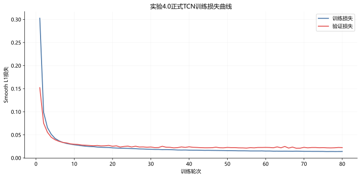

**来源与坐标：** 来源为 [`training_log_4.0.csv`](./model/training_log_4.0.csv) 的 `phase=final_tcn` 记录。横轴为训练轮次，纵轴为标准化基础动力功率的 Smooth L1 损失；蓝线为训练损失，红线为验证损失。

**现象与分析：** 第 1 轮训练/验证损失为 0.302717/0.152177，至第 80 轮降为 0.013995/0.022372；最低验证损失 0.020960 出现在第 68 轮。训练损失后期继续下降而验证损失小幅波动，说明 23 维规划输入已经学到主要关系，但不同 flight 的风场、任务长度和轨迹阶段仍带来泛化差异。最终权重按验证损失最优点保存，没有机械采用第 80 轮状态。

**结论与边界：** 曲线在标准化目标空间，不能直接换算为 W 或 Wh；它也不包含 RLS 的在线反馈效果。

#### 图 C-2 正式 TCN 学习率记录

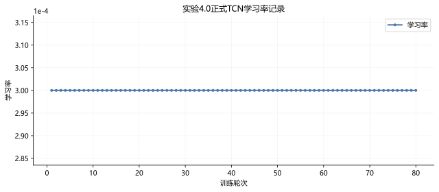

**来源与坐标：** 来源同图 C-1。横轴为训练轮次，纵轴为 AdamW 学习率，图例为“学习率”。

**现象与分析：** 当前代码配置的学习率为 $3\times10^{-4}$，图中若保持水平线，表示本次实现没有再加入学习率调度器。该图的主要作用是确认训练记录和配置一致，不能把恒定学习率本身解释成过拟合或收敛失败。

**结论与边界：** 学习率图不提供梯度范数、GPU 利用率或权重变化信息；优化状态仍需结合训练日志和验证误差判断。

#### 图 C-3 TCN 时间窗候选排序

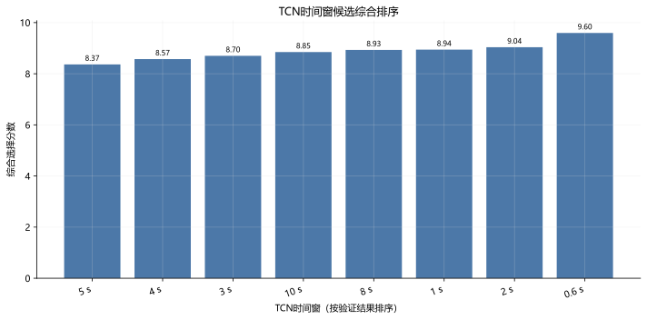

**来源与坐标：** 来源为 [`tcn_window_tuning_4.0.csv`](./model/tcn_window_tuning_4.0.csv)。横轴按验证基础动力功率 WAPE 从小到大排列 8 个候选窗，纵轴为验证 WAPE（%），柱顶为候选数值。

**现象与分析：** 5 s / 25 步以 7.4293% 验证 WAPE 排名第一，0.6 s / 3 步以 8.2465% 最高，8 个候选的跨度为 0.8172 个百分点。短窗只能看到当前状态附近的历史，长窗则受到网络理论感受野 13 步、首行左填充和固定 20 轮预算的共同限制；最终正式训练采用 5 s。

**结论与边界：** 该排序只用于选择 TCN 时间窗；它不是 RLS 窗口敏感性结果，也没有读取测试集。

#### 图 C-4 不同 TCN 时间窗的验证误差

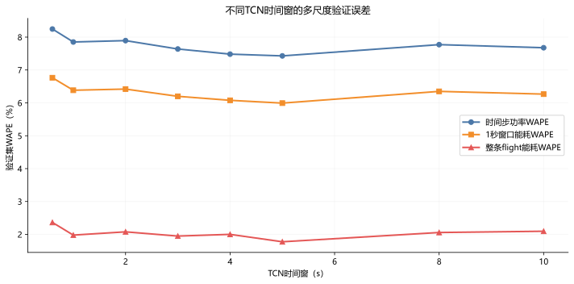

**来源与坐标：** 来源同图 C-3。横轴为物理时间窗（s），纵轴为验证集 WAPE（%），图例为验证集功率 WAPE。

**现象与分析：** 曲线反映窗口长度对同一 TCN 结构的影响。超过 2.6 s 后，序列继续变长，但末时刻卷积分支的有效感受野不会按输入长度增加；如果曲线在长窗处没有继续下降，不能简单归因于数据不足，也可能是网络深度固定造成的。

**结论与边界：** 该图不代表任意 TCN 深度的最优窗长；最终选择还需结合正式 80 轮训练和任务总能耗指标。

### C.2 总体误差与 RLS 窗口比较

#### 图 C-5 TCN 基线与 RLS 校正后的评估指标

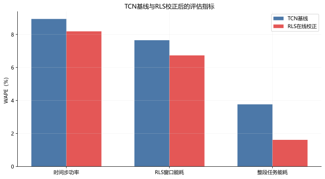

**来源与坐标：** 来源为 [`evaluation_4.0.csv`](./model/evaluation_4.0.csv) 和 [`tcn_vs_rls_summary_4.0.csv`](./model/tcn_vs_rls_summary_4.0.csv)。横轴依次为 0.2 s 时间步功率、1 s 窗口能耗和整段任务能耗，纵轴为 WAPE（%）；蓝色为 TCN，红色为在线 RLS。

**现象与分析：** RLS 把功率、1 s 窗口能耗和 flight 总能耗 WAPE 分别从 8.9398%、7.6507%、3.7642% 降至 8.1897%、6.7316%、1.6131%。flight 尺度相对改善约 57.2%，明显大于时间步功率，说明校正主要消除持续累计偏置；它不保证每个瞬时功率尖峰都下降。

**结论与边界：** 任务执行前只能使用 TCN 基线和任务前区间；RLS 柱是在线阶段结果，不能用于任务开始前的调度预算。

#### 图 C-6 各 flight 实际、TCN 与 RLS 总能耗

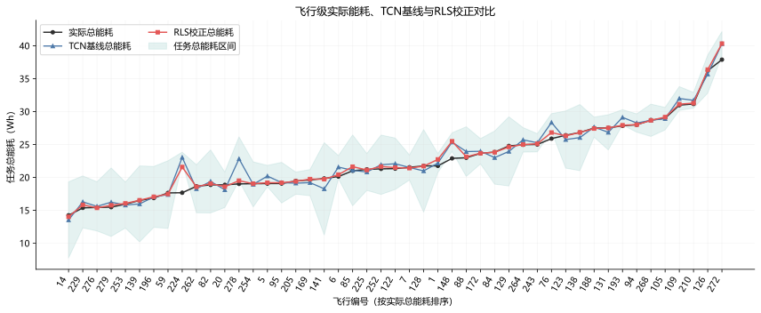

**来源与坐标：** 来源为 [`flight_energy_summary_4.0.csv`](./model/flight_energy_summary_4.0.csv)。横轴为按实际总能耗排序的测试 flight，纵轴为总能耗（Wh）；图例区分实际值、TCN 基线、RLS 校正和任务前总能耗区间。

**现象与分析：** 大多数 flight 的三组点接近；当前 RLS 绝对误差最大的 Flight 224 实际/TCN/RLS 总能耗为 17.66/23.03/21.56 Wh，Flight 148 为 22.88/25.35/25.47 Wh，Flight 272 为 37.88/40.30/40.32 Wh，说明 RLS 并不保证逐任务改善。异常 flight 应回查风场、载荷、任务长度和轨迹机动，而不能用 route 编号解释；RLS 只修正已经接收实际窗口之后的剩余部分。

**结论与边界：** 图中区间是任务前整条任务区间；在线剩余区间来自 RLS 轨迹表，二者不能混作同一覆盖率。

#### 图 C-7 各 flight 总能耗预测误差

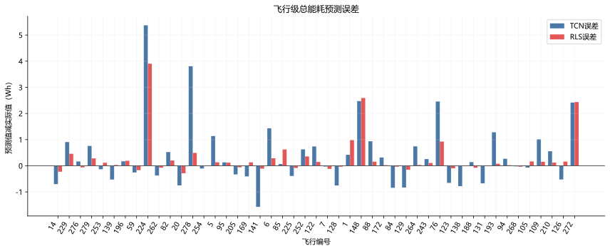

**来源与坐标：** 来源同图 C-6。横轴为测试 flight，纵轴为“预测值减实际值”（Wh），零线以上为高估，零线以下为低估；柱子区分 TCN 和 RLS。

**现象与分析：** 误差方向可以判断模型是否存在统一高估或低估，但长任务的绝对误差可能自然更大。若少数长任务的柱高明显超出主体，通常与未见任务长度或持续风场偏差有关，需要结合 [`generalization_evaluation_4.0.csv`](./model/generalization_evaluation_4.0.csv) 检查。

**结论与边界：** 不能用均值误差替代单个 flight 的风险判断；安全决策以实际可用能量与区间上界比较。

#### 图 C-8 不同实际功率区间的 MAE

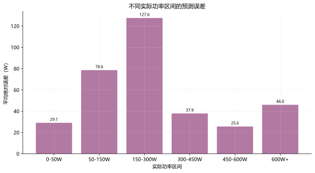

**来源与坐标：** 来源为 [`power_bin_evaluation_4.0.csv`](./model/power_bin_evaluation_4.0.csv)。横轴为 0--50、50--150、150--300、300--450、450--600 和 600 W 以上真实功率箱，纵轴为 RLS 校正功率 MAE（W）。

**现象与分析：** 0--50 W 箱有 11,781 行、真实均值仅 1.57 W，MAE 29.09 W 因小分母对应 1854.49% WAPE；样本最多的 450--600 W 箱有 23,364 行，MAE 25.61 W、WAPE 4.94%；600 W 以上 MAE 为 46.04 W。低功率箱应优先看绝对误差，高功率箱的长尾通常对应起飞、爬升和快速机动。

**结论与边界：** 功率分箱用于诊断工况，不替代 flight 总能耗和任务可行性评价。

#### 图 C-9 RLS 反馈窗长度对 WAPE 的影响

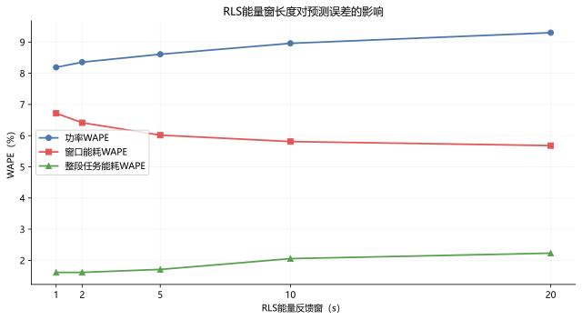

**来源与坐标：** 来源为 [`rls_energy_window_comparison_4.0.csv`](./model/rls_energy_window_comparison_4.0.csv) 测试集行。横轴为 1、2、5、10、20 s 反馈窗，纵轴为 WAPE（%）；曲线分别表示时间步功率、完整窗口能耗和整段任务能耗。

**现象与分析：** 从 1 s 增至 5 s 时，窗口 WAPE 由 6.7144% 降到 6.0148%，flight WAPE 由 1.6131% 升到 1.7090%；到 20 s 时功率/窗口/flight WAPE 为 9.2997%/5.6793%/2.2308%。积分平滑可降低窗口相对误差，但反馈延迟最终抵消收益；这些测试值只用于固定参数下的对照，不用于二次选型。

**结论与边界：** 1 s 是部署配置；其余窗长不参与参数选择，测试集结果不得反向改变线上配置。

#### 图 C-10 RLS 反馈窗的窗口误差与决定系数

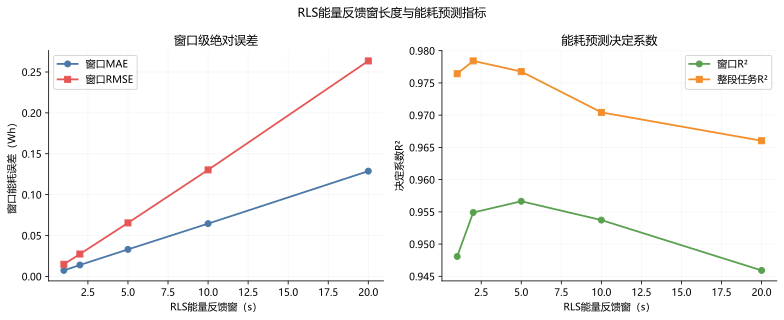

**来源与坐标：** 来源同图 C-9。左图横轴为反馈窗长度，纵轴为窗口能耗 MAE、RMSE（Wh）；右图纵轴为窗口和整段任务的 $R^2$，图例明确区分评价尺度。

**现象与分析：** 反馈窗越长，单窗绝对误差随能量量级增加：1 s RLS 窗口 MAE/RMSE 为 0.00730/0.01482 Wh，20 s 增至 0.12873/0.26352 Wh；窗口 WAPE 则从 6.7144% 降至 5.6793%。整段任务 WAPE 在 1 s 为 1.6131%，20 s 为 2.2308%，说明平滑收益不能抵消反馈延迟。绝对误差、WAPE 与 $R^2$ 必须结合读取。

**结论与边界：** 该图不能单独决定反馈周期；调度系统还要考虑实际计量模块的延迟和任务安全裕量。

#### 图 C-11 RLS 反馈窗长度与更新密度

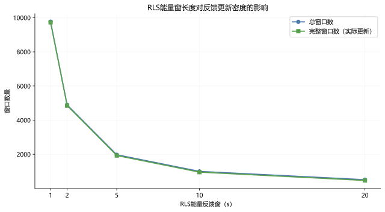

**来源与坐标：** 来源同图 C-9。横轴为反馈窗长度，纵轴为窗口数量；总窗口数包含尾部截断窗，完整窗口数等于允许更新的窗口数。

**现象与分析：** 1、2、5、10、20 s 的完整更新数依次为 9,728、4,854、1,927、952、466，约按窗口时长反比下降；每组另有 40、41、47、47、47 个截断尾窗。尾窗仍计入整条任务能量，但 `is_complete_window=false`，不会被误当作 RLS 更新。

**结论与边界：** 更新密度是在线响应能力的指标，不等于预测精度。

### C.3 三个代表 flight 的时间序列

三个代表 flight 按测试集中时间步数从多到少选择，文件名为 Flight 272、188、148。它们用于观察长序列，不代表各 route 的平均表现；对应的 `second_energy_timeseries` 横轴是固定 1 s RLS 窗口编号。

#### 图 C-12 Flight 272（R6）功率时序

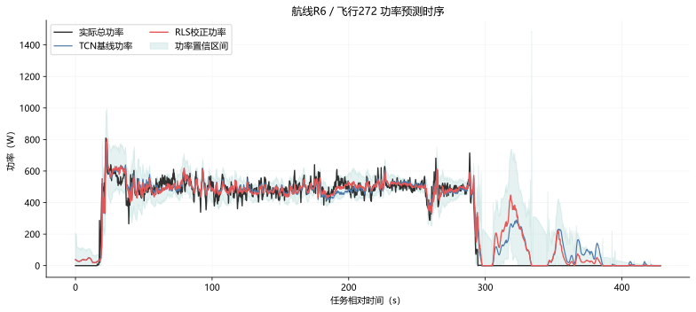

**来源与坐标：** 来源为 [`test_predictions_4.0.csv`](./predictions/test_predictions_4.0.csv)。横轴为任务相对时间（s），纵轴为功率（W）；图例区分实际总功率、TCN 基线、RLS 校正和功率区间。

**现象与分析：** Flight 272 是 428.2 s 的超长 R6 任务，实际平均功率 318.33 W，而 TCN/RLS 平均值约为 338.65/338.81 W；RLS 功率 MAE 从 43.18 W 降到 42.25 W，但总能耗仍高估约 2.44 Wh。曲线只能在完整窗口边界后改变，同一窗口不使用结束时才得到的真实标签，因此表现为分段调整而不是逐点追随真实功率。

**结论与边界：** 该图用于检查时间顺序和长任务漂移，不能代替超长任务分层统计。

#### 图 C-13 Flight 272（R6）窗口能耗时序

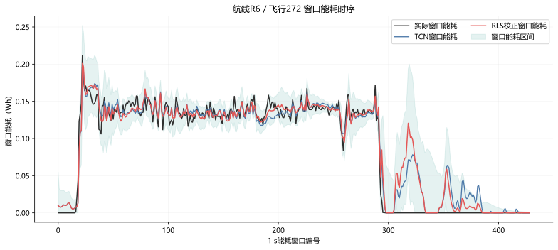

**来源与坐标：** 来源为 [`window_energy_summary_4.0.csv`](./model/window_energy_summary_4.0.csv)。横轴为 1 s 窗口编号，纵轴为窗口能耗（Wh）；曲线区分实际、TCN、RLS，阴影为窗口区间。

**现象与分析：** Flight 272 共 429 个窗口，其中 428 个完整窗可更新、末尾 0.2 s 截断窗只计量。实际、TCN、RLS 总能耗为 37.88、40.30、40.32 Wh，说明当前误差主要是持续高估，RLS 在该超长任务上没有进一步消除总量偏差；窗口曲线比瞬时功率平滑，更能直接对应在线更新所使用的能量配对。

**结论与边界：** 单窗口覆盖率不能替代剩余整条任务覆盖率。

#### 图 C-14 Flight 188（R1）功率时序

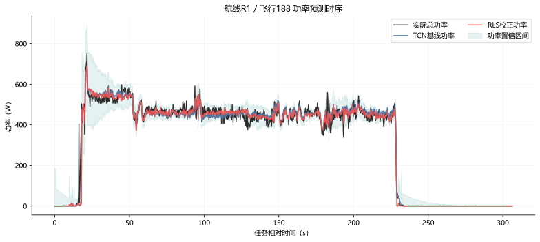

**来源与坐标：** 坐标和图例同图 C-12，数据来自测试预测表。

**现象与分析：** Flight 188 时长 306.2 s，实际、TCN、RLS 平均功率约为 322.96、324.61、322.06 W，RLS 功率 MAE 15.21 W，低于 TCN 的 16.35 W。整体均值接近，但局部尖峰仍可明显偏离，说明平均指标不能代替时序诊断。

**结论与边界：** 一条 R1 flight 不能代表整个 R1，也不能代表未见 route。

#### 图 C-15 Flight 188（R1）窗口能耗时序

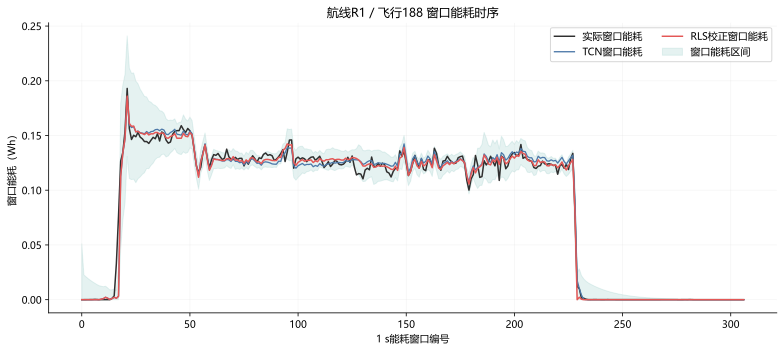

**来源与坐标：** 坐标和图例同图 C-13，数据来自窗口能耗汇总表。

**现象与分析：** Flight 188 共 307 个窗口、306 次完整更新；实际/TCN/RLS 总能耗为 27.49/27.63/27.41 Wh。RLS 消除了大部分累计高估，但略微转为低估；当误差正负交替时，缩放变化应理解为动态跟踪，而不是保证单向收敛。

**结论与边界：** 区间宽度随残差变化，允许扩大而非强制单调收缩。

#### 图 C-16 Flight 148（R1）功率时序

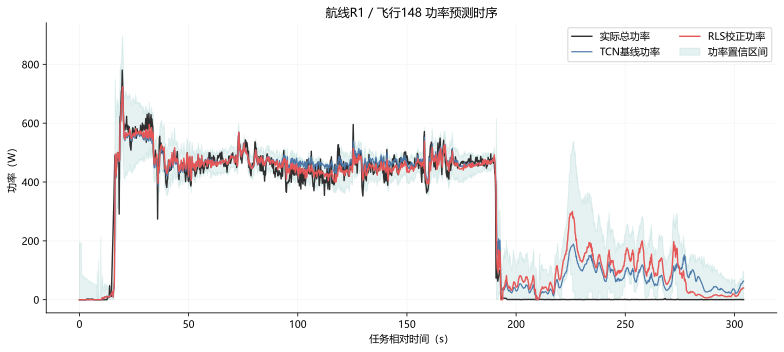

**来源与坐标：** 坐标和图例同图 C-12，数据来自测试预测表。

**现象与分析：** Flight 148 时长 304.2 s，实际、TCN、RLS 平均功率约为 270.60、299.72、301.13 W；RLS 功率 MAE 44.68 W，高于 TCN 的 40.42 W。该 flight 的累计预测由在线校正推向更高值，说明 RLS 并非每个 flight 都改善，局部风场和轨迹状态需要回查。

**结论与边界：** 代表图用于诊断，不替代全测试集表格。

#### 图 C-17 Flight 148（R1）窗口能耗时序

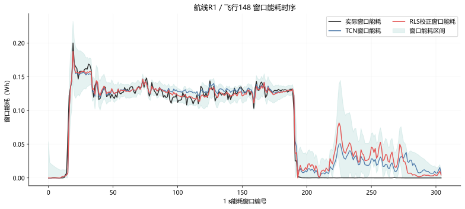

**来源与坐标：** 坐标和图例同图 C-13，数据来自窗口能耗汇总表。

**现象与分析：** Flight 148 有 305 个窗口、304 次更新；实际/TCN/RLS 总能耗为 22.8807/25.3537/25.4732 Wh，RLS 仍高估 2.5925 Wh。末尾截断窗只作汇总，没有泄漏进参数；该 flight 说明累计状态校正也可能受持续工况偏移影响。

**结论与边界：** 该图不显示任务前动态区间的条件变量，需结合分层评估表解释风场和载荷影响。

### C.4 散点与残差诊断

#### 图 C-18 时间步功率预测散点

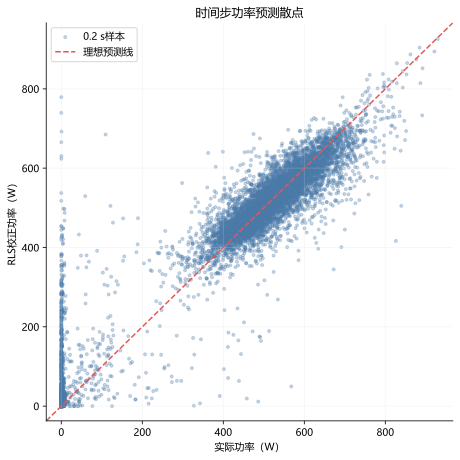

**来源与坐标：** 从测试预测表固定随机种子抽取最多 12000 个点。横轴为实际功率，纵轴为 RLS 校正功率（W），虚线为 $y=x$ 理想线，图例标出 0.2 s 样本。

**现象与分析：** 全部 48,739 个测试时间步的功率残差均值为 +5.10 W、中位数 +0.26 W，说明主体接近零但正向长尾拉高均值；99% 绝对残差约 261.37 W。散点只固定抽样 12,000 点用于可读性，正式 8.1897% WAPE 使用全部时间步计算。

**结论与边界：** 散点不展示时间顺序，也不能证明任务级区间覆盖。

#### 图 C-19 时间步功率残差分布

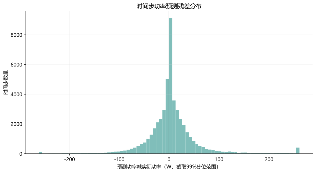

**来源与坐标：** 来源为全部测试时间步。横轴为预测减实际功率（W），显示范围截到残差绝对值 99% 分位；纵轴为时间步数量。

**现象与分析：** 残差中位数接近 0 W，但均值为 +5.10 W，表示少数大幅高估比低估尾部更强。直方图把显示范围截到 99% 分位，超出约 261.37 W 的极端误差仍参与正式 MAE/RMSE，只是不在主体图域内展开。

**结论与边界：** 最大误差和 RMSE 应从 `evaluation_4.0.json` 读取，不能从截断图形估计。

#### 图 C-20 0.2 s 时间步能耗散点

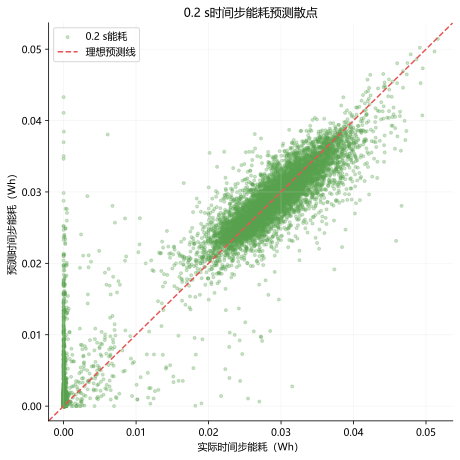

**来源与坐标：** 来源为测试预测表，最多抽样 12000 点。横轴为实际 0.2 s 能耗，纵轴为预测 0.2 s 能耗（Wh），虚线为理想线。

**现象与分析：** 0.2 s 能量残差均值为 +0.000283 Wh，99% 绝对残差约 0.014521 Wh，与功率残差按 $0.2/3600$ 换算一致。大量停桨或低功率点聚集在原点附近，因此散点视觉密度不能代替窗口和 flight 能量误差。

**结论与边界：** 该图不等同于 1 s RLS 窗口预测，也不等同于任务总能耗。

#### 图 C-21 0.2 s 时间步能耗残差

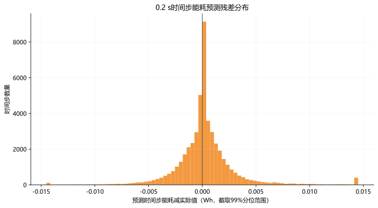

**来源与坐标：** 横轴为预测时间步能耗减实际值（Wh），显示范围为残差绝对值 99% 分位；纵轴为时间步数量。

**现象与分析：** 主体残差围绕零集中，但均值仍为正，和功率残差的高估长尾一致。单步误差若正负交替会在累计中抵消，若连续同向则会形成任务级偏差，这也是 RLS 以窗口能量而不是单点功率更新的原因。

**结论与边界：** 需要与功率时间序列和 flight 汇总联合判断，不能把残差峰值直接当作任务风险。

#### 图 C-22 1 s RLS 窗口能耗散点

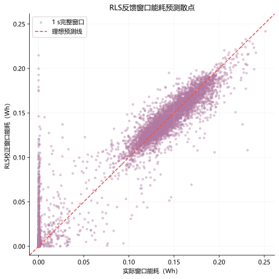

**来源与坐标：** 来源为窗口能耗汇总表。横轴为实际窗口能耗，纵轴为 RLS 校正窗口能耗（Wh）；虚线为理想线，图例标明 1 s 窗口。

**现象与分析：** 9,728 个完整窗口的残差均值为 +0.001401 Wh、中位数为 +0.000107 Wh，99% 绝对残差约为 0.067033 Wh。主体靠近对角线，但少数窗口仍有长尾；40 个截断尾窗被排除在更新散点之外。

**结论与边界：** 窗口散点不直接表示未来剩余路线的区间质量。

#### 图 C-23 1 s RLS 窗口能耗残差

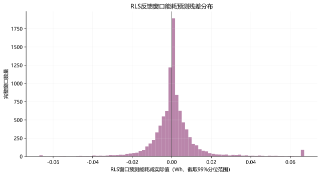

**来源与坐标：** 横轴为 RLS 窗口预测能耗减实际值（Wh），显示范围截到 99% 分位；纵轴为完整窗口数量。

**现象与分析：** 9,728 个完整窗口的残差均值为 +0.001401 Wh、中位数 +0.000107 Wh，表明大多数更新没有固定偏移，但少数连续高估会推动偏置和缩放变化。长尾出现时残差方差会增大，后续剩余任务区间可以重新变宽；是否扩大取决于具体 flight 的观测序列。

**结论与边界：** 总体直方图混合了不同工况，必须同时看风速、载荷和任务长度分层覆盖。

### C.5 新路线任务前接口

#### 图 C-24 候选新路线任务前功率

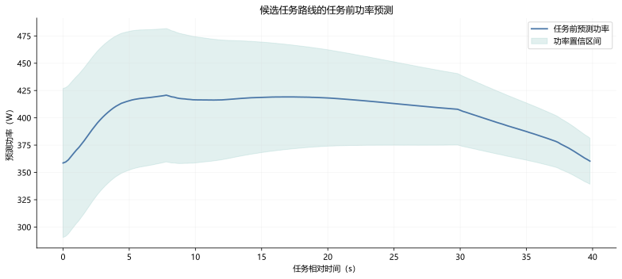

**来源与坐标：** 输入为 [`demo_candidate_task_4.0.csv`](./tasks/demo_candidate_task_4.0.csv)，输出为 [`task_before_prediction_4.0.csv`](./tasks/task_before_prediction_4.0.csv)。横轴为任务相对时间（s），纵轴为预测总功率（W）；曲线包含基础动力功率和 8 W 已知附加功率，阴影为逐时间步功率区间。

**现象与分析：** 输入使用 `NEW_ROUTE_X`，没有 route 独热列；机体系三轴速度/加速度、局部 ENU 位置、风场和载荷构成 23 维输入。40 s 路线的基础动力能耗为 4.4159 Wh，已知 8 W 附加设备贡献 0.0889 Wh。曲线证明接口能处理未见编号轨迹，但合成路线没有真实标签，不能作为精度样本。

**结论与边界：** 由于没有真实功率标签，这张图只验证任务前输出格式、附加功率叠加和区间字段。

#### 图 C-25 候选新路线累计能耗与区间

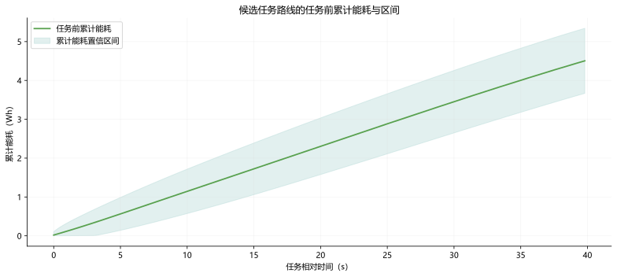

**来源与坐标：** 数据来源同图 C-24。横轴为任务相对时间（s），纵轴为累计能耗（Wh）；曲线为累计任务前预测，阴影为条件残差方差合成后的累计区间。

**现象与分析：** 累计预测从首步约 0.029 Wh 增长到 4.5048 Wh，任务末端 95% 区间为 3.6672--5.3423 Wh。曲线单调增加；区间半径按逐步条件方差平方和及验证 flight 共形倍率计算，不是把固定功率半径线性相加。

**结论与边界：** 区间没有显式覆盖天气预报误差、规划误差和电池老化，调度器仍需加入返航能耗上界和安全储备。

### C.6 RLS 参数与未来能耗校正

#### 图 C-26 RLS 7x7 参数网格验证结果

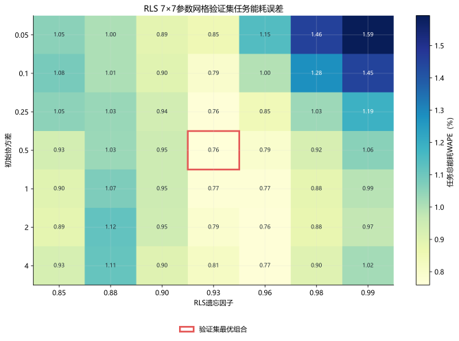

**来源与坐标：** 来源为 [`rls_tuning_4.0.csv`](./rls/rls_tuning_4.0.csv) 的 49 组验证集结果。横轴为遗忘因子 $\lambda$，纵轴为初始协方差 $P_0$，单元格数字和色阶均表示验证集 flight 总能耗 WAPE（%）；红框标出只依据验证集选出的部署组合。

**现象与分析：** 49 个单元格均有有限验证分数，最优组合为 $\lambda=0.93$、$P_0=0.5$，验证 flight WAPE 为 0.7590%；相邻组合仍在同一误差量级，说明最优附近较平缓。遗忘因子较小时响应更快、较大时保留历史更久；最终组合只按验证表选择，没有借用测试集。

**结论与边界：** 该图评价的是验证 flight 的任务总能耗，不代表单时间步功率误差；测试集没有参与参数搜索或区间倍率校准。

#### 图 C-27 Flight 272 的 RLS 参数轨迹

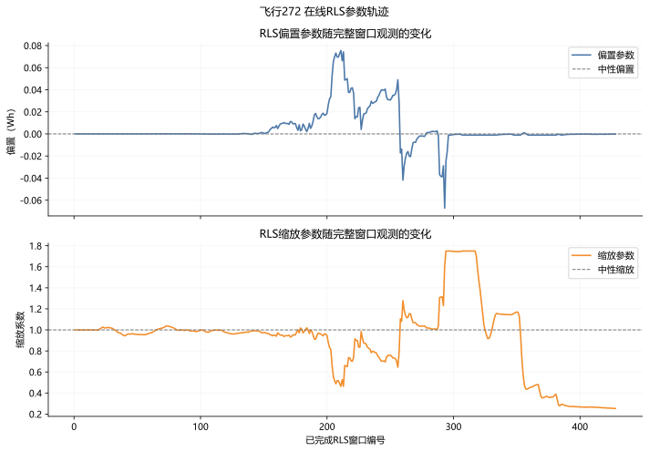

**来源与坐标：** 来源为 [`rls_parameter_trace_4.0.csv`](./rls/rls_parameter_trace_4.0.csv)。横轴为已完成的 1 s 完整窗口编号，上图纵轴为偏置（Wh/窗口），下图为缩放系数；虚线为中性状态 0 和 1。

**现象与分析：** Flight 272 完成 428 次更新，缩放系数范围为 0.2529--1.7500，末值为 0.2529；偏置末值约 -0.0002 Wh/窗。参数触及缩放下界，说明单一仿射状态难以解释该超长任务的阶段性偏差，需要结合超长任务分层而不能只看最终参数。

**结论与边界：** 该轨迹只代表一个 flight；新任务开始时 RLS 会恢复中性状态。

#### 图 C-28 Flight 188 的 RLS 参数轨迹

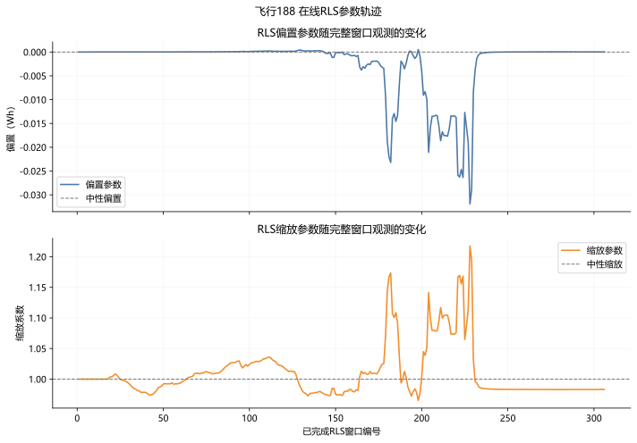

**来源与坐标：** 坐标、虚线和数据来源同图 C-27。

**现象与分析：** Flight 188 完成 306 次更新，缩放范围为 0.9653--1.2175，末值 0.9831，最终 flight 预测 27.4107 Wh 接近实际 27.4876 Wh。相较 Flight 272，其末值保持在中性缩放附近，说明累计系统偏差更小。

**结论与边界：** 参数轨迹不能单独给出预测区间覆盖；协方差和残差状态同样参与区间计算。

#### 图 C-29 Flight 148 的 RLS 参数轨迹

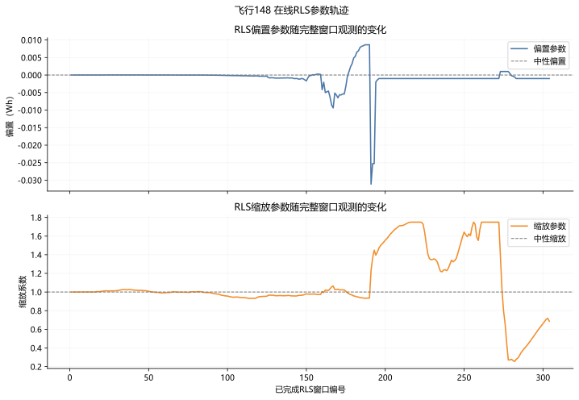

**来源与坐标：** 坐标和数据来源同图 C-27。

**现象与分析：** Flight 148 完成 304 次更新，缩放范围为 0.2548--1.7500，末值 0.6871；RLS 总能耗 25.4732 Wh，较实际 22.8807 Wh 高估 2.5925 Wh。参数并未简单回到 1，说明偏置、缩放和已执行实际能量共同决定最终累计值，且该 flight 暴露了在线校正的失败样本。

**结论与边界：** 参数更新频率固定为完整 1 s 窗口，末尾截断窗不应出现在此图中。

#### 图 C-30 实际窗口到达后的未来 TCN 能耗校正

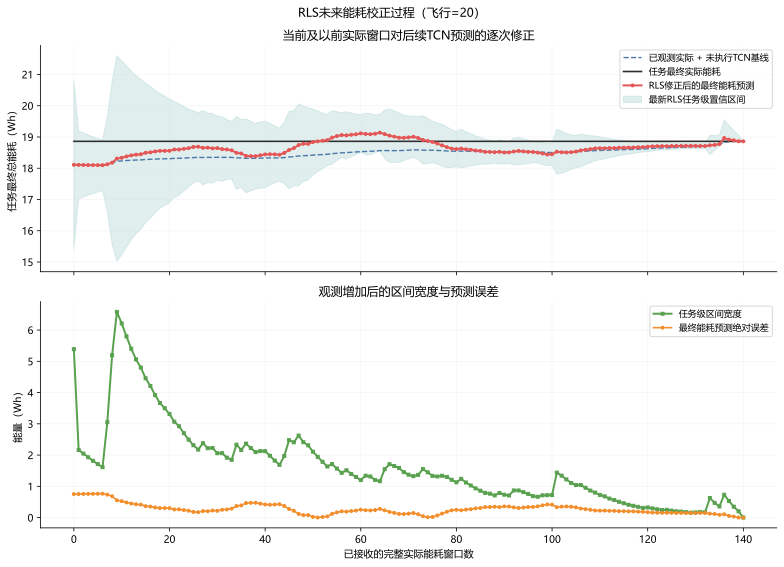

**来源与坐标：** 来源为 [`rls_future_correction_trace_4.0.csv`](./rls/rls_future_correction_trace_4.0.csv) 和 [`rls_future_correction_summary_4.0.json`](./rls/rls_future_correction_summary_4.0.json)。横轴为已接收完整实际能耗窗口数；上图纵轴为任务最终总能耗（Wh），比较已观测实际与未执行 TCN 基线、最终实际值、RLS 修正预测和最新任务级区间；下图展示区间宽度和最终预测绝对误差。

**现象与分析：** Flight 20 的最终预测由零观测时 18.1102 Wh 逐步接近实际 18.8607 Wh；到第 25、50、75、100、125、139 个窗口时绝对误差为 0.1805、0.0216、0.0189、0.4138、0.1514、0.0016 Wh。区间宽度同期为 2.3159、2.1080、1.3339、0.7203、0.2229、0.2004 Wh；第 100 个窗口的观测使点预测短暂偏离，说明不能把校正过程描述为严格单调收敛。

**结论与边界：** 任务末端剩余路线为零，最终预测等于已观测实际总能耗；终点零误差不能当作模型对未来的预测成绩。区间也不要求逐点严格单调收缩。

#### 图 C-31 RLS 未来能耗逐步校正动图


**来源与坐标：** 动图与图 C-30 使用同一代表 flight，均匀抽取 120 帧，约为 2240×1120 画布。左侧固定坐标范围展示最终能耗预测、实际水平线和任务级区间；右侧展示区间宽度和预测绝对误差，标题标明已接收的完整窗口数。

**现象与分析：** 动图从 0 个观测窗的 5.3879 Wh 区间宽度开始，随实际窗口进入逐步收缩；第 100 个窗口出现较大残差后点预测暂时回落，区间仍由当前协方差和残差状态重新计算。已执行部分始终取实际观测，只有未执行 TCN 基线和区间被重算，符合“当前窗结束后才更新”的因果顺序。

**结论与边界：** 代表 flight 选择逻辑写入摘要 JSON；动图是机制示例，全测试覆盖率和长任务风险仍以结构化表为准。

### C.7 八类正常航线总览

#### 图 C-32 H 与 R1--R7 代表 flight 的轨迹和累计能耗

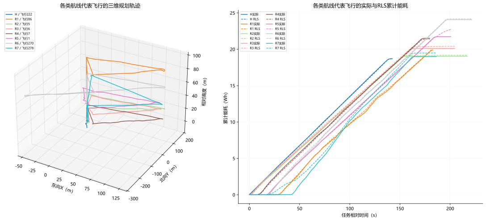

**来源与坐标：** 来源为 [`route_products_summary_4.0.json`](./routes/route_products_summary_4.0.json) 和八条航线对齐 CSV。左图为起点局部 ENU 三维规划轨迹，单位 m；右图横轴为时间（s）、纵轴为累计能耗（Wh），实线为实际值，虚线为 RLS。A1、A2、A3 未进入此图。

**现象与分析：** 八条代表 flight 的实际总能耗范围为 18.7078--24.0653 Wh。RLS 对 H、R1、R2、R3、R4、R6、R7 的累计绝对误差均小于对应 TCN，但 R5 从 TCN 的 1.93% 高估扩大到 RLS 的 4.51%；因此 RLS 总体有效，却不能保证每条路线单调改善。差异应由轨迹、风场和载荷解释，route 只用于追踪。

**结论与边界：** 每条 route 只选择一条长度接近该 route 中位数的代表 flight，图用于追踪和人工审查，不替代 route 或留出条件统计。

### C.8 八类正常航线逐项展示

每条正常航线保留与 3.2 同用途的五件套：对齐 CSV、功率/累计能耗 SVG、交互式三维 HTML、同步 GIF 和 JSON 摘要。SVG 上图横轴为时间（s）、纵轴为功率（W）；下图纵轴为累计能耗（Wh）。GIF 左侧同步显示实际功率、TCN 基线和 RLS 校正，右侧显示同一位置序列形成的全程参考轨迹与随时间推进的已执行轨迹；规划轨迹与已执行轨迹使用同一位置数据，功率/能量面板不绘制当前时刻竖线，避免把“规划”和“实飞”误读成两条不同轨迹。所有图例均为中文。

#### 图 C-33 H 航线 Flight 222 功率与累计能耗

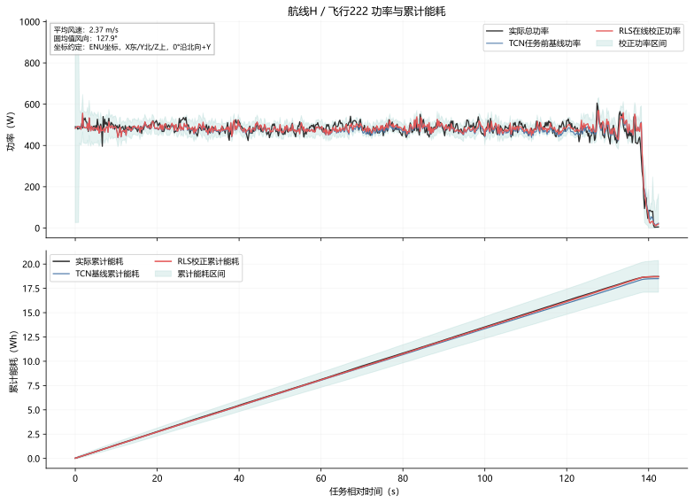

**来源与坐标：** [`flight_222_imu_aligned.csv`](./routes/route_H/flight_222/flight_222_imu_aligned.csv)；摘要见 [`flight_222_summary.json`](./routes/route_H/flight_222/flight_222_summary.json)。上图比较实际、TCN、RLS 功率与校正区间，下图比较累计能耗。

**结果分析：** Flight 222 时长 142.4 s、平均风速 2.37 m/s，实际/TCN/RLS 总能耗为 18.7078/18.5011/18.7020 Wh；RLS 将 -1.10% 的累计低估缩小到 -0.03%。H 用于覆盖低水平速度或无水平移动状态，仍需单独检查悬停阶段的速度、去重力加速度和风场记录。

**结论边界：** Flight 222 只是 H 的代表样本，不能单独估计所有悬停工况。

#### 图 C-34 H 航线 Flight 222 功率与三维轨迹动图


**图表说明：** 动图固定为 120 帧、约 2240×980，采用同一位置序列绘制全程参考轨迹和随时间推进的已执行轨迹；功率与能量面板不绘制当前时刻竖线。可打开[交互式三维规划轨迹](./routes/route_H/flight_222/flight_222_imu_trajectory.html)旋转、缩放，并读取当前时间、三轴速度、速度模长、风速和风向。

**结果分析：** 动图用于把功率变化与低速、爬升和降落阶段对应，静态总量仍以上一幅 SVG 和 JSON 为准。

#### 图 C-35 R1 航线 Flight 86 功率与累计能耗

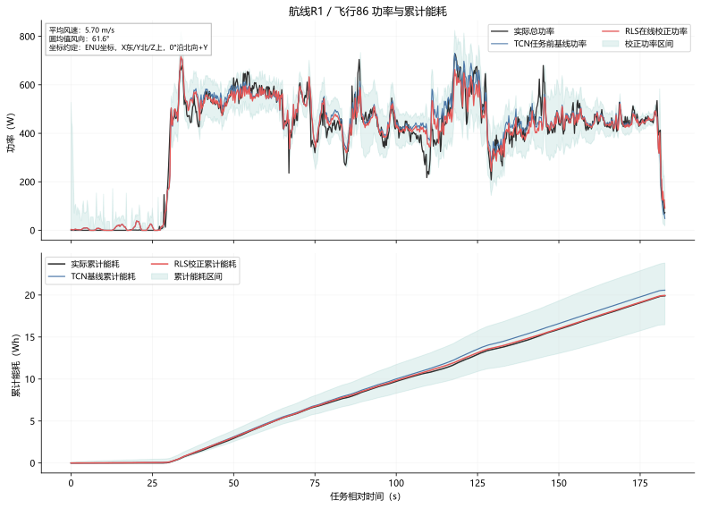

**来源与坐标：** [`flight_86_imu_aligned.csv`](./routes/route_R1/flight_86/flight_86_imu_aligned.csv)；摘要见 [`flight_86_summary.json`](./routes/route_R1/flight_86/flight_86_summary.json)。坐标和图例同图 C-33。

**结果分析：** Flight 86 时长 182.6 s、平均风速 5.70 m/s，实际/TCN/RLS 总能耗为 19.9046/20.5755/19.9551 Wh；RLS 把 +3.37% 高估缩小到 +0.25%。R1 样本数量较多，但该代表图不能替代未见路线和高风速统计。

**结论边界：** route 标签只出现在结果追踪和图题，不进入 TCN 输入。

#### 图 C-36 R1 航线 Flight 86 功率与三维轨迹动图


**图表说明：** 帧、坐标和动态图例同图 C-34；规划参考轨迹与已执行轨迹来自同一位置序列，功率/能量面板不显示当前时刻竖线。可打开[交互式三维规划轨迹](./routes/route_R1/flight_86/flight_86_imu_trajectory.html)。

**结果分析：** 轨迹转折与功率峰值的时间对应关系可用于回查误差阶段，不能据此推断所有 R1 任务的平均功率。

#### 图 C-37 R2 航线 Flight 5 功率与累计能耗

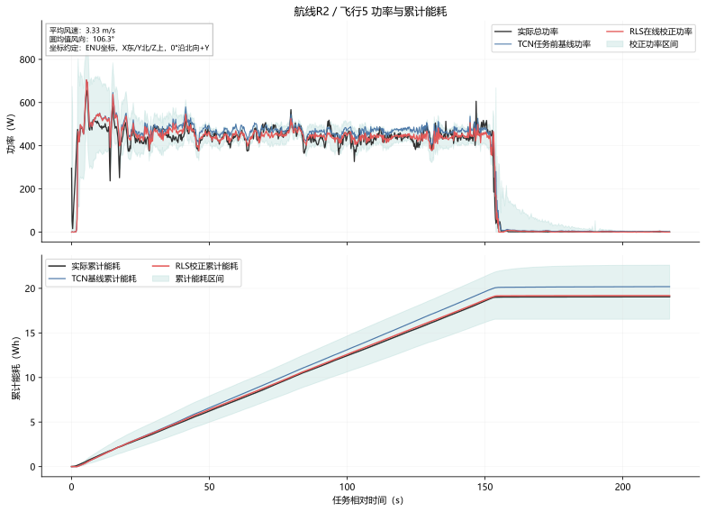

**来源与坐标：** [`flight_5_imu_aligned.csv`](./routes/route_R2/flight_5/flight_5_imu_aligned.csv)；摘要见 [`flight_5_summary.json`](./routes/route_R2/flight_5/flight_5_summary.json)。R2 属于完整留出的未见 route。

**结果分析：** Flight 5 时长 217.0 s，实际/TCN/RLS 总能耗为 19.0533/20.1895/19.1854 Wh，误差由 +5.96% 降到 +0.69%。R2 完整留作未见路线，结果说明连续轨迹、风场和载荷可以直接驱动预测，无需 R2 独热编码。

**结论边界：** R2 只有少量测试 flight，必须与 R3、R4、R7 合计结果一起解释。

#### 图 C-38 R2 航线 Flight 5 功率与三维轨迹动图


**图表说明：** 帧、坐标和图例同图 C-34。可打开[交互式三维规划轨迹](./routes/route_R2/flight_5/flight_5_imu_trajectory.html)。

**结果分析：** 动图说明未见 route 仍可生成轨迹追踪产物；它不提供额外训练样本，也不改变测试划分。

#### 图 C-39 R3 航线 Flight 6 功率与累计能耗

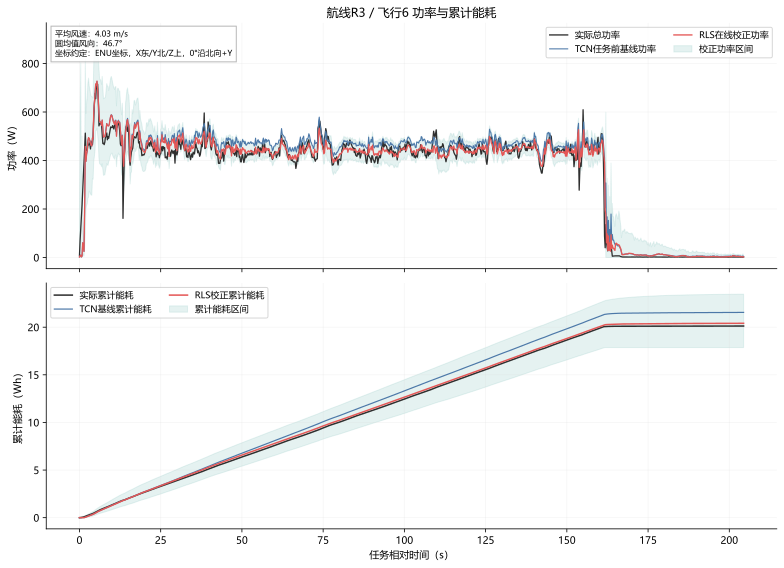

**来源与坐标：** [`flight_6_imu_aligned.csv`](./routes/route_R3/flight_6/flight_6_imu_aligned.csv)；摘要见 [`flight_6_summary.json`](./routes/route_R3/flight_6/flight_6_summary.json)。R3 未参与训练和验证。

**结果分析：** Flight 6 时长 204.4 s，实际/TCN/RLS 为 20.1227/21.5537/20.4099 Wh；RLS 把 +7.11% 高估缩小到 +1.43%。该未见路线的累计结果较好，但任务前仍只能依据 TCN 区间上界派遣，不能提前使用在线校正成绩。

**结论边界：** 单条 R3 图不能概括未见路线内部变化。

#### 图 C-40 R3 航线 Flight 6 功率与三维轨迹动图


**图表说明：** 帧、坐标和图例同图 C-34。可打开[交互式三维规划轨迹](./routes/route_R3/flight_6/flight_6_imu_trajectory.html)。

**结果分析：** 可把功率高估或低估时段与转弯、爬升和下降阶段对齐，避免只看 route 名称。

#### 图 C-41 R4 航线 Flight 7 功率与累计能耗

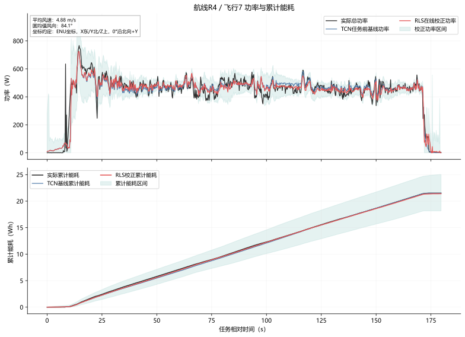

**来源与坐标：** [`flight_7_imu_aligned.csv`](./routes/route_R4/flight_7/flight_7_imu_aligned.csv)；摘要见 [`flight_7_summary.json`](./routes/route_R4/flight_7/flight_7_summary.json)。R4 为未见 route。

**结果分析：** Flight 7 时长 179.6 s、平均风速 4.88 m/s，实际/TCN/RLS 为 21.5227/21.4924/21.4023 Wh。TCN 仅低估 0.14%，RLS 后低估扩大到 0.56%，说明在线仿射校正不保证单条任务改善；该差异仍很小，但不能代表其他 R4 工况。

**结论边界：** 未见 route 的正式数值使用分层表，不由代表图决定。

#### 图 C-42 R4 航线 Flight 7 功率与三维轨迹动图


**图表说明：** 帧、坐标和图例同图 C-34。可打开[交互式三维规划轨迹](./routes/route_R4/flight_7/flight_7_imu_trajectory.html)。

**结果分析：** 动图中的风速、风向和三轴速度均来自对齐表，可用于判断误差是否与局部环境和机动阶段同步。

#### 图 C-43 R5 航线 Flight 1 功率与累计能耗

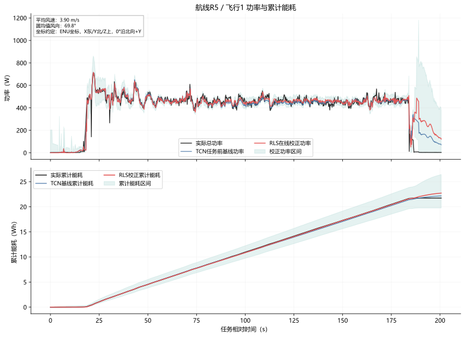

**来源与坐标：** [`flight_1_imu_aligned.csv`](./routes/route_R5/flight_1/flight_1_imu_aligned.csv)；摘要见 [`flight_1_summary.json`](./routes/route_R5/flight_1/flight_1_summary.json)。

**结果分析：** Flight 1 时长 200.6 s，实际/TCN/RLS 为 21.7416/22.1615/22.7216 Wh；RLS 将 +1.93% 高估扩大为 +4.51% 高估。该结果显示双向更新可能越过真实值，安全决策必须同时看上界而不是只看点预测。

**结论边界：** 代表 flight 只承担追踪和人工审查，不替代总体测试表。

#### 图 C-44 R5 航线 Flight 1 功率与三维轨迹动图


**图表说明：** 帧、坐标和图例同图 C-34。可打开[交互式三维规划轨迹](./routes/route_R5/flight_1/flight_1_imu_trajectory.html)。

**结果分析：** 功率和轨迹同步展示用于区分持续性偏置与局部尖峰；RLS 参数需要另看参数轨迹图。

#### 图 C-45 R6 航线 Flight 270 功率与累计能耗

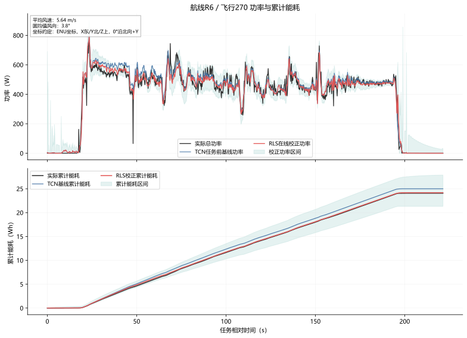

**来源与坐标：** [`flight_270_imu_aligned.csv`](./routes/route_R6/flight_270/flight_270_imu_aligned.csv)；摘要见 [`flight_270_summary.json`](./routes/route_R6/flight_270/flight_270_summary.json)。R6 另包含长任务 Flight 272。

**结果分析：** Flight 270 时长 221.4 s、平均风速 5.64 m/s，实际/TCN/RLS 为 24.0653/24.9909/24.1697 Wh；误差由 +3.85% 降至 +0.43%。这一正常长任务不能掩盖同属 R6 的超长 Flight 272 仍有 2.44 Wh 高估，以及超长组 33.33% 的区间覆盖率。

**结论边界：** 需要把该图和 Flight 272 时间序列、超长任务覆盖率一起解释。

#### 图 C-46 R6 航线 Flight 270 功率与三维轨迹动图


**图表说明：** 帧、坐标和图例同图 C-34。可打开[交互式三维规划轨迹](./routes/route_R6/flight_270/flight_270_imu_trajectory.html)。

**结果分析：** 动图用于检查代表 R6 的长航迹中功率变化、轨迹进度和在线校正是否同步，不替代困难 Flight 272 的统计。

#### 图 C-47 R7 航线 Flight 278 功率与累计能耗

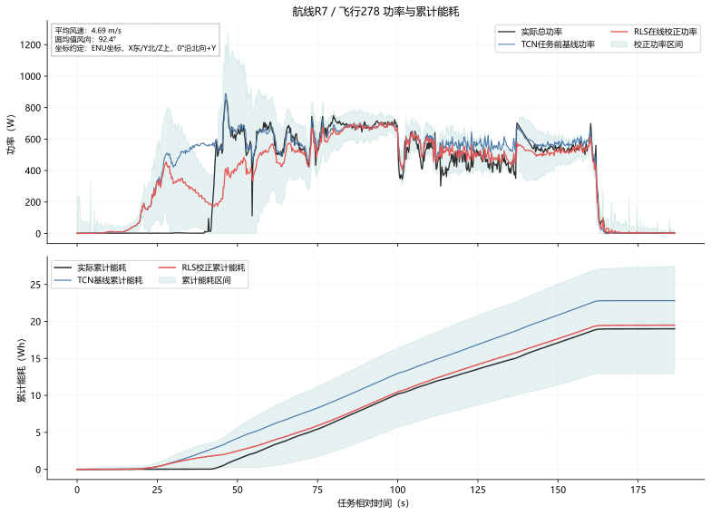

**来源与坐标：** [`flight_278_imu_aligned.csv`](./routes/route_R7/flight_278/flight_278_imu_aligned.csv)；摘要见 [`flight_278_summary.json`](./routes/route_R7/flight_278/flight_278_summary.json)。R7 为未见 route。

**结果分析：** Flight 278 时长 186.4 s，实际/TCN/RLS 为 19.0027/22.8097/19.4946 Wh。实际功率到 42.0 s 才连续超过 100 W，TCN 在 19.8 s 已提前抬升；20--42 s 地面等待段的实际/TCN 平均功率为 4.17/432.68 W。地面低功率观测又把 RLS 缩放压低，使 42--47 s 真正启动段的 RLS MAE 达到 310.80 W。总能量误差由 +20.03% 降至 +2.59%，其中包含“等待阶段高估、启动阶段低估”的抵消，不能据此认为过程曲线已经准确。完整同类样本和分阶段统计见 B.9 节。

**结论边界：** 该图揭示的是阶段识别和 RLS 状态滞后问题；它只有一条代表 flight，不能代替 R7 的未见路线统计，也不能只用最终累计能量评价启动过程。

#### 图 C-48 R7 航线 Flight 278 功率与三维轨迹动图


**图表说明：** 帧、坐标和图例同图 C-34。可打开[交互式三维规划轨迹](./routes/route_R7/flight_278/flight_278_imu_trajectory.html)。

**结果分析：** 三维轨迹和功率曲线共同说明 R7 通过连续物理状态进入模型，而不是固定编号；动态图不增加训练信息。

## D. 产物清单、完整性与复现边界

### D.1 结构化数据与元数据

| 文件 | 内容与使用边界 |
| --- | --- |
| `processed/planning_energy_features_4.0.csv` | 全部正常 flight 的 0.2 s 建模表，含离线标签、追踪字段、23 维输入和路线派生量。 |
| `processed/train_4.0.csv` | 完整 flight 训练集，用于 scaler 和 TCN 权重拟合。 |
| `processed/val_4.0.csv` | 完整 flight 验证集，用于时间窗、RLS 参数和区间校准。 |
| `processed/test_4.0.csv` | 最终测试集，只用于冻结后的评价。 |
| `processed/resample_map_4.0.csv` | 每个 0.2 s 新时间点对应的原始索引、原始时间范围和能量处理方法。 |
| `processed/feature_analysis_4.0.csv` | 候选字段的唯一值数、零值比例、均值、标准差、是否进入 TCN 和保留/删除理由。 |
| `processed/feature_metadata_4.0.json` | 23 维逐字段单位、含义、历史来源、部署来源、坐标约定、禁止输入和采样说明。 |
| `processed/dataset_summary_4.0.json` | 数据行数、flight 数、切分规模、未见条件数量、原始与重采样周期。 |

### D.2 模型评估与预测表

| 文件 | 内容与使用边界 |
| --- | --- |
| [`training_log_4.0.csv`](./model/training_log_4.0.csv) | 8 个候选各 20 轮及正式模型 80 轮的训练损失、验证损失和学习率。 |
| [`tcn_window_tuning_4.0.csv`](./model/tcn_window_tuning_4.0.csv) | 8 个时间窗的验证 WAPE、MAE、最佳损失和轮数。 |
| [`uncertainty_model_4.0.json`](./model/uncertainty_model_4.0.json) | 七个条件变量的异方差系数、尺度、下限和完整 flight 共形倍率。 |
| [`evaluation_4.0.csv`](./model/evaluation_4.0.csv) | 当前测试集总体指标的单行表。 |
| [`evaluation_4.0.json`](./model/evaluation_4.0.json) | 总体指标、区间校准来源、留出条件摘要和剩余任务区间诊断。 |
| [`flight_energy_summary_4.0.csv`](./model/flight_energy_summary_4.0.csv) | 每个测试 flight 的实际、TCN、RLS 总能耗及任务前区间。 |
| [`window_energy_summary_4.0.csv`](./model/window_energy_summary_4.0.csv) | 每个 1 s 或截断尾窗的步数、持续时间、完整性、实际/预测能耗和误差。 |
| [`power_bin_evaluation_4.0.csv`](./model/power_bin_evaluation_4.0.csv) | 六个真实功率区间的样本量、均值、MAE、RMSE 和 WAPE。 |
| [`route_energy_summary_4.0.csv`](./model/route_energy_summary_4.0.csv) | 按 route 汇总的 flight 数、行数和总能耗误差；route 不进入模型。 |
| [`tcn_vs_rls_summary_4.0.csv`](./model/tcn_vs_rls_summary_4.0.csv) | 时间步、窗口和 flight 三个尺度的 TCN/RLS WAPE 对照。 |
| [`generalization_evaluation_4.0.csv`](./model/generalization_evaluation_4.0.csv) | 已见/未见路线、风速、载荷、任务长度和任一留出条件的 flight 级指标。 |
| [`interval_stratified_evaluation_4.0.csv`](./model/interval_stratified_evaluation_4.0.csv) | 按风速、风向、载荷和任务长度分箱的误差、覆盖率和区间宽度。 |
| [`remaining_task_evaluation_4.0.csv`](./model/remaining_task_evaluation_4.0.csv) | 初始/post-update 及不同剩余窗口数的在线覆盖率、宽度和机械线性膨胀诊断。 |
| [`rls_energy_window_comparison_4.0.csv`](./model/rls_energy_window_comparison_4.0.csv) | 验证/测试集 1、2、5、10、20 s 固定参数窗口敏感性总体表。 |
| [`rls_energy_window_comparison_by_flight_4.0.csv`](./model/rls_energy_window_comparison_by_flight_4.0.csv) | 五种反馈窗逐 flight 的 TCN/RLS 能耗、误差和完整/截断窗口数量。 |
| [`rls_energy_window_evaluation_4.0.csv`](./model/rls_energy_window_evaluation_4.0.csv) | 五种反馈窗的逐窗口明细，记录完整性、预测/实际能耗、RLS 更新状态、区间和 flight 级累计字段，供在线更新顺序与尾窗排除审计。 |
| [`rls_energy_window_comparison_4.0.json`](./model/rls_energy_window_comparison_4.0.json) | 窗口分析目的、固定参数、完整窗口政策、字段解释和总体记录。 |
| [`test_predictions_4.0.csv`](./predictions/test_predictions_4.0.csv) | 测试集逐 0.2 s 的真实标签、TCN 基线、RLS 校正、上下界和规划输入。 |
| [`all_route_predictions_4.0.csv`](./predictions/all_route_predictions_4.0.csv) | 全部正常 flight 的逐步预测，供 H、R1--R7 路线产物生成。 |

### D.3 RLS 与任务接口产物

| 文件 | 内容与使用边界 |
| --- | --- |
| [`rls_tuning_4.0.csv`](./rls/rls_tuning_4.0.csv) | 49 组遗忘因子/初始协方差的验证 flight 能耗指标。 |
| [`rls_interval_calibration_4.0.json`](./rls/rls_interval_calibration_4.0.json) | 5 折完整-flight 交叉拟合记录、剩余任务倍率、窗口倍率和初始残差标准差。 |
| [`rls_parameter_trace_4.0.csv`](./rls/rls_parameter_trace_4.0.csv) | 每次完整窗口更新后的偏置、缩放、协方差、残差和窗口配对；不含截断尾窗更新。 |
| [`rls_parameter_statistics_4.0.csv`](./rls/rls_parameter_statistics_4.0.csv) | 按 route 汇总的更新次数、平均偏置、最终缩放和平均协方差迹。 |
| [`rls_parameter_summary_4.0.json`](./rls/rls_parameter_summary_4.0.json) | 参数轨迹和未来修正轨迹路径、更新数量与代表 flight。 |
| [`rls_future_correction_trace_4.0.csv`](./rls/rls_future_correction_trace_4.0.csv) | 初始状态和每次完整窗口后的剩余基线、校正预测、上下界、最终误差、区间宽度与参数。 |
| [`rls_future_correction_summary_4.0.json`](./rls/rls_future_correction_summary_4.0.json) | RLS 校正代表 flight、全体平均最终误差、区间覆盖和宽度缩放诊断。 |
| [`demo_candidate_task_4.0.csv`](./tasks/demo_candidate_task_4.0.csv) | 任意新路线任务前接口示例输入；含 0.2 s 规划状态和 8 W 附加功率。 |
| [`task_before_prediction_4.0.csv`](./tasks/task_before_prediction_4.0.csv) | 新路线逐步功率、能耗、上下界和累计输出。 |
| [`task_before_summary_4.0.json`](./tasks/task_before_summary_4.0.json) | 新路线总能耗、任务区间、安全储备、电池可行性和充电/更换建议。 |
| [`online_remaining_prediction_4.0.csv`](./tasks/online_remaining_prediction_4.0.csv) | 第一个完整窗口观测后，全部未执行时间步的新预测和累计区间。 |
| [`online_decision_4.0.json`](./tasks/online_decision_4.0.json) | 窗口配对、参数状态、剩余/最终区间、观测影响和返航/充电判据。 |

`out/rls/` 只保留 RLS 参数、校准和“实际能耗逐步进入后修正未来 TCN 能耗”的产物；五种窗口的模型评价表放在 `out/model/`，避免把分析表与在线状态文件混在一起。

### D.4 航线五件套

| 航线 / flight | 对齐 CSV | 静态 SVG | 交互 HTML | 动态 GIF | 摘要 JSON |
| --- | --- | --- | --- | --- | --- |
| H / 222 | [`CSV`](./routes/route_H/flight_222/flight_222_imu_aligned.csv) | [`SVG`](./routes/route_H/flight_222/flight_222_power_energy.svg) | [`HTML`](./routes/route_H/flight_222/flight_222_imu_trajectory.html) | [`GIF`](./routes/route_H/flight_222/flight_222_imu_trajectory.gif) | [`JSON`](./routes/route_H/flight_222/flight_222_summary.json) |
| R1 / 86 | [`CSV`](./routes/route_R1/flight_86/flight_86_imu_aligned.csv) | [`SVG`](./routes/route_R1/flight_86/flight_86_power_energy.svg) | [`HTML`](./routes/route_R1/flight_86/flight_86_imu_trajectory.html) | [`GIF`](./routes/route_R1/flight_86/flight_86_imu_trajectory.gif) | [`JSON`](./routes/route_R1/flight_86/flight_86_summary.json) |
| R2 / 5 | [`CSV`](./routes/route_R2/flight_5/flight_5_imu_aligned.csv) | [`SVG`](./routes/route_R2/flight_5/flight_5_power_energy.svg) | [`HTML`](./routes/route_R2/flight_5/flight_5_imu_trajectory.html) | [`GIF`](./routes/route_R2/flight_5/flight_5_imu_trajectory.gif) | [`JSON`](./routes/route_R2/flight_5/flight_5_summary.json) |
| R3 / 6 | [`CSV`](./routes/route_R3/flight_6/flight_6_imu_aligned.csv) | [`SVG`](./routes/route_R3/flight_6/flight_6_power_energy.svg) | [`HTML`](./routes/route_R3/flight_6/flight_6_imu_trajectory.html) | [`GIF`](./routes/route_R3/flight_6/flight_6_imu_trajectory.gif) | [`JSON`](./routes/route_R3/flight_6/flight_6_summary.json) |
| R4 / 7 | [`CSV`](./routes/route_R4/flight_7/flight_7_imu_aligned.csv) | [`SVG`](./routes/route_R4/flight_7/flight_7_power_energy.svg) | [`HTML`](./routes/route_R4/flight_7/flight_7_imu_trajectory.html) | [`GIF`](./routes/route_R4/flight_7/flight_7_imu_trajectory.gif) | [`JSON`](./routes/route_R4/flight_7/flight_7_summary.json) |
| R5 / 1 | [`CSV`](./routes/route_R5/flight_1/flight_1_imu_aligned.csv) | [`SVG`](./routes/route_R5/flight_1/flight_1_power_energy.svg) | [`HTML`](./routes/route_R5/flight_1/flight_1_imu_trajectory.html) | [`GIF`](./routes/route_R5/flight_1/flight_1_imu_trajectory.gif) | [`JSON`](./routes/route_R5/flight_1/flight_1_summary.json) |
| R6 / 270 | [`CSV`](./routes/route_R6/flight_270/flight_270_imu_aligned.csv) | [`SVG`](./routes/route_R6/flight_270/flight_270_power_energy.svg) | [`HTML`](./routes/route_R6/flight_270/flight_270_imu_trajectory.html) | [`GIF`](./routes/route_R6/flight_270/flight_270_imu_trajectory.gif) | [`JSON`](./routes/route_R6/flight_270/flight_270_summary.json) |
| R7 / 278 | [`CSV`](./routes/route_R7/flight_278/flight_278_imu_aligned.csv) | [`SVG`](./routes/route_R7/flight_278/flight_278_power_energy.svg) | [`HTML`](./routes/route_R7/flight_278/flight_278_imu_trajectory.html) | [`GIF`](./routes/route_R7/flight_278/flight_278_imu_trajectory.gif) | [`JSON`](./routes/route_R7/flight_278/flight_278_summary.json) |

[`route_products_summary_4.0.json`](./routes/route_products_summary_4.0.json) 记录八条航线的代表 flight、持续时间、风场圆均值、三种总能耗和五件套路径；[`all_routes_trajectory_energy.svg`](./routes/all_routes_trajectory_energy.svg) 提供统一总览。A1、A2、A3 未生成 4.0 路线目录，这是数据边界，不是产物缺失。

### D.5 可视化、日志和模型边界

[`visualization_summary_4.0.json`](./visualization_summary_4.0.json) 记录全部 SVG、GIF、HTML 的分类和路径。最终清单为 39 个 SVG、9 个 GIF、8 个 HTML、0 个 PNG；所有报告图片均由当前 `out/` 直接嵌入，且不存在 `out/runs/`。本次运行直接写入版本独立的 `4.0/out/`。[`terminal_4.0.log`](./logs/terminal_4.0.log) 使用 UTF-8 记录每次模式、CUDA 设备、阶段耗时和结构化返回值。若外部终端捕获层显示中文乱码，应先区分日志文件字节、实时终端显示和捕获解码；当前 Markdown、JSON、CSV 和日志文件均按 UTF-8 读取。

模型权重与 scaler 位于 `4.0/model/`，不属于 `out/`：

- `best_planning_tcn_4.0.pt`：正式训练验证损失最低时的独立检查点。
- `final_planning_tcn_4.0.pt`：任务接口默认读取的 4.0 检查点。
- `planning_scaler_4.0.json`：23 维输入顺序、训练均值/标准差和基础动力功率尺度。

复现当前产物应在项目根目录使用 CUDA 执行：

```powershell
python 4.0/main.py all --device cuda --force-prepare
```

该命令会重建 4.0 自己的处理数据、权重、日志和 `out/`，不会修改 3.2。当前报告随 `out/` 同步，任一表格或图形重新生成后，都应重新核对 B 节指标、C 节逐图结论和 D 节链接。
